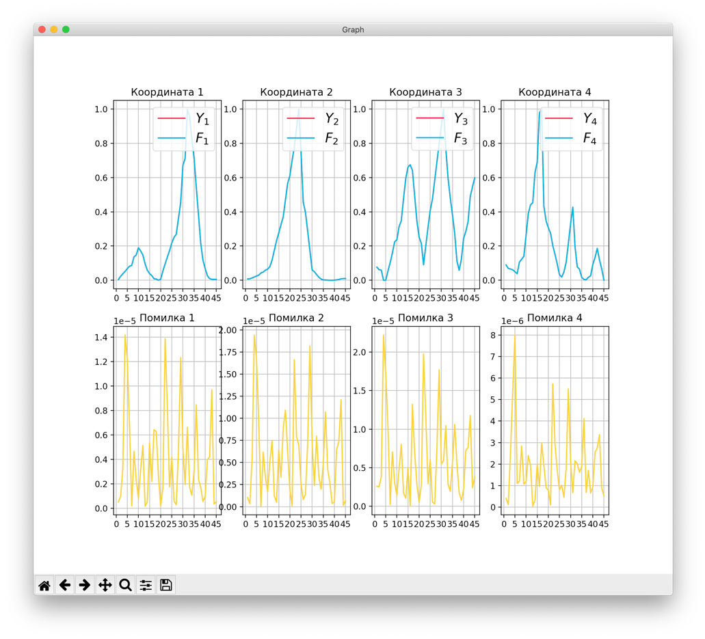
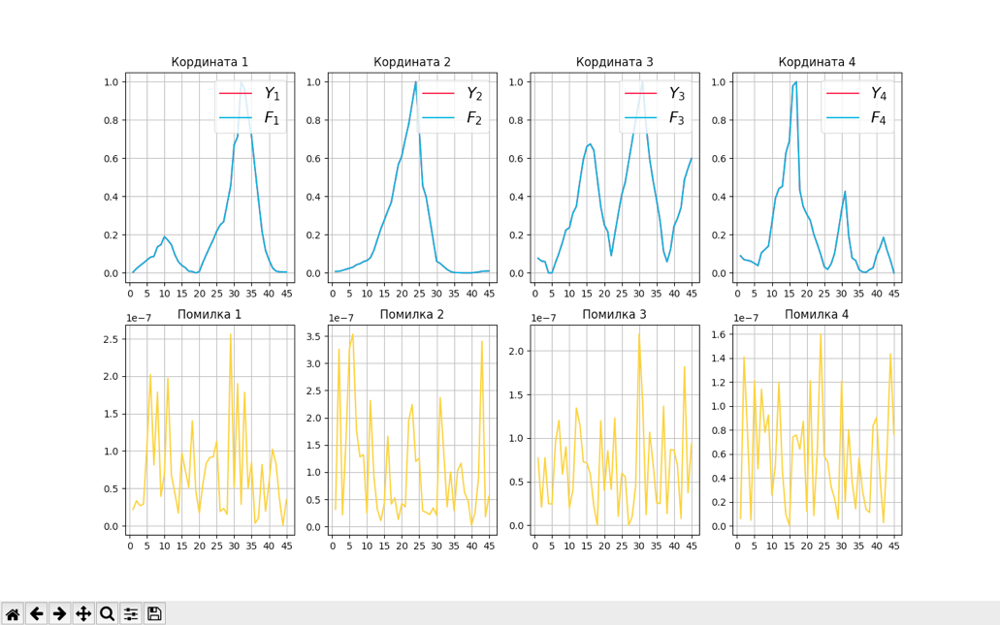

# sysan2

Вибрали два методи оптимізації:
1. Метод покординатного спуску
1. Метод спряжених градієнтів 


## Результаты 

### Метод покординатного спуску


### Метод спряжених градієнтів  


### Метод покординатного спуску

```

Error normalised (Y - F)
----------- ----------- ----------- -----------
1.41715e-05 1.94213e-05 2.22196e-05 7.99925e-06
----------- ----------- ----------- -----------

Error (Y_ - F_))
-------- -------- --------- --------
0.181113 0.385998 0.0408139 0.014832
-------- -------- --------- --------

(Psi11)[1]=0.249641*T0(x11) + -0.007899*T1(x11) + -0.013345*T2(x11)

(Psi12)[1]=-0.004942*T0(x12) + 0.184127*T1(x12) + -0.017634*T2(x12)

(Psi21)[1]=0.261960*T0(x21) + -0.021562*T1(x21) + 0.051671*T2(x21) + 0.023092*T3(x21)

(Psi22)[1]=0.007843*T0(x22) + 0.164754*T1(x22) + 0.059059*T2(x22) + 0.003248*T3(x22)

(Psi31)[1]=0.150740*T0(x31) + -0.162592*T1(x31) + -0.029698*T2(x31) + -0.100818*T3(x31) + -0.013530*T4(x31) + 0.002769*T5(x31) + 0.250189*T6(x31) + 0.067546*T7(x31) + -0.068130*T8(x31) + -0.000588*T9(x31) + -0.056376*T10(x31) + 0.000270*T11(x31) + -0.288570*T12(x31) + -0.233722*T13(x31) + -0.061339*T14(x31) + 0.127607*T15(x31) + 0.184817*T16(x31) + 0.169407*T17(x31) + 0.008860*T18(x31) + 0.069629*T19(x31)

(Psi32)[1]=-0.014537*T0(x32) + -0.204866*T1(x32) + -0.337093*T2(x32) + 0.318188*T3(x32) + 0.212196*T4(x32) + -0.178663*T5(x32) + 0.013679*T6(x32) + -0.059169*T7(x32) + -0.233143*T8(x32) + 0.029141*T9(x32) + -0.119926*T10(x32) + -0.131151*T11(x32) + 0.004501*T12(x32) + 0.168017*T13(x32) + 0.057584*T14(x32) + 0.164031*T15(x32) + -0.208629*T16(x32) + 0.026424*T17(x32) + -0.082857*T18(x32) + -0.051832*T19(x32)

(Psi33)[1]=-0.040087*T0(x33) + 0.050163*T1(x33) + -0.395767*T2(x33) + 0.166018*T3(x33) + 0.026261*T4(x33) + -0.052678*T5(x33) + -0.128690*T6(x33) + -0.251687*T7(x33) + -0.021005*T8(x33) + 0.059033*T9(x33) + 0.057502*T10(x33) + -0.114095*T11(x33) + -0.125508*T12(x33) + -0.066588*T13(x33) + -0.073640*T14(x33) + 0.027355*T15(x33) + -0.198802*T16(x33) + 0.218360*T17(x33) + 0.097536*T18(x33) + 0.155239*T19(x33)

(Psi11)[2]=0.258038*T0(x11) + -0.201308*T1(x11) + -0.079548*T2(x11)

(Psi12)[2]=-0.050343*T0(x12) + 0.282722*T1(x12) + -0.025560*T2(x12)

(Psi21)[2]=0.238059*T0(x21) + 0.463341*T1(x21) + 0.215777*T2(x21) + 0.073817*T3(x21)

(Psi22)[2]=0.180199*T0(x22) + 0.135073*T1(x22) + 0.033630*T2(x22) + 0.005404*T3(x22)

(Psi31)[2]=0.226697*T0(x31) + 0.090055*T1(x31) + 0.329242*T2(x31) + 0.109120*T3(x31) + 0.153300*T4(x31) + 0.077810*T5(x31) + -0.440574*T6(x31) + -0.355335*T7(x31) + -0.349774*T8(x31) + -0.136352*T9(x31) + -0.095666*T10(x31) + 0.049438*T11(x31) + 0.363674*T12(x31) + 0.284602*T13(x31) + 0.097846*T14(x31) + -0.032005*T15(x31) + -0.085025*T16(x31) + -0.159381*T17(x31) + 0.090743*T18(x31) + -0.099728*T19(x31)

(Psi32)[2]=-0.004988*T0(x32) + 0.386645*T1(x32) + -0.195289*T2(x32) + 0.031216*T3(x32) + -0.278251*T4(x32) + 0.297172*T5(x32) + 0.077775*T6(x32) + 0.142135*T7(x32) + 0.092902*T8(x32) + -0.095242*T9(x32) + -0.036317*T10(x32) + 0.088098*T11(x32) + 0.020510*T12(x32) + -0.155114*T13(x32) + -0.035230*T14(x32) + -0.270648*T15(x32) + 0.348763*T16(x32) + -0.046423*T17(x32) + 0.212220*T18(x32) + 0.147295*T19(x32)

(Psi33)[2]=-0.021672*T0(x33) + 0.123470*T1(x33) + 0.289793*T2(x33) + -0.048522*T3(x33) + -0.285434*T4(x33) + 0.061003*T5(x33) + 0.075448*T6(x33) + 0.346019*T7(x33) + 0.052342*T8(x33) + -0.187436*T9(x33) + -0.075022*T10(x33) + 0.211674*T11(x33) + 0.248036*T12(x33) + -0.149200*T13(x33) + -0.054633*T14(x33) + 0.122998*T15(x33) + 0.360764*T16(x33) + -0.321025*T17(x33) + -0.099883*T18(x33) + -0.078643*T19(x33)

(Psi11)[3]=0.467740*T0(x11) + -0.053949*T1(x11) + 0.048130*T2(x11)

(Psi12)[3]=0.006658*T0(x12) + 0.359031*T1(x12) + 0.054572*T2(x12)

(Psi21)[3]=0.359786*T0(x21) + -0.061051*T1(x21) + -0.000964*T2(x21) + 0.089814*T3(x21)

(Psi22)[3]=-0.020709*T0(x22) + -0.030532*T1(x22) + -0.022807*T2(x22) + 0.000732*T3(x22)

(Psi31)[3]=0.361705*T0(x31) + -0.215046*T1(x31) + -0.226649*T2(x31) + -0.089501*T3(x31) + -0.103893*T4(x31) + -0.044249*T5(x31) + 0.395928*T6(x31) + 0.366039*T7(x31) + 0.392211*T8(x31) + 0.244493*T9(x31) + 0.196864*T10(x31) + -0.042658*T11(x31) + -0.429380*T12(x31) + -0.278321*T13(x31) + -0.122086*T14(x31) + -0.002274*T15(x31) + 0.190407*T16(x31) + 0.137832*T17(x31) + -0.041175*T18(x31) + 0.151472*T19(x31)

(Psi32)[3]=-0.028652*T0(x32) + -0.089642*T1(x32) + 0.003534*T2(x32) + -0.016002*T3(x32) + 0.277746*T4(x32) + -0.318124*T5(x32) + -0.094017*T6(x32) + -0.040182*T7(x32) + -0.091796*T8(x32) + 0.192416*T9(x32) + -0.094038*T10(x32) + -0.080871*T11(x32) + -0.051774*T12(x32) + 0.143266*T13(x32) + 0.047118*T14(x32) + 0.368314*T15(x32) + -0.374007*T16(x32) + -0.043137*T17(x32) + -0.320553*T18(x32) + -0.028056*T19(x32)

(Psi33)[3]=0.045525*T0(x33) + 0.077747*T1(x33) + -0.396402*T2(x33) + 0.090063*T3(x33) + 0.358293*T4(x33) + -0.076386*T5(x33) + -0.095745*T6(x33) + -0.310310*T7(x33) + -0.064409*T8(x33) + 0.174055*T9(x33) + 0.143097*T10(x33) + -0.251097*T11(x33) + -0.248396*T12(x33) + 0.194514*T13(x33) + 0.021866*T14(x33) + -0.137087*T15(x33) + -0.374393*T16(x33) + 0.322770*T17(x33) + 0.239836*T18(x33) + 0.118725*T19(x33)

(Psi11)[4]=0.189683*T0(x11) + -0.001108*T1(x11) + 0.023489*T2(x11)

(Psi12)[4]=0.006665*T0(x12) + 0.061953*T1(x12) + -0.118615*T2(x12)

(Psi21)[4]=0.187399*T0(x21) + -0.122026*T1(x21) + -0.012596*T2(x21) + 0.047520*T3(x21)

(Psi22)[4]=-0.038114*T0(x22) + -0.056714*T1(x22) + -0.048816*T2(x22) + 0.006933*T3(x22)

(Psi31)[4]=0.213394*T0(x31) + 0.167968*T1(x31) + -0.191605*T2(x31) + 0.103172*T3(x31) + 0.033065*T4(x31) + 0.116008*T5(x31) + 0.004285*T6(x31) + 0.073850*T7(x31) + 0.116993*T8(x31) + 0.026068*T9(x31) + 0.083112*T10(x31) + 0.029389*T11(x31) + 0.008372*T12(x31) + 0.042405*T13(x31) + -0.039483*T14(x31) + -0.036374*T15(x31) + -0.063095*T16(x31) + 0.005400*T17(x31) + -0.001228*T18(x31) + 0.036308*T19(x31)

(Psi32)[4]=0.002215*T0(x32) + 0.222086*T1(x32) + 0.122352*T2(x32) + -0.225177*T3(x32) + 0.049212*T4(x32) + -0.142197*T5(x32) + -0.004748*T6(x32) + 0.017700*T7(x32) + 0.124922*T8(x32) + -0.009518*T9(x32) + 0.044851*T10(x32) + 0.039259*T11(x32) + -0.020486*T12(x32) + 0.012063*T13(x32) + -0.056660*T14(x32) + -0.002029*T15(x32) + -0.049021*T16(x32) + -0.007392*T17(x32) + -0.005958*T18(x32) + 0.072894*T19(x32)

(Psi33)[4]=0.102777*T0(x33) + 0.047378*T1(x33) + -0.041535*T2(x33) + 0.038782*T3(x33) + 0.027477*T4(x33) + 0.076314*T5(x33) + -0.099656*T6(x33) + -0.000917*T7(x33) + 0.052738*T8(x33) + 0.032316*T9(x33) + -0.008584*T10(x33) + -0.016394*T11(x33) + 0.001053*T12(x33) + 0.020221*T13(x33) + 0.040763*T14(x33) + -0.079225*T15(x33) + 0.028278*T16(x33) + -0.014751*T17(x33) + 0.058177*T18(x33) + -0.009532*T19(x33)

(Phi1)[1]=0.249641*T0(x11) + -0.007899*T1(x11) + -0.013345*T2(x11) + -0.004942*T0(x12) + 0.184127*T1(x12) + -0.017634*T2(x12)

(Phi2)[1]=0.261960*T0(x21) + -0.021562*T1(x21) + 0.051671*T2(x21) + 0.023092*T3(x21) + 0.007843*T0(x22) + 0.164754*T1(x22) + 0.059059*T2(x22) + 0.003248*T3(x22)

(Phi3)[1]=0.150740*T0(x31) + -0.162592*T1(x31) + -0.029698*T2(x31) + -0.100818*T3(x31) + -0.013530*T4(x31) + 0.002769*T5(x31) + 0.250189*T6(x31) + 0.067546*T7(x31) + -0.068130*T8(x31) + -0.000588*T9(x31) + -0.056376*T10(x31) + 0.000270*T11(x31) + -0.288570*T12(x31) + -0.233722*T13(x31) + -0.061339*T14(x31) + 0.127607*T15(x31) + 0.184817*T16(x31) + 0.169407*T17(x31) + 0.008860*T18(x31) + 0.069629*T19(x31) + -0.014537*T0(x32) + -0.204866*T1(x32) + -0.337093*T2(x32) + 0.318188*T3(x32) + 0.212196*T4(x32) + -0.178663*T5(x32) + 0.013679*T6(x32) + -0.059169*T7(x32) + -0.233143*T8(x32) + 0.029141*T9(x32) + -0.119926*T10(x32) + -0.131151*T11(x32) + 0.004501*T12(x32) + 0.168017*T13(x32) + 0.057584*T14(x32) + 0.164031*T15(x32) + -0.208628*T16(x32) + 0.026424*T17(x32) + -0.082857*T18(x32) + -0.051832*T19(x32) + -0.040087*T0(x33) + 0.050163*T1(x33) + -0.395767*T2(x33) + 0.166018*T3(x33) + 0.026261*T4(x33) + -0.052678*T5(x33) + -0.128690*T6(x33) + -0.251687*T7(x33) + -0.021005*T8(x33) + 0.059033*T9(x33) + 0.057502*T10(x33) + -0.114095*T11(x33) + -0.125508*T12(x33) + -0.066588*T13(x33) + -0.073640*T14(x33) + 0.027355*T15(x33) + -0.198802*T16(x33) + 0.218360*T17(x33) + 0.097536*T18(x33) + 0.155239*T19(x33)

(Phi1)[2]=0.258038*T0(x11) + -0.201308*T1(x11) + -0.079548*T2(x11) + -0.050343*T0(x12) + 0.282722*T1(x12) + -0.025560*T2(x12)

(Phi2)[2]=0.238059*T0(x21) + 0.463341*T1(x21) + 0.215777*T2(x21) + 0.073817*T3(x21) + 0.180199*T0(x22) + 0.135073*T1(x22) + 0.033630*T2(x22) + 0.005404*T3(x22)

(Phi3)[2]=0.226697*T0(x31) + 0.090055*T1(x31) + 0.329242*T2(x31) + 0.109120*T3(x31) + 0.153300*T4(x31) + 0.077810*T5(x31) + -0.440574*T6(x31) + -0.355336*T7(x31) + -0.349774*T8(x31) + -0.136352*T9(x31) + -0.095666*T10(x31) + 0.049438*T11(x31) + 0.363675*T12(x31) + 0.284602*T13(x31) + 0.097846*T14(x31) + -0.032006*T15(x31) + -0.085025*T16(x31) + -0.159381*T17(x31) + 0.090743*T18(x31) + -0.099728*T19(x31) + -0.004988*T0(x32) + 0.386646*T1(x32) + -0.195289*T2(x32) + 0.031216*T3(x32) + -0.278252*T4(x32) + 0.297172*T5(x32) + 0.077775*T6(x32) + 0.142135*T7(x32) + 0.092902*T8(x32) + -0.095242*T9(x32) + -0.036317*T10(x32) + 0.088098*T11(x32) + 0.020510*T12(x32) + -0.155115*T13(x32) + -0.035230*T14(x32) + -0.270648*T15(x32) + 0.348763*T16(x32) + -0.046423*T17(x32) + 0.212221*T18(x32) + 0.147295*T19(x32) + -0.021672*T0(x33) + 0.123470*T1(x33) + 0.289793*T2(x33) + -0.048522*T3(x33) + -0.285435*T4(x33) + 0.061003*T5(x33) + 0.075448*T6(x33) + 0.346019*T7(x33) + 0.052342*T8(x33) + -0.187436*T9(x33) + -0.075022*T10(x33) + 0.211675*T11(x33) + 0.248036*T12(x33) + -0.149200*T13(x33) + -0.054633*T14(x33) + 0.122998*T15(x33) + 0.360764*T16(x33) + -0.321025*T17(x33) + -0.099883*T18(x33) + -0.078643*T19(x33)

(Phi1)[3]=0.467740*T0(x11) + -0.053949*T1(x11) + 0.048130*T2(x11) + 0.006658*T0(x12) + 0.359031*T1(x12) + 0.054572*T2(x12)

(Phi2)[3]=0.359786*T0(x21) + -0.061051*T1(x21) + -0.000964*T2(x21) + 0.089814*T3(x21) + -0.020708*T0(x22) + -0.030532*T1(x22) + -0.022807*T2(x22) + 0.000732*T3(x22)

(Phi3)[3]=0.361706*T0(x31) + -0.215046*T1(x31) + -0.226649*T2(x31) + -0.089501*T3(x31) + -0.103893*T4(x31) + -0.044249*T5(x31) + 0.395928*T6(x31) + 0.366040*T7(x31) + 0.392211*T8(x31) + 0.244493*T9(x31) + 0.196864*T10(x31) + -0.042658*T11(x31) + -0.429380*T12(x31) + -0.278321*T13(x31) + -0.122087*T14(x31) + -0.002274*T15(x31) + 0.190407*T16(x31) + 0.137832*T17(x31) + -0.041175*T18(x31) + 0.151472*T19(x31) + -0.028652*T0(x32) + -0.089642*T1(x32) + 0.003534*T2(x32) + -0.016002*T3(x32) + 0.277747*T4(x32) + -0.318125*T5(x32) + -0.094017*T6(x32) + -0.040182*T7(x32) + -0.091796*T8(x32) + 0.192416*T9(x32) + -0.094038*T10(x32) + -0.080871*T11(x32) + -0.051774*T12(x32) + 0.143266*T13(x32) + 0.047118*T14(x32) + 0.368315*T15(x32) + -0.374008*T16(x32) + -0.043137*T17(x32) + -0.320553*T18(x32) + -0.028056*T19(x32) + 0.045525*T0(x33) + 0.077747*T1(x33) + -0.396403*T2(x33) + 0.090063*T3(x33) + 0.358294*T4(x33) + -0.076386*T5(x33) + -0.095745*T6(x33) + -0.310310*T7(x33) + -0.064409*T8(x33) + 0.174055*T9(x33) + 0.143098*T10(x33) + -0.251097*T11(x33) + -0.248396*T12(x33) + 0.194514*T13(x33) + 0.021866*T14(x33) + -0.137087*T15(x33) + -0.374393*T16(x33) + 0.322770*T17(x33) + 0.239836*T18(x33) + 0.118725*T19(x33)

(Phi1)[4]=0.189683*T0(x11) + -0.001108*T1(x11) + 0.023489*T2(x11) + 0.006665*T0(x12) + 0.061953*T1(x12) + -0.118615*T2(x12)

(Phi2)[4]=0.187399*T0(x21) + -0.122026*T1(x21) + -0.012596*T2(x21) + 0.047520*T3(x21) + -0.038114*T0(x22) + -0.056714*T1(x22) + -0.048816*T2(x22) + 0.006933*T3(x22)

(Phi3)[4]=0.213394*T0(x31) + 0.167968*T1(x31) + -0.191605*T2(x31) + 0.103172*T3(x31) + 0.033065*T4(x31) + 0.116009*T5(x31) + 0.004285*T6(x31) + 0.073850*T7(x31) + 0.116993*T8(x31) + 0.026068*T9(x31) + 0.083112*T10(x31) + 0.029389*T11(x31) + 0.008372*T12(x31) + 0.042405*T13(x31) + -0.039483*T14(x31) + -0.036374*T15(x31) + -0.063095*T16(x31) + 0.005400*T17(x31) + -0.001228*T18(x31) + 0.036308*T19(x31) + 0.002215*T0(x32) + 0.222086*T1(x32) + 0.122352*T2(x32) + -0.225177*T3(x32) + 0.049212*T4(x32) + -0.142197*T5(x32) + -0.004748*T6(x32) + 0.017700*T7(x32) + 0.124922*T8(x32) + -0.009518*T9(x32) + 0.044851*T10(x32) + 0.039259*T11(x32) + -0.020486*T12(x32) + 0.012063*T13(x32) + -0.056660*T14(x32) + -0.002029*T15(x32) + -0.049021*T16(x32) + -0.007392*T17(x32) + -0.005958*T18(x32) + 0.072894*T19(x32) + 0.102777*T0(x33) + 0.047378*T1(x33) + -0.041535*T2(x33) + 0.038782*T3(x33) + 0.027477*T4(x33) + 0.076314*T5(x33) + -0.099656*T6(x33) + -0.000917*T7(x33) + 0.052738*T8(x33) + 0.032316*T9(x33) + -0.008584*T10(x33) + -0.016394*T11(x33) + 0.001053*T12(x33) + 0.020221*T13(x33) + 0.040763*T14(x33) + -0.079225*T15(x33) + 0.028278*T16(x33) + -0.014751*T17(x33) + 0.058177*T18(x33) + -0.009532*T19(x33)

(F1)=-0.000000*T0(x11) + 0.000000*T1(x11) + 0.000000*T2(x11) + 0.000000*T0(x12) + -0.000000*T1(x12) + 0.000000*T2(x12) + -0.000000*T0(x21) + 0.000000*T1(x21) + -0.000000*T2(x21) + -0.000000*T3(x21) + -0.000000*T0(x22) + -0.000000*T1(x22) + -0.000000*T2(x22) + -0.000000*T3(x22) + 0.150740*T0(x31) + -0.162592*T1(x31) + -0.029699*T2(x31) + -0.100818*T3(x31) + -0.013530*T4(x31) + 0.002769*T5(x31) + 0.250190*T6(x31) + 0.067546*T7(x31) + -0.068130*T8(x31) + -0.000588*T9(x31) + -0.056376*T10(x31) + 0.000270*T11(x31) + -0.288571*T12(x31) + -0.233723*T13(x31) + -0.061339*T14(x31) + 0.127607*T15(x31) + 0.184817*T16(x31) + 0.169407*T17(x31) + 0.008860*T18(x31) + 0.069629*T19(x31) + -0.014537*T0(x32) + -0.204866*T1(x32) + -0.337094*T2(x32) + 0.318189*T3(x32) + 0.212197*T4(x32) + -0.178663*T5(x32) + 0.013679*T6(x32) + -0.059169*T7(x32) + -0.233144*T8(x32) + 0.029141*T9(x32) + -0.119926*T10(x32) + -0.131151*T11(x32) + 0.004501*T12(x32) + 0.168017*T13(x32) + 0.057584*T14(x32) + 0.164031*T15(x32) + -0.208629*T16(x32) + 0.026424*T17(x32) + -0.082857*T18(x32) + -0.051832*T19(x32) + -0.040087*T0(x33) + 0.050163*T1(x33) + -0.395768*T2(x33) + 0.166018*T3(x33) + 0.026261*T4(x33) + -0.052679*T5(x33) + -0.128691*T6(x33) + -0.251688*T7(x33) + -0.021005*T8(x33) + 0.059033*T9(x33) + 0.057502*T10(x33) + -0.114096*T11(x33) + -0.125509*T12(x33) + -0.066589*T13(x33) + -0.073640*T14(x33) + 0.027355*T15(x33) + -0.198803*T16(x33) + 0.218360*T17(x33) + 0.097536*T18(x33) + 0.155240*T19(x33)

(F2)=-0.000001*T0(x11) + 0.000001*T1(x11) + 0.000000*T2(x11) + 0.000000*T0(x12) + -0.000001*T1(x12) + 0.000000*T2(x12) + 0.000000*T0(x21) + 0.000000*T1(x21) + 0.000000*T2(x21) + 0.000000*T3(x21) + 0.000000*T0(x22) + 0.000000*T1(x22) + 0.000000*T2(x22) + 0.000000*T3(x22) + 0.226698*T0(x31) + 0.090055*T1(x31) + 0.329244*T2(x31) + 0.109121*T3(x31) + 0.153300*T4(x31) + 0.077810*T5(x31) + -0.440576*T6(x31) + -0.355337*T7(x31) + -0.349776*T8(x31) + -0.136353*T9(x31) + -0.095666*T10(x31) + 0.049438*T11(x31) + 0.363676*T12(x31) + 0.284604*T13(x31) + 0.097846*T14(x31) + -0.032006*T15(x31) + -0.085026*T16(x31) + -0.159382*T17(x31) + 0.090743*T18(x31) + -0.099729*T19(x31) + -0.004988*T0(x32) + 0.386648*T1(x32) + -0.195290*T2(x32) + 0.031216*T3(x32) + -0.278253*T4(x32) + 0.297173*T5(x32) + 0.077775*T6(x32) + 0.142136*T7(x32) + 0.092902*T8(x32) + -0.095243*T9(x32) + -0.036317*T10(x32) + 0.088098*T11(x32) + 0.020510*T12(x32) + -0.155115*T13(x32) + -0.035230*T14(x32) + -0.270650*T15(x32) + 0.348765*T16(x32) + -0.046423*T17(x32) + 0.212222*T18(x32) + 0.147296*T19(x32) + -0.021672*T0(x33) + 0.123470*T1(x33) + 0.289794*T2(x33) + -0.048523*T3(x33) + -0.285436*T4(x33) + 0.061004*T5(x33) + 0.075448*T6(x33) + 0.346021*T7(x33) + 0.052342*T8(x33) + -0.187437*T9(x33) + -0.075023*T10(x33) + 0.211676*T11(x33) + 0.248037*T12(x33) + -0.149201*T13(x33) + -0.054633*T14(x33) + 0.122999*T15(x33) + 0.360766*T16(x33) + -0.321027*T17(x33) + -0.099884*T18(x33) + -0.078643*T19(x33)

(F3)=-0.000003*T0(x11) + 0.000000*T1(x11) + -0.000000*T2(x11) + -0.000000*T0(x12) + -0.000002*T1(x12) + -0.000000*T2(x12) + -0.000000*T0(x21) + 0.000000*T1(x21) + 0.000000*T2(x21) + -0.000000*T3(x21) + 0.000000*T0(x22) + 0.000000*T1(x22) + 0.000000*T2(x22) + -0.000000*T3(x22) + 0.361708*T0(x31) + -0.215048*T1(x31) + -0.226651*T2(x31) + -0.089501*T3(x31) + -0.103894*T4(x31) + -0.044249*T5(x31) + 0.395931*T6(x31) + 0.366042*T7(x31) + 0.392214*T8(x31) + 0.244495*T9(x31) + 0.196865*T10(x31) + -0.042658*T11(x31) + -0.429383*T12(x31) + -0.278323*T13(x31) + -0.122087*T14(x31) + -0.002274*T15(x31) + 0.190409*T16(x31) + 0.137833*T17(x31) + -0.041175*T18(x31) + 0.151473*T19(x31) + -0.028653*T0(x32) + -0.089642*T1(x32) + 0.003534*T2(x32) + -0.016002*T3(x32) + 0.277749*T4(x32) + -0.318127*T5(x32) + -0.094018*T6(x32) + -0.040182*T7(x32) + -0.091797*T8(x32) + 0.192418*T9(x32) + -0.094038*T10(x32) + -0.080872*T11(x32) + -0.051775*T12(x32) + 0.143267*T13(x32) + 0.047119*T14(x32) + 0.368317*T15(x32) + -0.374010*T16(x32) + -0.043137*T17(x32) + -0.320555*T18(x32) + -0.028056*T19(x32) + 0.045526*T0(x33) + 0.077748*T1(x33) + -0.396405*T2(x33) + 0.090063*T3(x33) + 0.358296*T4(x33) + -0.076387*T5(x33) + -0.095746*T6(x33) + -0.310313*T7(x33) + -0.064410*T8(x33) + 0.174056*T9(x33) + 0.143099*T10(x33) + -0.251099*T11(x33) + -0.248398*T12(x33) + 0.194515*T13(x33) + 0.021866*T14(x33) + -0.137088*T15(x33) + -0.374396*T16(x33) + 0.322772*T17(x33) + 0.239838*T18(x33) + 0.118726*T19(x33)

(F4)=-0.000001*T0(x11) + 0.000000*T1(x11) + -0.000000*T2(x11) + -0.000000*T0(x12) + -0.000000*T1(x12) + 0.000001*T2(x12) + 0.000001*T0(x21) + -0.000001*T1(x21) + -0.000000*T2(x21) + 0.000000*T3(x21) + -0.000000*T0(x22) + -0.000000*T1(x22) + -0.000000*T2(x22) + 0.000000*T3(x22) + 0.213394*T0(x31) + 0.167968*T1(x31) + -0.191604*T2(x31) + 0.103172*T3(x31) + 0.033065*T4(x31) + 0.116008*T5(x31) + 0.004285*T6(x31) + 0.073850*T7(x31) + 0.116993*T8(x31) + 0.026068*T9(x31) + 0.083112*T10(x31) + 0.029389*T11(x31) + 0.008372*T12(x31) + 0.042405*T13(x31) + -0.039483*T14(x31) + -0.036374*T15(x31) + -0.063095*T16(x31) + 0.005400*T17(x31) + -0.001228*T18(x31) + 0.036308*T19(x31) + 0.002215*T0(x32) + 0.222086*T1(x32) + 0.122352*T2(x32) + -0.225177*T3(x32) + 0.049212*T4(x32) + -0.142197*T5(x32) + -0.004748*T6(x32) + 0.017700*T7(x32) + 0.124921*T8(x32) + -0.009518*T9(x32) + 0.044851*T10(x32) + 0.039259*T11(x32) + -0.020486*T12(x32) + 0.012063*T13(x32) + -0.056660*T14(x32) + -0.002029*T15(x32) + -0.049021*T16(x32) + -0.007392*T17(x32) + -0.005958*T18(x32) + 0.072894*T19(x32) + 0.102777*T0(x33) + 0.047378*T1(x33) + -0.041535*T2(x33) + 0.038782*T3(x33) + 0.027477*T4(x33) + 0.076314*T5(x33) + -0.099656*T6(x33) + -0.000917*T7(x33) + 0.052738*T8(x33) + 0.032316*T9(x33) + -0.008584*T10(x33) + -0.016394*T11(x33) + 0.001053*T12(x33) + 0.020221*T13(x33) + 0.040763*T14(x33) + -0.079225*T15(x33) + 0.028278*T16(x33) + -0.014751*T17(x33) + 0.058177*T18(x33) + -0.009532*T19(x33)

(F1) transformed:
-1.596200190472645e-07(x11) + 1.873409441941724e-07 +
-8.937534218194069e-07(x12) + 2.4754907015209443e-07 +
1.913627056090304e-08(x21)^2 + 3.256935916851131e-07(x21) - 3.462638653613874e-07 +
3.9595051354068287e-08(x22)^2 - 1.4834121900822968e-07(x22) - 4.870276088560233e-08 +
140.64064629095128(x31)^18 - 12609.131578748375(x31)^17 + 496687.10913361085(x31)^16 - 11123912.490822924(x31)^15 + 157408282.86769763(x31)^14 - 1504803376.7750368(x31)^13 + 10192224933.100716(x31)^12 - 50606232978.38742(x31)^11 + 188677476884.092(x31)^10 - 536824993123.907(x31)^9 + 1176821560074.8513(x31)^8 - 1994954125268.1338(x31)^7 + 2608826545925.306(x31)^6 - 2607063994563.308(x31)^5 + 1954077998580.1975(x31)^4 - 1063206509792.8542(x31)^3 + 396456131394.5347(x31)^2 - 90607750017.9852(x31) + 9569702740.152319 +
257.412386454886(x32)^18 - 19081.329285810516(x32)^17 + 583115.2156534242(x32)^16 - 9396005.222285345(x32)^15 + 88691210.34190495(x32)^14 - 501533911.91668415(x32)^13 + 1486469659.15598(x32)^12 + 413923400.5572128(x32)^11 - 25732710934.042404(x32)^10 + 131251356813.25836(x32)^9 - 396249599604.06885(x32)^8 + 830096926600.644(x32)^7 - 1265012956819.0435(x32)^6 + 1420221217118.7776(x32)^5 - 1166410666434.2246(x32)^4 + 682882247583.8494(x32)^3 - 270228971404.83658(x32)^2 + 64828130459.13388(x32) - 7123692023.502373 +
292.2164801732732(x33)^18 - 29198.23859491258(x33)^17 + 1159568.7987138242(x33)^16 - 24794067.843099706(x33)^15 + 331726538.8730506(x33)^14 - 3024609552.322054(x33)^13 + 19818671588.818104(x33)^12 - 96585195378.19157(x33)^11 + 357948212956.7395(x33)^10 - 1022637528151.7462(x33)^9 + 2268029791404.3525(x33)^8 - 3909604599906.7485(x33)^7 + 5214525257333.256(x33)^6 - 5321755801322.719(x33)^5 + 4073403398517.107(x33)^4 - 2260911020710.749(x33)^3 + 858489716861.2148(x33)^2 - 199340319448.73447(x33) + 21335962676.298027 +
-1.64421593730499

(F2) transformed:
-1.0142326512451865e-06(x11) + 2.761027947337477e-06 +
-3.340390550426615e-06(x12) + 8.87146714986054e-07 +
2.8058627521897473e-07(x21)^2 - 9.634392745436752e-07(x21) + 1.25249833561379e-06 +
5.216409678465581e-08(x22)^2 + 5.115654859728773e-09(x22) + 9.16933434678366e-08 +
-191.52316549884168(x31)^18 + 22005.78708553931(x31)^17 - 948026.1040534955(x31)^16 + 21727757.151583217(x31)^15 - 306739083.2190831(x31)^14 + 2896827430.1817875(x31)^13 - 19301769728.61061(x31)^12 + 94084530148.524(x31)^11 - 343932510127.56396(x31)^10 + 958548161526.1584(x31)^9 - 2056637975114.8506(x31)^8 + 3409552904715.314(x31)^7 - 4356920880186.2764(x31)^6 + 4251192454873.315(x31)^5 - 3108778518216.3706(x31)^4 + 1649070209797.0015(x31)^3 - 599111679696.5522(x31)^2 + 133330802206.62053(x31) - 13706620089.327248 +
-366.63831078758756(x32)^18 + 30457.213958240493(x32)^17 - 935372.3604836506(x32)^16 + 14411958.083057983(x32)^15 - 120872709.95004159(x32)^14 + 481819953.8143182(x32)^13 + 582210348.0675735(x32)^12 - 19132375200.480057(x32)^11 + 123502591081.56592(x32)^10 - 480792005668.62384(x32)^9 + 1303569690753.3994(x32)^8 - 2584319997973.9473(x32)^7 + 3814253550982.071(x32)^6 - 4197133798700.753(x32)^5 + 3401390746411.7227(x32)^4 - 1972883344275.065(x32)^3 + 775371638681.2554(x32)^2 - 185027505828.21255(x32) + 20244145469.888023 +
-340.5380964192793(x33)^18 + 31924.6191376198(x33)^17 - 1167723.9303065531(x33)^16 + 23019373.04450379(x33)^15 - 282824814.7920565(x33)^14 + 2356910796.0209475(x33)^13 - 14084531036.576157(x33)^12 + 62738541631.0704(x33)^11 - 214036187929.4099(x33)^10 + 569351473308.9635(x33)^9 - 1192604028239.249(x33)^8 + 1971730537794.155(x33)^7 - 2559997059192.3687(x33)^6 + 2576769100029.2407(x33)^5 - 1966201702825.6003(x33)^4 + 1096900906609.2458(x33)^3 - 421104633458.9099(x33)^2 + 99250272246.11517(x33) - 10808658150.940287 +
0.5486042873861395

(F3) transformed:
3.0798446248219115e-06(x11) - 2.4057016572469695e-06 +
-1.7586969809962948e-06(x12) - 2.7277362550985252e-06 +
-2.9354319691767144e-08(x21)^2 + 8.438927429666642e-08(x21) - 5.615900497637502e-08 +
-2.629442962570937e-09(x22)^2 + 4.251726612674774e-09(x22) - 4.5771707545828664e-10 +
142.60522258082966(x31)^18 - 17546.205403705888(x31)^17 + 812305.8343907727(x31)^16 - 19999924.212530535(x31)^15 + 301384403.5213415(x31)^14 - 3014752193.294853(x31)^13 + 21125141425.205315(x31)^12 - 107637098926.6591(x31)^11 + 409248698363.18744(x31)^10 - 1181450653938.5376(x31)^9 + 2616813205731.042(x31)^8 - 4465701617954.933(x31)^7 + 5859970153579.94(x31)^6 - 5859137762293.571(x31)^5 + 4382356555242.099(x31)^4 - 2373661687682.831(x31)^3 + 879178072696.9244(x31)^2 - 199188746190.04156(x31) + 20818312760.38142 +
584.3309044566748(x32)^18 - 49173.75861777088(x32)^17 + 1707088.7189340987(x32)^16 - 32420788.08050279(x32)^15 + 384363235.9011386(x32)^14 - 3074527466.6312203(x32)^13 + 17432434556.29343(x32)^12 - 72313387302.81941(x32)^11 + 223720032115.88776(x32)^10 - 521006041901.561(x32)^9 + 913125669340.3147(x32)^8 - 1190358304298.8203(x32)^7 + 1119911696629.7031(x32)^6 - 707650510390.3589(x32)^5 + 238027796922.0741(x32)^4 + 21576036508.63678(x32)^3 - 61505909566.78931(x32)^2 + 25617366941.209454(x32) - 3855953034.075386 +
288.78371079772717(x33)^18 - 26748.997062177594(x33)^17 + 954747.2061583346(x33)^16 - 18427859.14553873(x33)^15 + 224269495.4919911(x33)^14 - 1881713603.9379065(x33)^13 + 11535309110.510624(x33)^12 - 53697282168.98739(x33)^11 + 194451790365.6869(x33)^10 - 554745422064.2913(x33)^9 + 1251224292547.0735(x33)^8 - 2223445912429.1475(x33)^7 + 3084184717323.4746(x33)^6 - 3289069771436.952(x33)^5 + 2635081747205.0566(x33)^4 - 1530189771834.5195(x33)^3 + 606803609658.5902(x33)^2 - 146775908053.11224(x33) + 16317545457.62135 +
-1.0020073946979169

(F4) transformed:
1.1405704341480792e-06(x11) - 1.1272802605290019e-06 +
-6.435765714988874e-06(x12) + 5.692464603757456e-06 +
5.356017614559964e-06(x21)^2 - 1.7914602514525293e-05(x21) + 1.1437771353584176e-05 +
3.022940831984481e-06(x22)^2 - 5.440596994786172e-06(x22) + 1.6687862447923765e-06 +
68.60110557612701(x31)^18 - 6442.35247212824(x31)^17 + 259154.1670163889(x31)^16 - 5660036.402792847(x31)^15 + 77818197.25507528(x31)^14 - 730253467.597151(x31)^13 + 4910532155.184515(x31)^12 - 24421990900.283985(x31)^11 + 91753552000.22275(x31)^10 - 264005074352.33072(x31)^9 + 586256144578.1761(x31)^8 - 1006907328411.6826(x31)^7 + 1332841206585.6526(x31)^6 - 1345840981851.8066(x31)^5 + 1016855988576.369(x31)^4 - 556153288084.9738(x31)^3 + 207827100668.65878(x31)^2 - 47448113512.682884(x31) + 4990095076.954682 +
80.39397825464901(x32)^18 - 10001.829702952633(x32)^17 + 418708.55981293495(x32)^16 - 9491511.077689523(x32)^15 + 135506838.17259848(x32)^14 - 1315553055.327464(x32)^13 + 9103425691.19008(x32)^12 - 46337776540.59396(x32)^11 + 177294289599.9615(x32)^10 - 517277791113.8806(x32)^9 + 1160522334842.668(x32)^8 - 2007718770248.2285(x32)^7 + 2670449872479.5063(x32)^6 - 2704338698009.4033(x32)^5 + 2046208644442.0857(x32)^4 - 1119525205171.2158(x32)^3 + 418170233571.35236(x32)^2 - 95379867676.98524(x32) + 10018437074.607368 +
-105.30247285535857(x33)^18 + 10259.7519278209(x33)^17 - 382841.1927789118(x33)^16 + 7719594.268052263(x33)^15 - 97328429.39338858(x33)^14 + 832692368.389504(x33)^13 - 5087276100.922446(x33)^12 + 22944403601.62696(x33)^11 - 78076216110.94653(x33)^10 + 203209641011.08658(x33)^9 - 407482401784.455(x33)^8 + 630514548761.4144(x33)^7 - 749659845698.5916(x33)^6 + 677364762064.1223(x33)^5 - 455841011836.9655(x33)^4 + 220801423388.02466(x33)^3 - 72564846537.3769(x33)^2 + 14444128900.39986(x33) - 1310020503.749288 +
-0.10409310252741452

(F1) transformed denormed:
-2.184893356521939e-06(x11) + 2.1224069805659194e-09 +
-4.139249127223272e-06(x12) + 4.1328698148097876e-10 +
6.119376295279815e-09(x21)^2 + 2.363777801053359e-09(x21) - 1.6717576321861639e-12 +
3.693064716703023e-07(x22)^2 - 5.533900050755326e-10(x22) - 1.048792558821038e-13 +
467.4263999129484(x31)^18 - 1.7077361391698005(x31)^17 + 0.0032484728308866473(x31)^16 - 3.7536928644961776e-06(x31)^15 + 2.8558452115227045e-09(x31)^14 - 1.5093891885086258e-12(x31)^13 +
36976.04398385655(x32)^18 - 1012.6401170314538(x32)^17 + 14.707127114597267(x32)^16 - 0.12616280253818404(x32)^15 + 0.0006560677777242732(x32)^14 - 1.8662054711307074e-06(x32)^13 + 5.211920129206875e-10(x32)^12 + 2.000250431427833e-11(x32)^11 - 9.815869571622875e-14(x32)^10 +
33103.098988450685(x33)^18 - 5745.662034793526(x33)^17 + 484.5923102667171(x33)^16 - 23.856435472746647(x33)^15 + 0.7640710336790636(x33)^14 - 0.017041106928492575(x33)^13 + 0.0002767504422426473(x33)^12 - 3.3716504258259858e-06(x33)^11 + 3.142398591528492e-08(x33)^10 - 2.2676030938946154e-10(x33)^9 + 1.2745248680359366e-12(x33)^8 - 5.582610522057975e-15(x33)^7 +
-650567.220934112

(F2) transformed denormed:
-2.5035099497950725e-05(x11) + 4.8645158640116576e-08 +
-2.4056200461508543e-05(x12) + 2.3033436369357877e-09 +
4.82377508846015e-06(x21)^2 - 1.106742198338032e-08(x21) + 9.404076644567602e-12 +
5.735146665714469e-07(x22)^2 - 4.208720032494051e-11(x22) + 3.0707657335631405e-13 +
-1247.5228663087844(x31)^18 + 4.945966267472285(x31)^17 - 0.00976152910834903(x31)^16 + 1.1368126921616717e-05(x31)^15 - 8.59530980790549e-09(x31)^14 + 4.485339964658552e-12(x31)^13 - 1.684906863671647e-15(x31)^12 +
-88933.63702430547(x32)^18 + 2387.122331992097(x32)^17 - 32.59309714517182(x32)^16 + 0.2423522590981565(x32)^15 - 0.0008320089459222118(x32)^14 - 1.351397904266867e-06(x32)^13 + 3.0353266256379336e-08(x32)^12 - 1.7184388892304996e-10(x32)^11 + 5.967287568771196e-13(x32)^10 - 1.4554056190961235e-15(x32)^9 +
-56004.969204317655(x33)^18 + 9209.606243110236(x33)^17 - 724.9180655805599(x33)^16 + 33.130279550785865(x33)^15 - 0.9792042579835225(x33)^14 + 0.020053752667429953(x33)^13 - 0.0002984778564949359(x33)^12 + 3.3406761947154403e-06(x33)^11 - 2.8804064120710485e-08(x33)^10 + 1.9440101314218925e-10(x33)^9 - 1.0358195050698532e-12(x33)^8 + 4.3638069401744755e-15(x33)^7 +
1493555.3006434443

(F3) transformed denormed:
5.814034861635181e-06(x11) - 3.917197036953405e-09 +
-1.1503765090563673e-06(x12) - 6.54531408076793e-10 +
-4.5235344411051336e-08(x21)^2 + 8.540130445559623e-11(x21) - 3.896935660353006e-14 +
-3.048503303584418e-09(x22)^2 + 2.416255273687889e-12(x22) +
94.35367453288939(x31)^18 - 0.3918974818800023(x31)^17 + 0.0008172431194693976(x31)^16 - 1.0075769288197164e-06(x31)^15 + 8.042730531494902e-10(x31)^14 - 4.4105638035075756e-13(x31)^13 +
16195.51130824596(x32)^18 - 493.3464918621763(x32)^17 + 8.291105842473318(x32)^16 - 0.08756671593399214(x32)^15 + 0.0006261044791776457(x32)^14 - 3.179559494243719e-06(x32)^13 + 1.1842635307750446e-08(x32)^12 - 3.304005576176435e-11(x32)^11 + 6.990601806418725e-14(x32)^10 +
4324.940211014491(x33)^18 - 701.8370004836469(x33)^17 + 54.24032951063291(x33)^16 - 2.4442581988903886(x33)^15 + 0.07201493354118285(x33)^14 - 0.0014926030775999377(x33)^13 + 2.287305172872492e-05(x33)^12 - 2.6804580386113773e-07(x33)^11 + 2.4536435960806025e-09(x33)^10 - 1.773786458731987e-11(x33)^9 + 1.0155072973003364e-13(x33)^8 +
-232366.4731120168

(F4) transformed denormed:
2.2218167611626534e-06(x11) - 1.8528669921367042e-09 +
-4.349253631141243e-06(x12) + 1.378818641663177e-09 +
8.518505710462715e-06(x21)^2 - 1.8262266303328435e-08(x21) + 8.011686264953421e-12 +
3.594137346613683e-06(x22)^2 - 3.2016233007884187e-09(x22) + 5.213784889758181e-13 +
34.439539627276396(x31)^18 - 0.12737311256688663(x31)^17 + 0.00024114844304972858(x31)^16 - 2.725939765402784e-07(x31)^15 + 2.031064443074162e-10(x31)^14 - 1.0600581997175849e-13(x31)^13 +
4221.505056273463(x32)^18 - 144.88725614948797(x32)^17 + 2.770356859653317(x32)^16 - 0.03375009457234895(x32)^15 + 0.00028192466731459705(x32)^14 - 1.690563459997568e-06(x32)^13 + 7.505660553170049e-09(x32)^12 - 2.5209060555209e-11(x32)^11 + 6.501243445828837e-14(x32)^10 +
-1668.9425294461723(x33)^18 + 280.1479794038348(x33)^17 - 22.45394609710812(x33)^16 + 1.0483348983289054(x33)^15 - 0.03173192317696966(x33)^14 + 0.000665225550963636(x33)^13 - 1.0086168840933825e-05(x33)^12 + 1.1386239484123113e-07(x33)^11 - 9.757031008092513e-10(x33)^10 + 6.423873988203237e-12(x33)^9 - 3.269833504519348e-14(x33)^8 +
-50579.21841570053
```

### Метод спряжених градієнтів 

```
(Psi11)[1]=0.124858*T0(x11) + 0.005517*T1(x11) + 0.013034*T2(x11) + 0.028380*T3(x11)

(Psi12)[1]=0.124858*T0(x12) + 0.162441*T1(x12) + -0.031733*T2(x12) + -0.037489*T3(x12)

(Psi21)[1]=0.134902*T0(x21) + -0.021562*T1(x21) + 0.051671*T2(x21) + 0.023092*T3(x21)

(Psi22)[1]=0.134902*T0(x22) + 0.164754*T1(x22) + 0.059059*T2(x22) + 0.003248*T3(x22)

(Psi31)[1]=-6.830594*T0(x31) + -5.628856*T1(x31) + 5.287806*T2(x31) + -4.817187*T3(x31) + 4.030410*T4(x31) + -5.880581*T5(x31) + 4.762207*T6(x31) + -3.385346*T7(x31) + 3.196317*T8(x31) + -2.877465*T9(x31) + 1.671802*T10(x31) + -1.967980*T11(x31) + 1.650825*T12(x31) + -0.686743*T13(x31) + 0.680166*T14(x31) + -0.958357*T15(x31)

(Psi32)[1]=-6.830594*T0(x32) + -44.891338*T1(x32) + -38.650450*T2(x32) + -26.843706*T3(x32) + -16.110594*T4(x32) + -4.664255*T5(x32) + 6.621575*T6(x32) + 14.353167*T7(x32) + 19.391200*T8(x32) + 22.521261*T9(x32) + 21.388894*T10(x32) + 18.703283*T11(x32) + 13.697610*T12(x32) + 8.839553*T13(x32) + 4.460131*T14(x32) + 1.670257*T15(x32)

(Psi33)[1]=-6.830594*T0(x33) + -0.149556*T1(x33) + -2.280894*T2(x33) + -2.450959*T3(x33) + -3.536208*T4(x33) + -5.351377*T5(x33) + -2.668201*T6(x33) + -3.347636*T7(x33) + -1.012606*T8(x33) + 0.889500*T9(x33) + 3.326475*T10(x33) + 3.856534*T11(x33) + 3.767400*T12(x33) + 3.365295*T13(x33) + 2.224757*T14(x33) + 1.532862*T15(x33)

(Psi11)[2]=0.102201*T0(x11) + -0.206055*T1(x11) + -0.066276*T2(x11) + -0.006812*T3(x11)

(Psi12)[2]=0.102201*T0(x12) + 0.261710*T1(x12) + -0.040397*T2(x12) + -0.036690*T3(x12)

(Psi21)[2]=0.209129*T0(x21) + 0.463341*T1(x21) + 0.215777*T2(x21) + 0.073817*T3(x21)

(Psi22)[2]=0.209129*T0(x22) + 0.135073*T1(x22) + 0.033630*T2(x22) + 0.005404*T3(x22)

(Psi31)[2]=14.289496*T0(x31) + 11.732826*T1(x31) + -11.017535*T2(x31) + 10.639723*T3(x31) + -9.332956*T4(x31) + 12.360222*T5(x31) + -9.753803*T6(x31) + 7.240649*T7(x31) + -7.481936*T8(x31) + 6.049793*T9(x31) + -4.325507*T10(x31) + 4.803808*T11(x31) + -3.246806*T12(x31) + 1.297885*T13(x31) + -1.735405*T14(x31) + 2.077795*T15(x31)

(Psi32)[2]=14.289496*T0(x32) + 92.034432*T1(x32) + 77.805721*T2(x32) + 55.353320*T3(x32) + 31.838935*T4(x32) + 8.569722*T5(x32) + -13.720161*T6(x32) + -29.888489*T7(x32) + -39.685688*T8(x32) + -45.229948*T9(x32) + -42.916223*T10(x32) + -36.777057*T11(x32) + -26.634298*T12(x32) + -16.718964*T13(x32) + -8.538648*T14(x32) + -3.344705*T15(x32)

(Psi33)[2]=14.289496*T0(x33) + 1.610990*T1(x33) + 3.698528*T2(x33) + 2.360863*T3(x33) + 3.075068*T4(x33) + 6.020143*T5(x33) + 1.373664*T6(x33) + 3.598001*T7(x33) + 1.598417*T8(x33) + -0.650808*T9(x33) + -3.838811*T10(x33) + -4.214549*T11(x33) + -4.273877*T12(x33) + -4.903821*T13(x33) + -2.874820*T14(x33) + -2.009416*T15(x33)

(Psi11)[3]=0.234118*T0(x11) + -0.063689*T1(x11) + 0.066534*T2(x11) + -0.015238*T3(x11)

(Psi12)[3]=0.234118*T0(x12) + 0.327121*T1(x12) + 0.031871*T2(x12) + -0.055773*T3(x12)

(Psi21)[3]=0.169539*T0(x21) + -0.061051*T1(x21) + -0.000964*T2(x21) + 0.089814*T3(x21)

(Psi22)[3]=0.169539*T0(x22) + -0.030532*T1(x22) + -0.022807*T2(x22) + 0.000732*T3(x22)

(Psi31)[3]=-15.309198*T0(x31) + -12.844779*T1(x31) + 11.893417*T2(x31) + -11.504850*T3(x31) + 10.089669*T4(x31) + -13.499257*T5(x31) + 10.519569*T6(x31) + -7.864604*T7(x31) + 8.183422*T8(x31) + -6.346192*T9(x31) + 4.774588*T10(x31) + -5.213526*T11(x31) + 3.448203*T12(x31) + -1.340011*T13(x31) + 1.904216*T14(x31) + -2.327672*T15(x31)

(Psi32)[3]=-15.309198*T0(x32) + -99.170509*T1(x32) + -84.413589*T2(x32) + -59.745487*T3(x32) + -34.369541*T4(x32) + -9.405319*T5(x32) + 14.707502*T6(x32) + 32.376298*T7(x32) + 42.697215*T8(x32) + 48.852655*T9(x32) + 46.270154*T10(x32) + 39.748518*T11(x32) + 28.690954*T12(x32) + 17.964348*T13(x32) + 9.216188*T14(x32) + 3.752993*T15(x32)

(Psi33)[3]=-15.309198*T0(x33) + -1.747645*T1(x33) + -4.386510*T2(x33) + -2.278928*T3(x33) + -2.994629*T4(x33) + -6.202432*T5(x33) + -1.085141*T6(x33) + -3.664335*T7(x33) + -1.965099*T8(x33) + 0.433832*T9(x33) + 3.952945*T10(x33) + 4.311843*T11(x33) + 4.490368*T12(x33) + 5.396744*T13(x33) + 3.153085*T14(x33) + 2.265751*T15(x33)

(Psi11)[4]=0.099725*T0(x11) + 0.009000*T1(x11) + 0.053473*T2(x11) + 0.022827*T3(x11)

(Psi12)[4]=0.099725*T0(x12) + 0.032787*T1(x12) + -0.138104*T2(x12) + -0.050584*T3(x12)

(Psi21)[4]=0.074642*T0(x21) + -0.122026*T1(x21) + -0.012596*T2(x21) + 0.047520*T3(x21)

(Psi22)[4]=0.074642*T0(x22) + -0.056714*T1(x22) + -0.048816*T2(x22) + 0.006933*T3(x22)

(Psi31)[4]=-1.758474*T0(x31) + -1.366085*T1(x31) + 1.249325*T2(x31) + -1.353093*T3(x31) + 1.348337*T4(x31) + -1.456366*T5(x31) + 1.224544*T6(x31) + -1.004835*T7(x31) + 1.099029*T8(x31) + -0.779070*T9(x31) + 0.762829*T10(x31) + -0.656676*T11(x31) + 0.405759*T12(x31) + -0.202088*T13(x31) + 0.264035*T14(x31) + -0.253058*T15(x31)

(Psi32)[4]=-1.758474*T0(x32) + -11.259703*T1(x32) + -9.591986*T2(x32) + -7.126507*T3(x32) + -3.719160*T4(x32) + -0.993572*T5(x32) + 1.881455*T6(x32) + 3.942455*T7(x32) + 5.083132*T8(x32) + 5.464295*T9(x32) + 5.210913*T10(x32) + 4.359834*T11(x32) + 3.132853*T12(x32) + 1.941755*T13(x32) + 0.990950*T14(x32) + 0.443151*T15(x32)

(Psi33)[4]=-1.758474*T0(x33) + -0.528595*T1(x33) + -0.400190*T2(x33) + 0.436325*T3(x33) + 0.725325*T4(x33) + 0.756681*T5(x33) + 0.889602*T6(x33) + 0.437485*T7(x33) + -0.026903*T8(x33) + -0.309217*T9(x33) + -0.424083*T10(x33) + -0.518882*T11(x33) + -0.422027*T12(x33) + -0.080210*T13(x33) + -0.081593*T14(x33) + -0.024820*T15(x33)

(Phi1)[1]=0.124858*T0(x11) + 0.005517*T1(x11) + 0.013034*T2(x11) + 0.028380*T3(x11) + 0.124858*T0(x12) + 0.162441*T1(x12) + -0.031733*T2(x12) + -0.037489*T3(x12)

(Phi2)[1]=0.134902*T0(x21) + -0.021562*T1(x21) + 0.051671*T2(x21) + 0.023092*T3(x21) + 0.134902*T0(x22) + 0.164754*T1(x22) + 0.059059*T2(x22) + 0.003248*T3(x22)

(Phi3)[1]=-6.830595*T0(x31) + -5.628856*T1(x31) + 5.287806*T2(x31) + -4.817187*T3(x31) + 4.030410*T4(x31) + -5.880582*T5(x31) + 4.762207*T6(x31) + -3.385346*T7(x31) + 3.196317*T8(x31) + -2.877466*T9(x31) + 1.671803*T10(x31) + -1.967980*T11(x31) + 1.650825*T12(x31) + -0.686743*T13(x31) + 0.680166*T14(x31) + -0.958357*T15(x31) + -6.830595*T0(x32) + -44.891341*T1(x32) + -38.650453*T2(x32) + -26.843708*T3(x32) + -16.110595*T4(x32) + -4.664255*T5(x32) + 6.621576*T6(x32) + 14.353168*T7(x32) + 19.391201*T8(x32) + 22.521263*T9(x32) + 21.388896*T10(x32) + 18.703284*T11(x32) + 13.697610*T12(x32) + 8.839554*T13(x32) + 4.460131*T14(x32) + 1.670257*T15(x32) + -6.830595*T0(x33) + -0.149556*T1(x33) + -2.280894*T2(x33) + -2.450959*T3(x33) + -3.536208*T4(x33) + -5.351378*T5(x33) + -2.668201*T6(x33) + -3.347637*T7(x33) + -1.012606*T8(x33) + 0.889500*T9(x33) + 3.326475*T10(x33) + 3.856534*T11(x33) + 3.767400*T12(x33) + 3.365295*T13(x33) + 2.224757*T14(x33) + 1.532862*T15(x33)

(Phi1)[2]=0.102201*T0(x11) + -0.206055*T1(x11) + -0.066276*T2(x11) + -0.006812*T3(x11) + 0.102201*T0(x12) + 0.261710*T1(x12) + -0.040397*T2(x12) + -0.036690*T3(x12)

(Phi2)[2]=0.209129*T0(x21) + 0.463341*T1(x21) + 0.215777*T2(x21) + 0.073817*T3(x21) + 0.209129*T0(x22) + 0.135073*T1(x22) + 0.033630*T2(x22) + 0.005404*T3(x22)

(Phi3)[2]=14.289496*T0(x31) + 11.732825*T1(x31) + -11.017535*T2(x31) + 10.639722*T3(x31) + -9.332955*T4(x31) + 12.360222*T5(x31) + -9.753803*T6(x31) + 7.240648*T7(x31) + -7.481936*T8(x31) + 6.049793*T9(x31) + -4.325506*T10(x31) + 4.803808*T11(x31) + -3.246806*T12(x31) + 1.297885*T13(x31) + -1.735405*T14(x31) + 2.077795*T15(x31) + 14.289496*T0(x32) + 92.034430*T1(x32) + 77.805720*T2(x32) + 55.353320*T3(x32) + 31.838934*T4(x32) + 8.569722*T5(x32) + -13.720161*T6(x32) + -29.888488*T7(x32) + -39.685687*T8(x32) + -45.229948*T9(x32) + -42.916222*T10(x32) + -36.777056*T11(x32) + -26.634297*T12(x32) + -16.718964*T13(x32) + -8.538648*T14(x32) + -3.344705*T15(x32) + 14.289496*T0(x33) + 1.610990*T1(x33) + 3.698528*T2(x33) + 2.360863*T3(x33) + 3.075068*T4(x33) + 6.020143*T5(x33) + 1.373664*T6(x33) + 3.598001*T7(x33) + 1.598417*T8(x33) + -0.650808*T9(x33) + -3.838811*T10(x33) + -4.214549*T11(x33) + -4.273877*T12(x33) + -4.903821*T13(x33) + -2.874820*T14(x33) + -2.009416*T15(x33)

(Phi1)[3]=0.234118*T0(x11) + -0.063689*T1(x11) + 0.066534*T2(x11) + -0.015238*T3(x11) + 0.234118*T0(x12) + 0.327121*T1(x12) + 0.031871*T2(x12) + -0.055773*T3(x12)

(Phi2)[3]=0.169539*T0(x21) + -0.061051*T1(x21) + -0.000964*T2(x21) + 0.089814*T3(x21) + 0.169539*T0(x22) + -0.030532*T1(x22) + -0.022807*T2(x22) + 0.000732*T3(x22)

(Phi3)[3]=-15.309197*T0(x31) + -12.844779*T1(x31) + 11.893417*T2(x31) + -11.504850*T3(x31) + 10.089669*T4(x31) + -13.499257*T5(x31) + 10.519569*T6(x31) + -7.864604*T7(x31) + 8.183422*T8(x31) + -6.346192*T9(x31) + 4.774588*T10(x31) + -5.213526*T11(x31) + 3.448203*T12(x31) + -1.340011*T13(x31) + 1.904216*T14(x31) + -2.327672*T15(x31) + -15.309197*T0(x32) + -99.170507*T1(x32) + -84.413587*T2(x32) + -59.745486*T3(x32) + -34.369541*T4(x32) + -9.405319*T5(x32) + 14.707501*T6(x32) + 32.376297*T7(x32) + 42.697214*T8(x32) + 48.852654*T9(x32) + 46.270153*T10(x32) + 39.748517*T11(x32) + 28.690953*T12(x32) + 17.964347*T13(x32) + 9.216187*T14(x32) + 3.752993*T15(x32) + -15.309197*T0(x33) + -1.747645*T1(x33) + -4.386510*T2(x33) + -2.278928*T3(x33) + -2.994628*T4(x33) + -6.202432*T5(x33) + -1.085141*T6(x33) + -3.664335*T7(x33) + -1.965099*T8(x33) + 0.433832*T9(x33) + 3.952945*T10(x33) + 4.311842*T11(x33) + 4.490368*T12(x33) + 5.396744*T13(x33) + 3.153085*T14(x33) + 2.265751*T15(x33)

(Phi1)[4]=0.099725*T0(x11) + 0.009000*T1(x11) + 0.053473*T2(x11) + 0.022827*T3(x11) + 0.099725*T0(x12) + 0.032787*T1(x12) + -0.138104*T2(x12) + -0.050584*T3(x12)

(Phi2)[4]=0.074642*T0(x21) + -0.122026*T1(x21) + -0.012596*T2(x21) + 0.047520*T3(x21) + 0.074642*T0(x22) + -0.056714*T1(x22) + -0.048816*T2(x22) + 0.006933*T3(x22)

(Phi3)[4]=-1.758474*T0(x31) + -1.366085*T1(x31) + 1.249325*T2(x31) + -1.353093*T3(x31) + 1.348338*T4(x31) + -1.456366*T5(x31) + 1.224544*T6(x31) + -1.004835*T7(x31) + 1.099029*T8(x31) + -0.779070*T9(x31) + 0.762829*T10(x31) + -0.656676*T11(x31) + 0.405759*T12(x31) + -0.202088*T13(x31) + 0.264035*T14(x31) + -0.253058*T15(x31) + -1.758474*T0(x32) + -11.259703*T1(x32) + -9.591987*T2(x32) + -7.126507*T3(x32) + -3.719160*T4(x32) + -0.993572*T5(x32) + 1.881455*T6(x32) + 3.942455*T7(x32) + 5.083132*T8(x32) + 5.464295*T9(x32) + 5.210913*T10(x32) + 4.359834*T11(x32) + 3.132853*T12(x32) + 1.941755*T13(x32) + 0.990951*T14(x32) + 0.443151*T15(x32) + -1.758474*T0(x33) + -0.528595*T1(x33) + -0.400190*T2(x33) + 0.436325*T3(x33) + 0.725325*T4(x33) + 0.756681*T5(x33) + 0.889602*T6(x33) + 0.437485*T7(x33) + -0.026903*T8(x33) + -0.309217*T9(x33) + -0.424083*T10(x33) + -0.518882*T11(x33) + -0.422027*T12(x33) + -0.080210*T13(x33) + -0.081593*T14(x33) + -0.024820*T15(x33)

(F1)=-0.000000*T0(x11) + -0.000000*T1(x11) + -0.000000*T2(x11) + -0.000000*T3(x11) + -0.000000*T0(x12) + -0.000000*T1(x12) + 0.000000*T2(x12) + 0.000000*T3(x12) + 0.000000*T0(x21) + -0.000000*T1(x21) + 0.000000*T2(x21) + 0.000000*T3(x21) + 0.000000*T0(x22) + 0.000000*T1(x22) + 0.000000*T2(x22) + 0.000000*T3(x22) + -6.830595*T0(x31) + -5.628856*T1(x31) + 5.287806*T2(x31) + -4.817187*T3(x31) + 4.030410*T4(x31) + -5.880582*T5(x31) + 4.762207*T6(x31) + -3.385346*T7(x31) + 3.196317*T8(x31) + -2.877466*T9(x31) + 1.671803*T10(x31) + -1.967980*T11(x31) + 1.650825*T12(x31) + -0.686743*T13(x31) + 0.680166*T14(x31) + -0.958357*T15(x31) + -6.830595*T0(x32) + -44.891341*T1(x32) + -38.650453*T2(x32) + -26.843708*T3(x32) + -16.110595*T4(x32) + -4.664255*T5(x32) + 6.621576*T6(x32) + 14.353168*T7(x32) + 19.391201*T8(x32) + 22.521263*T9(x32) + 21.388896*T10(x32) + 18.703284*T11(x32) + 13.697610*T12(x32) + 8.839554*T13(x32) + 4.460131*T14(x32) + 1.670257*T15(x32) + -6.830595*T0(x33) + -0.149556*T1(x33) + -2.280894*T2(x33) + -2.450959*T3(x33) + -3.536208*T4(x33) + -5.351378*T5(x33) + -2.668201*T6(x33) + -3.347637*T7(x33) + -1.012606*T8(x33) + 0.889500*T9(x33) + 3.326475*T10(x33) + 3.856534*T11(x33) + 3.767400*T12(x33) + 3.365295*T13(x33) + 2.224757*T14(x33) + 1.532862*T15(x33)

(F2)=0.000000*T0(x11) + -0.000000*T1(x11) + -0.000000*T2(x11) + -0.000000*T3(x11) + 0.000000*T0(x12) + 0.000000*T1(x12) + -0.000000*T2(x12) + -0.000000*T3(x12) + -0.000000*T0(x21) + -0.000000*T1(x21) + -0.000000*T2(x21) + -0.000000*T3(x21) + -0.000000*T0(x22) + -0.000000*T1(x22) + -0.000000*T2(x22) + -0.000000*T3(x22) + 14.289497*T0(x31) + 11.732826*T1(x31) + -11.017535*T2(x31) + 10.639723*T3(x31) + -9.332956*T4(x31) + 12.360222*T5(x31) + -9.753803*T6(x31) + 7.240649*T7(x31) + -7.481936*T8(x31) + 6.049794*T9(x31) + -4.325507*T10(x31) + 4.803808*T11(x31) + -3.246806*T12(x31) + 1.297885*T13(x31) + -1.735405*T14(x31) + 2.077795*T15(x31) + 14.289497*T0(x32) + 92.034434*T1(x32) + 77.805723*T2(x32) + 55.353322*T3(x32) + 31.838936*T4(x32) + 8.569722*T5(x32) + -13.720162*T6(x32) + -29.888489*T7(x32) + -39.685689*T8(x32) + -45.229950*T9(x32) + -42.916224*T10(x32) + -36.777058*T11(x32) + -26.634299*T12(x32) + -16.718964*T13(x32) + -8.538648*T14(x32) + -3.344705*T15(x32) + 14.289497*T0(x33) + 1.610990*T1(x33) + 3.698528*T2(x33) + 2.360863*T3(x33) + 3.075068*T4(x33) + 6.020143*T5(x33) + 1.373664*T6(x33) + 3.598001*T7(x33) + 1.598417*T8(x33) + -0.650808*T9(x33) + -3.838811*T10(x33) + -4.214549*T11(x33) + -4.273877*T12(x33) + -4.903821*T13(x33) + -2.874820*T14(x33) + -2.009416*T15(x33)

(F3)=0.000000*T0(x11) + -0.000000*T1(x11) + 0.000000*T2(x11) + -0.000000*T3(x11) + 0.000000*T0(x12) + 0.000000*T1(x12) + 0.000000*T2(x12) + -0.000000*T3(x12) + -0.000000*T0(x21) + 0.000000*T1(x21) + 0.000000*T2(x21) + -0.000000*T3(x21) + -0.000000*T0(x22) + 0.000000*T1(x22) + 0.000000*T2(x22) + -0.000000*T3(x22) + -15.309197*T0(x31) + -12.844779*T1(x31) + 11.893416*T2(x31) + -11.504849*T3(x31) + 10.089668*T4(x31) + -13.499256*T5(x31) + 10.519568*T6(x31) + -7.864604*T7(x31) + 8.183422*T8(x31) + -6.346191*T9(x31) + 4.774587*T10(x31) + -5.213526*T11(x31) + 3.448203*T12(x31) + -1.340011*T13(x31) + 1.904216*T14(x31) + -2.327672*T15(x31) + -15.309197*T0(x32) + -99.170503*T1(x32) + -84.413584*T2(x32) + -59.745484*T3(x32) + -34.369539*T4(x32) + -9.405319*T5(x32) + 14.707501*T6(x32) + 32.376296*T7(x32) + 42.697212*T8(x32) + 48.852652*T9(x32) + 46.270151*T10(x32) + 39.748516*T11(x32) + 28.690952*T12(x32) + 17.964347*T13(x32) + 9.216187*T14(x32) + 3.752993*T15(x32) + -15.309197*T0(x33) + -1.747645*T1(x33) + -4.386510*T2(x33) + -2.278927*T3(x33) + -2.994628*T4(x33) + -6.202431*T5(x33) + -1.085141*T6(x33) + -3.664334*T7(x33) + -1.965099*T8(x33) + 0.433832*T9(x33) + 3.952945*T10(x33) + 4.311842*T11(x33) + 4.490368*T12(x33) + 5.396744*T13(x33) + 3.153085*T14(x33) + 2.265750*T15(x33)

(F4)=0.000000*T0(x11) + 0.000000*T1(x11) + 0.000000*T2(x11) + 0.000000*T3(x11) + 0.000000*T0(x12) + 0.000000*T1(x12) + -0.000000*T2(x12) + -0.000000*T3(x12) + -0.000000*T0(x21) + 0.000000*T1(x21) + 0.000000*T2(x21) + -0.000000*T3(x21) + -0.000000*T0(x22) + 0.000000*T1(x22) + 0.000000*T2(x22) + -0.000000*T3(x22) + -1.758474*T0(x31) + -1.366085*T1(x31) + 1.249325*T2(x31) + -1.353093*T3(x31) + 1.348338*T4(x31) + -1.456366*T5(x31) + 1.224544*T6(x31) + -1.004835*T7(x31) + 1.099029*T8(x31) + -0.779070*T9(x31) + 0.762829*T10(x31) + -0.656676*T11(x31) + 0.405759*T12(x31) + -0.202088*T13(x31) + 0.264035*T14(x31) + -0.253058*T15(x31) + -1.758474*T0(x32) + -11.259703*T1(x32) + -9.591987*T2(x32) + -7.126507*T3(x32) + -3.719160*T4(x32) + -0.993572*T5(x32) + 1.881455*T6(x32) + 3.942455*T7(x32) + 5.083132*T8(x32) + 5.464295*T9(x32) + 5.210913*T10(x32) + 4.359834*T11(x32) + 3.132853*T12(x32) + 1.941755*T13(x32) + 0.990951*T14(x32) + 0.443151*T15(x32) + -1.758474*T0(x33) + -0.528595*T1(x33) + -0.400190*T2(x33) + 0.436325*T3(x33) + 0.725325*T4(x33) + 0.756681*T5(x33) + 0.889602*T6(x33) + 0.437485*T7(x33) + -0.026903*T8(x33) + -0.309217*T9(x33) + -0.424083*T10(x33) + -0.518882*T11(x33) + -0.422027*T12(x33) + -0.080210*T13(x33) + -0.081593*T14(x33) + -0.024820*T15(x33)

(F1) transformed:
-3.059050288305169e-08(x11)^2 + 9.214931336731298e-08(x11) - 6.652480726186235e-08 +
7.035785447780088e-09(x12)^2 - 1.1321676443944802e-07(x12) + 8.787515518347936e-08 +
-2.763946821170272e-09(x21)^2 - 4.7041791850231186e-08(x21) + 5.001290355020878e-08 +
-5.718956094299763e-09(x22)^2 + 2.142579693055486e-08(x22) + 7.034372020312301e-09 +
-4329.246859512825(x31)^14 + 148878.02841523394(x31)^13 - 2792977.8429844114(x31)^12 + 32266767.826266814(x31)^11 - 245982810.60190082(x31)^10 + 1294538726.982038(x31)^9 - 4844225592.071834(x31)^8 + 13123280153.005547(x31)^7 - 25951583247.596306(x31)^6 + 37417838265.91723(x31)^5 - 38861673417.82803(x31)^4 + 28288269299.17202(x31)^3 - 13685711033.232067(x31)^2 + 3950145251.840641(x31) - 514513986.7572119 +
409.3055831506372(x32)^14 - 23476.503754090205(x32)^13 + 623865.4801602699(x32)^12 - 9559363.731808063(x32)^11 + 93088183.8843081(x32)^10 - 607873607.2725612(x32)^9 + 2757570699.4487524(x32)^8 - 8891792523.746952(x32)^7 + 20631903254.92471(x32)^6 - 34514796767.70934(x32)^5 + 41220839046.67635(x32)^4 - 34254218954.75718(x32)^3 + 18804242180.10517(x32)^2 - 6126715525.791315(x32) + 896712559.0643202 +
95.30347132665861(x33)^14 - 24055.887174375486(x33)^13 + 837892.6216553671(x33)^12 - 13780602.011338174(x33)^11 + 133951018.52064925(x33)^10 - 847770686.8240974(x33)^9 + 3683192204.78743(x33)^8 - 11323184293.878536(x33)^7 + 25017501329.789444(x33)^6 - 39855489950.57531(x33)^5 + 45362580839.380325(x33)^4 - 35960855679.234726(x33)^3 + 18853610034.702606(x33)^2 - 5873517380.598049(x33) + 822949230.5929867 +
49.57647146258803

(F2) transformed:
-9.947951688439122e-11(x11)^2 - 4.4708488182668385e-09(x11) - 4.795531261466867e-09 +
4.095657510948552e-09(x12)^2 + 3.163404501817913e-08(x12) - 2.5829140904600262e-08 +
-4.069724353234162e-08(x21)^2 + 1.397408210272631e-07(x21) - 1.8166702661165472e-07 +
-7.56600760851251e-09(x22)^2 - 7.421534360180183e-10(x22) - 1.32994485484343e-08 +
9586.07306776749(x31)^14 - 331049.0487568178(x31)^13 + 6201335.714084924(x31)^12 - 71528742.05068938(x31)^11 + 545063860.8269572(x31)^10 - 2868996492.8292875(x31)^9 + 10735918194.231522(x31)^8 - 29066245917.144535(x31)^7 + 57399003847.79731(x31)^6 - 82581796011.80806(x31)^5 + 85528484461.32712(x31)^4 - 62052352547.880035(x31)^3 + 29910291211.118423(x31)^2 - 8599229237.25403(x31) + 1115507613.3323112 +
-676.1835950573052(x32)^14 + 42083.39553839575(x32)^13 - 1188218.0694799135(x32)^12 + 18977887.063065194(x32)^11 - 189167200.65665108(x32)^10 + 1249251413.0812736(x32)^9 - 5689930594.076918(x32)^8 + 18343451096.556297(x32)^7 - 42451260569.96411(x32)^6 + 70735428873.42595(x32)^5 - 84089788639.90942(x32)^4 + 69540089357.16115(x32)^3 - 37991754691.45302(x32)^2 + 12321524981.774466(x32) - 1795675054.1479201 +
-293.67492506641827(x33)^14 + 44494.84717298781(x33)^13 - 1401501.9154041498(x33)^12 + 21596401.71496643(x33)^11 - 199827328.47429705(x33)^10 + 1217713910.7776752(x33)^9 - 5141413308.350321(x33)^8 + 15477645249.126217(x33)^7 - 33687077873.80676(x33)^6 + 53111680810.283005(x33)^5 - 60030498888.92674(x33)^4 + 47375840492.2217(x33)^3 - 24770630726.417274(x33)^2 + 7705125552.691268(x33) - 1078796986.4734778 +
-109.1300667315345

(F3) transformed:
-7.384819248850301e-08(x11)^2 + 9.992297190298918e-08(x11) - 3.85566425327353e-08 +
-4.7810511216455494e-08(x12)^2 + 2.3184632366172589e-07(x12) - 1.4112366835610483e-07 +
-5.752040206836801e-08(x21)^2 + 1.6536257573957723e-07(x21) - 1.1004479593580344e-07 +
-5.152434528769965e-09(x22)^2 + 8.331310387263961e-09(x22) - 8.968831546586146e-10 +
-10385.959031086539(x31)^14 + 359651.1930608668(x31)^13 - 6766149.2232040195(x31)^12 + 78406727.35258059(x31)^11 - 600062380.6987789(x31)^10 + 3170320683.951602(x31)^9 - 11900455053.30263(x31)^8 + 32300709815.998005(x31)^7 - 63916019220.34021(x31)^6 + 92107289932.01309(x31)^5 - 95517363838.60538(x31)^4 + 69371243577.61363(x31)^3 - 33466017585.12075(x31)^2 + 9628023270.393293(x31) - 1249659167.1470623 +
844.0986452312577(x32)^14 - 51044.122306473466(x32)^13 + 1422798.6783011593(x32)^12 - 22535461.856534265(x32)^11 + 223077942.49775827(x32)^10 - 1463840327.7613883(x32)^9 + 6627143235.58031(x32)^8 - 21242188790.087364(x32)^7 + 48891540620.85463(x32)^6 - 81047298845.04474(x32)^5 + 95883336906.4497(x32)^4 - 78936331964.03754(x32)^3 + 42945421591.4(x32)^2 - 13874570363.58706(x32) + 2014872805.6845763 +
384.4502333250057(x33)^14 - 52189.65558044873(x33)^13 + 1625000.126056656(x33)^12 - 24930814.061399948(x33)^11 + 229945319.94744104(x33)^10 - 1397175943.7515144(x33)^9 + 5883109660.378702(x33)^8 - 17666210804.942703(x33)^7 + 38363495491.46997(x33)^6 - 60361279653.93211(x33)^5 + 68098755683.18973(x33)^4 - 53652983965.407425(x33)^3 + 28009202696.653774(x33)^2 - 8699916374.250587(x33) + 1216415506.8150754 +
116.90195009196812

(F4) transformed:
9.100615773019979e-12(x11)^2 - 5.4985091821151e-09(x11) + 6.0134331284160245e-09 +
2.1394607713461706e-09(x12)^2 + 1.0893022514266875e-08(x12) - 1.3325514948871502e-08 +
-1.682251155727635e-08(x21)^2 + 5.626727412920483e-08(x21) - 3.59244271069574e-08 +
-9.49464811406942e-09(x22)^2 + 1.708818491129375e-08(x22) - 5.241438809010935e-09 +
-1320.5970896714598(x31)^14 + 45814.23327169719(x31)^13 - 848561.3567268144(x31)^12 + 9650697.005928468(x31)^11 - 72579827.99455236(x31)^10 + 377550081.17664814(x31)^9 - 1397675076.7983027(x31)^8 + 3746228178.6512947(x31)^7 - 7328078181.784952(x31)^6 + 10448673861.5383(x31)^5 - 10729507094.68001(x31)^4 + 7721809863.89234(x31)^3 - 3693793863.941274(x31)^2 + 1054384982.3070886(x31) - 135859565.79450682 +
58.658997174477435(x32)^14 - 5673.313454412582(x32)^13 + 179291.0583774168(x32)^12 - 2949669.6943051554(x32)^11 + 29331531.466346085(x32)^10 - 190930152.52393225(x32)^9 + 853789276.0535296(x32)^8 - 2700384039.658778(x32)^7 + 6134390469.468426(x32)^6 - 10043975080.758198(x32)^5 + 11747045516.419306(x32)^4 - 9569404119.42805(x32)^3 + 5156357273.061719(x32)^2 - 1651359735.5298681(x32) + 237915048.26330408 +
31.28971794130681(x33)^14 - 2182.550760508464(x33)^13 + 49333.203322710324(x33)^12 - 537139.0779885576(x33)^11 + 3259709.63606951(x33)^10 - 11329257.418259446(x33)^9 + 19188570.311686307(x33)^8 + 8886421.321379006(x33)^7 - 129191367.45802271(x33)^6 + 333514475.41026115(x33)^5 - 487236230.30235845(x33)^4 + 451059638.80270565(x33)^3 - 263323781.52965176(x33)^2 + 88986859.96950804(x33) - 13325081.270077184 +
14.457519775542343

(F1) transformed denormed:
-5.06303859180602e-07(x11)^2 + 1.176480473119738e-09(x11) - 7.095955195726878e-13 +
3.7497995472640213e-08(x12)^2 - 1.911089874941548e-10(x12) + 5.302553298859955e-14 +
-8.837229756521137e-10(x21)^2 - 3.4141398945095055e-10(x21) + 2.414616758540219e-13 +
-5.334117957319401e-08(x22)^2 + 7.992940955120675e-11(x22) + 1.5148211100827847e-14 +
-6462.635866105239(x31)^14 + 12.01827886703862(x31)^13 - 0.012443374744507331(x31)^12 + 8.070188338045157e-06(x31)^11 - 3.501388008853598e-09(x31)^10 + 1.059736005441948e-12(x31)^9 +
42188.798600124166(x32)^14 - 1095.297090029185(x32)^13 + 15.714880384770245(x32)^12 - 0.1413978730154004(x32)^11 + 0.0008527572672141264(x32)^10 - 3.587301247223043e-06(x32)^9 + 1.0798990671689896e-08(x32)^8 - 2.3628583466017104e-11(x32)^7 + 3.7837199601492454e-14(x32)^6 +
21254.906488888955(x33)^14 - 4234.44404748763(x33)^13 + 304.47771923534094(x33)^12 - 11.616029640824319(x33)^11 + 0.27286575213603814(x33)^10 - 0.0042595754981314595(x33)^9 + 4.6198929487853236e-05(x33)^8 - 3.573543481707009e-07(x33)^7 + 1.9973615337619316e-09(x33)^6 - 8.081564674185016e-12(x33)^5 + 2.343073202733396e-14(x33)^4 +
757864.9000021904

(F2) transformed denormed:
7.020111142638934e-09(x11)^2 - 6.391452221233617e-11(x11) - 7.954938508940841e-14 +
2.7248392664366725e-08(x12)^2 + 8.308926223990741e-11(x12) - 2.4238277862514138e-14 +
-6.996578043436824e-07(x21)^2 + 1.6052601109963957e-09(x21) - 1.364002325168354e-12 +
-8.318380496325842e-08(x22)^2 + 6.103439224524056e-12(x22) - 4.453921008142038e-14 +
22294.8316131414(x31)^14 - 41.528315310775234(x31)^13 + 0.042940471428986444(x31)^12 - 2.7818137737751167e-05(x31)^11 + 1.2066306988921334e-08(x31)^10 - 3.652398935569986e-12(x31)^9 +
-122855.10629282291(x32)^14 + 3295.9483353392707(x32)^13 - 48.57486266026123(x32)^12 + 0.4454044445783862(x32)^11 - 0.0027165109274504295(x32)^10 + 1.148934912797721e-05(x32)^9 - 3.4635255407125503e-08(x32)^8 + 7.569198118570936e-11(x32)^7 - 1.208646924796943e-13(x32)^6 +
-65460.61802809564(x33)^14 + 11504.16534055037(x33)^13 - 770.6868765416277(x33)^12 + 27.857168885074376(x33)^11 - 0.6267586776631072(x33)^10 + 0.00945666668203151(x33)^9 - 9.99204465412637e-05(x33)^8 + 7.579994529422032e-07(x33)^7 - 4.177559561598818e-09(x33)^6 + 1.6737515126338638e-11(x33)^5 - 4.820539238594901e-14(x33)^4 +
-2991214.52551529

(F3) transformed denormed:
-1.4865787417791324e-07(x11)^2 + 1.7374260914896681e-10(x11) - 5.911043264034316e-14 +
-3.321065763985519e-08(x12)^2 + 5.6115308556536895e-11(x12) - 1.2239297289995933e-14 +
-8.863960388084753e-08(x21)^2 + 1.6734567289118077e-10(x21) - 7.636130478075696e-14 +
-5.973588418045169e-09(x22)^2 + 4.7346804067782265e-12(x22) +
-2236.716460182132(x31)^14 + 4.179080063972457(x31)^13 - 0.004338610354337074(x31)^12 + 2.8224913356324343e-06(x31)^11 - 1.229054823321965e-09(x31)^10 + 3.7329538899014214e-13(x31)^9 +
13653.015080138652(x32)^14 - 363.33630043537687(x32)^13 + 5.3211968888208405(x32)^12 - 0.04852273966338953(x32)^11 + 0.00029437918792700425(x32)^10 - 1.238624204503327e-06(x32)^9 + 3.714912959467288e-09(x32)^8 - 8.07826807957264e-12(x32)^7 + 1.2837383994140131e-14(x32)^6 +
7267.774487174485(x33)^14 - 1239.64756709521(x33)^13 + 82.4382495226892(x33)^12 - 2.9689630247201437(x33)^11 + 0.06660418551955648(x33)^10 - 0.0010021994454509414(x33)^9 + 1.0562130338381157e-05(x33)^8 - 7.993368763725318e-08(x33)^7 + 4.395805976019321e-10(x33)^6 - 1.7577209115293569e-12(x33)^5 + 5.053309813393537e-15(x33)^4 +
275033.6983098106

(F4) transformed denormed:
1.249197345346566e-09(x11)^2 - 1.0775508207036214e-11(x11) + 9.306065549745796e-15 +
1.3637829102655487e-09(x12)^2 + 2.684510608833903e-12(x12) - 1.1665928763784309e-15 +
-2.6755448454916667e-08(x21)^2 + 5.7359236027416625e-11(x21) - 2.5163576918237688e-14 +
-1.128869965049831e-08(x22)^2 + 1.0055869445551103e-11(x22) - 1.6375814786520684e-15 +
-286.69911449678324(x31)^14 + 0.5329080292172956(x31)^13 - 0.0005448906862910844(x31)^12 + 3.485178137921821e-07(x31)^11 - 1.4936789368606886e-10(x31)^10 + 4.47192406821506e-14(x31)^9 +
1628.3894190664378(x32)^14 - 46.29397494891535(x32)^13 + 0.6975595206783315(x32)^12 - 0.006408900529219309(x32)^11 + 3.873901317223071e-05(x32)^10 - 1.615395188982838e-07(x32)^9 + 4.791302529994569e-10(x32)^8 - 1.0297642913911635e-12(x32)^7 + 1.6176462202254888e-15(x32)^6 +
359.52371441165246(x33)^14 - 44.3148908329128(x33)^13 + 2.2241878695684116(x33)^12 - 0.05746084981128231(x33)^11 + 0.0008472145146807759(x33)^10 - 7.1611461882227444e-06(x33)^9 + 2.7757171283478525e-08(x33)^8 + 7.371956743290413e-11(x33)^7 - 1.6055114132103408e-12(x33)^6 + 1.0070070304321789e-14(x33)^5 +
39379.63682519449
```
