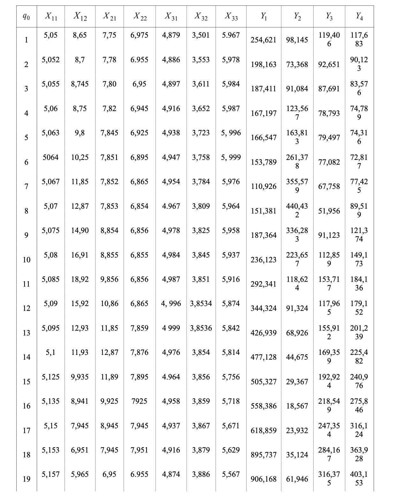
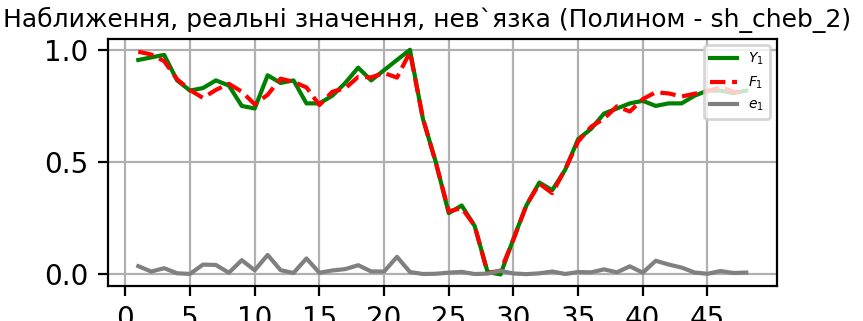
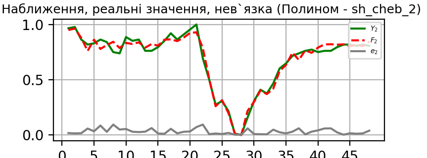
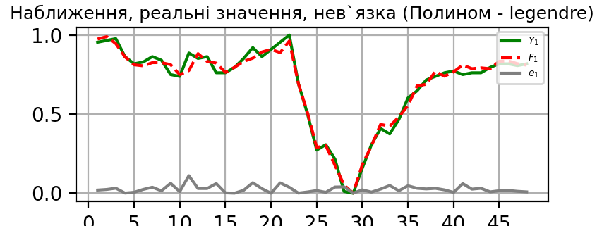
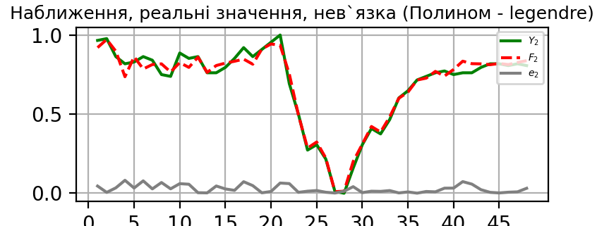
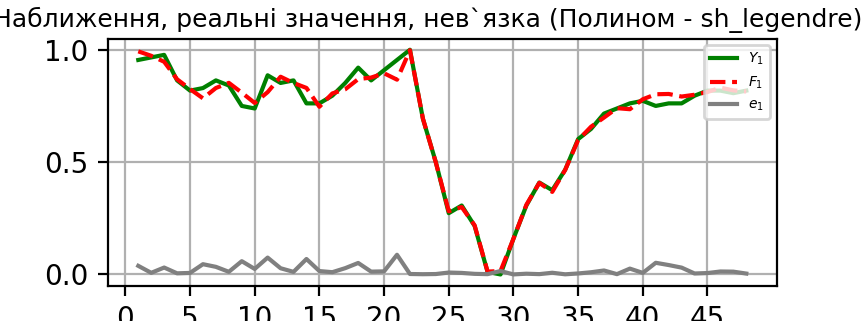
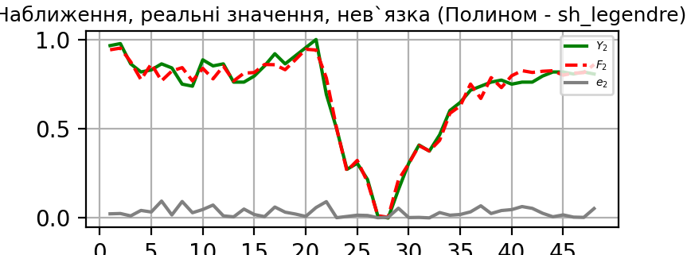
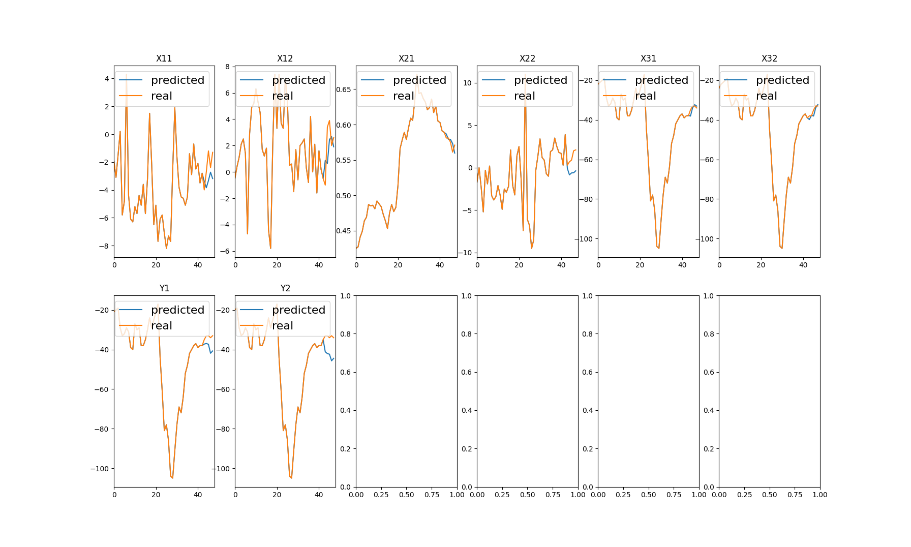

# Lab3

Вибрали два методи оптимізації:
1. Cформировали .exe файл. Запускаеться по времени в интервале [40 сек, 2 мин 30 сек], зависит от мощности машины. Добавили выбор между программой второй и третьей лабораторной работы.

Инструкция по запуску программы:
      1. Зайти в папку SA и нажать на "MyApplication3.exe" .
      3. Ожидать запуска программы.
      4. Для запуска №3 Программы нажать на кнопку "lab3"

1. Запустили программу для двух выборок которые данны по заданию и для своей. Результаты привели в протоколе.

1. Добавили свой вариант структуры Фpk и провели анализ в протоколе.

1. Сделали сравнительный анализ работы программ  2 и 3 работы(структуры на основе адитивных функций и мультипликативных) 

1. Добавили прогнозирование

1. Также пытались сделать прогноз с по ощью нейронной сети, но, к сожалению, получили довольно большие неточночти, для устранения этих проблем нужно больше времени и пересмотреть структуру сети.


## Результаты для выбоки



### Зміщені поліноми Чебишева другого роду
#### Y1


#### Y2


### Поліноми Лежандра
#### Y1


#### Y2


### Зміщенні поліноми Лежандра  
#### Y1


#### Y2


### Прогнузування на основі ARIMA(p,q,d)




### Приклад аналітичні результати роботи для  
```
Error normalised (Y - F)

--------  --------  ---------  --------
0.133436  0.162831  0.0716446  0.134824
--------  --------  ---------  --------

Error (Y_ - F_))
-------  -------  -------  -------
113.958  140.359  58.9981  53.7639
-------  -------  -------  -------
Input data: X
-----  ------  ------  -----  ------  ------  -----
5.05    8.65    7.75   6.975  4.879   3.501   5.967
5.052   8.7     7.78   6.955  4.886   3.553   5.978
5.055   8.745   7.8    6.95   4.897   3.611   5.984
5.06    8.75    7.82   6.945  4.916   3.652   5.987
5.063   9.8     7.845  6.925  4.938   3.723   5.996
5.064  10.25    7.851  6.895  4.947   3.758   5.999
5.067  11.85    7.852  6.865  4.954   3.784   5.976
5.07   12.87    7.853  6.854  4.967   3.809   5.964
5.075  14.9     8.854  6.856  4.978   3.825   5.958
5.08   16.91    8.855  6.855  4.984   3.845   5.937
5.085  18.92    9.856  6.856  4.987   3.851   5.916
5.09   15.92   10.86   6.865  4.996   3.8534  5.874
5.095  12.93   11.85   7.859  4.999   3.8536  5.842
5.1    11.93   12.87   7.876  4.976   3.854   5.814
5.125   9.935  11.89   7.895  4.964   3.856   5.756
5.135   8.941   9.925  7.925  4.958   3.859   5.718
5.15    7.945   8.945  7.945  4.937   3.867   5.671
5.153   6.951   7.945  7.951  4.916   3.879   5.629
5.157   5.965   6.95   6.955  4.874   3.886   5.567
5.2     4.965   5.965  6.975  4.842   3.897   5.486
5.25    3.974   4.975  7.001  4.814   3.916   5.452
5.3     2.981   5      7.125  4.756   3.938   5.501
5.315   3.985   6.975  7.145  4.718   3.947   5.554
5.325   4.99    7.955  7.165  4.671   3.954   5.621
5.35    5.995   8.945  7.195  4.629   3.967   5.658
5.353   7.997   9.935  7.209  4.567   3.978   5.712
5.357   9.001  10.92   7.225  4.482   3.984   5.753
5.4    10.94   11.89   7.25   4.452   3.987   5.781
5.425  12.9    12.86   7.975  4.364   3.996   5.802
5.445  10.88   14.85   7.955  4.326   3.999   5.825
5.465   8.944  15.85   7.95   4.264   3.976   5.845
5.475   6.78   12.85   7.945  4.184   3.964   5.851
5.485   6.764  10.85   7.925  4.156   3.958   5.854
5.495   6.568   8.865  7.895  4.136   3.937   5.856
5.497   6.437   6.859  7.865  4.129   3.916   5.854
5.5     5.325   4.876  7.854  4.116   3.874   5.856
5.515   5.206   2.895  7.853  4.098   3.842   5.859
5.525   5.149   1.925  7.855  4.0816  3.814   5.867
5.545   5.089   3.945  7.856  4.0686  3.756   5.879
5.575   4.933   4.953  7.865  4.0486  3.718   5.886
5.6     4.889   5.955  7.859  4.0246  3.671   5.005
5.65    3.935   6.975  7.876  4.0126  3.629   5.027
5.7     3.941   7.001  7.895  4.0114  3.567   5.049
5.745   2.945   7.125  7.925  4.0026  3.484   5.095
5.75    3.95    7.145  7.945  4.0019  3.452   5.189
-----  ------  ------  -----  ------  ------  -----

Input data: Y
-------  -------  -------  -------
254.621   98.145  119.406  117.683
198.163   73.368   92.651   90.123
187.411   91.084   87.691   83.576
167.197  123.567   78.793   74.789
166.547  163.813   79.497   74.316
153.789  261.378   77.082   72.817
110.926  355.579   67.758   77.425
151.381  440.432   51.956   89.519
187.364  336.283   91.123  121.374
236.123  223.657  112.859  149.173
292.341  118.624  153.717  184.136
344.324   91.324  117.965  179.152
426.939   68.926  155.912  201.239
477.128   44.675  169.359  225.482
505.327   29.367  192.924  240.976
558.386   18.567  218.549  275.846
618.859   23.932  247.354  316.124
895.737   35.124  284.167  363.928
906.168   61.946  316.375  403.153
885.761  121.387  341.326  431.195
790.639  310.519  375.651  471.588
723.784  485.142  446.856  436.847
731.438  588.125  548.314  441.842
721.321  683.435  644.716  439.425
691.845  772.834  729.942  422.147
508.614  880.562  849.316  435.954
429.956  687.987  748.231  450.492
330.129  488.951  647.987  454.897
127.152  385.494  442.967  458.289
78.654  211.209  232.856  172.164
52.145  196.197  115.632  153.356
86.243   87.325   93.135  127.168
126.345   64.615   77.824  106.123
132.879   52.534   63.453   82.659
167.156   32.178   52.167   93.834
170.531   66.176   42.836   91.345
184.243   70.364   37.192   96.841
191.956   76.428   25.834   93.952
216.829   83.475   50.985  109.463
383.329  104.924   98.591  133.415
279.421  184.183  102.861  108.613
225.356  286.324  105.817  107.319
176.578  366.457   78.473   82.263
170.948  265.814   81.417   84.132
158.334  184.549   78.653   81.953
-------  -------  -------  -------

X normalised:
----------  ----------  ---------  -----------  -----------  ---------  ---------
0           0.357121    0.418312   0.107939     0.879651     0.0895795  0.967807
0.00285714  0.36025     0.420467   0.0900981    0.886671     0.184644   0.978873
0.00714286  0.363067    0.421903   0.0856378    0.897703     0.290676   0.984909
0.0142857   0.36338     0.423339   0.0811775    0.916759     0.365631   0.987928
0.0185714   0.429108    0.425135   0.0633363    0.938823     0.49543    0.996982
0.02        0.457277    0.425566   0.0365745    0.947849     0.559415   1
0.0242857   0.557433    0.425637   0.00981267   0.954869     0.606947   0.976861
0.0285714   0.621283    0.425709   0            0.967907     0.652651   0.964789
0.0357143   0.748357    0.497594   0.00178412   0.978939     0.681901   0.958753
0.0428571   0.874178    0.497666   0.000892061  0.984956     0.718464   0.937626
0.05        1           0.569551   0.00178412   0.987965     0.729433   0.916499
0.0571429   0.812207    0.641652   0.00981267   0.996991     0.733821   0.874245
0.0642857   0.625039    0.712747   0.896521     1            0.734186   0.842052
0.0714286   0.562441    0.785996   0.911686     0.976933     0.734918   0.813883
0.107143    0.437559    0.715619   0.928635     0.964898     0.738574   0.755533
0.121429    0.375336    0.574506   0.955397     0.958881     0.744059   0.717304
0.142857    0.312989    0.504129   0.973238     0.93782      0.758684   0.67002
0.147143    0.250767    0.432316   0.978591     0.916759     0.780622   0.627767
0.152857    0.189045    0.360862   0.0900981    0.874636     0.793419   0.565392
0.214286    0.126448    0.290126   0.107939     0.842543     0.813528   0.483903
0.285714    0.0644131   0.219031   0.131133     0.814462     0.848263   0.449698
0.357143    0.00225352  0.220826   0.241748     0.756293     0.888483   0.498994
0.378571    0.0651017   0.362657   0.25959      0.718183     0.904936   0.552314
0.392857    0.128013    0.433034   0.277431     0.671046     0.917733   0.619718
0.428571    0.190923    0.504129   0.304193     0.628924     0.941499   0.656942
0.432857    0.316244    0.575224   0.316682     0.566744     0.961609   0.711268
0.438571    0.379092    0.645961   0.330955     0.481496     0.972578   0.752515
0.5         0.500469    0.715619   0.353256     0.451409     0.978062   0.780684
0.535714    0.623161    0.785278   1            0.363153     0.994516   0.801811
0.564286    0.496714    0.928187   0.982159     0.325043     1          0.82495
0.592857    0.375524    1          0.977698     0.262862     0.957952   0.84507
0.607143    0.240063    0.78456    0.973238     0.18263      0.936015   0.851107
0.621429    0.239061    0.640934   0.955397     0.154548     0.925046   0.854125
0.635714    0.226792    0.498384   0.928635     0.13449      0.886654   0.856137
0.638571    0.218592    0.354327   0.901873     0.12747      0.848263   0.854125
0.642857    0.148983    0.211921   0.892061     0.114432     0.771481   0.856137
0.664286    0.141534    0.0696589  0.891169     0.0963795    0.71298    0.859155
0.678571    0.137966    0          0.892953     0.0799318    0.661792   0.867203
0.707143    0.13421     0.145063   0.893845     0.066894     0.555759   0.879276
0.75        0.124444    0.217451   0.901873     0.0468358    0.486289   0.886318
0.785714    0.12169     0.289408   0.896521     0.022766     0.400366   0
0.857143    0.0619718   0.362657   0.911686     0.0107311    0.323583   0.0221328
0.928571    0.0623474   0.364524   0.928635     0.00952763   0.210238   0.0442656
0.992857    0           0.373429   0.955397     0.000702036  0.0585009  0.0905433
1           0.0629108   0.374865   0.973238     0            0          0.185111
----------  ----------  ---------  -----------  -----------  ---------  ---------

Y normalised:
---------  ----------  ---------  ----------
0.237085   0.0923184   0.11363    0.112511
0.170977   0.0635746   0.0811396  0.0433983
0.158387   0.0841269   0.0751164  0.0269804
0.134718   0.12181     0.0643111  0.00494519
0.133957   0.1685      0.065166   0.00375905
0.119018   0.281685    0.0622333  0
0.0688284  0.390967    0.0509106  0.0115555
0.116198   0.489405    0.0317214  0.0418837
0.158332   0.368582    0.0792841  0.121767
0.215425   0.237925    0.105679   0.191478
0.281252   0.116076    0.155295   0.279155
0.342121   0.0844054   0.11188    0.266657
0.438857   0.0584215   0.157961   0.322044
0.497625   0.0302879   0.17429    0.382839
0.530644   0.0125291   0.202907   0.421693
0.592772   0           0.234025   0.509137
0.663582   0.00622393  0.269004   0.610142
0.987786   0.0192078   0.313708   0.73002
1          0.050324    0.35282    0.828385
0.976105   0.119281    0.383119   0.898706
0.864724   0.338693    0.424802   1
0.786441   0.541273    0.51127    0.91288
0.795404   0.660744    0.634477   0.925406
0.783557   0.771313    0.751543   0.919345
0.749043   0.875025    0.855038   0.876017
0.534493   1           1          0.91064
0.44239    0.776594    0.877247   0.947097
0.325499   0.545692    0.755515   0.958144
0.0878278  0.425672    0.506548   0.96665
0.0310401  0.223484    0.251398   0.249133
0          0.206068    0.109047   0.201968
0.0399263  0.0797661   0.0817273  0.136296
0.0868829  0.0534203   0.0631343  0.0835216
0.0945338  0.0394051   0.0456828  0.0246808
0.13467    0.0157901   0.0319776  0.0527044
0.138622   0.0552312   0.0206465  0.0464628
0.154677   0.0600897   0.0137927  0.0602451
0.163709   0.0671245   0          0.0530003
0.192833   0.0752997   0.0305423  0.0918974
0.387793   0.100183    0.0883529  0.151962
0.266124   0.192131    0.0935382  0.0897658
0.202818   0.310625    0.0971278  0.0865208
0.145702   0.403587    0.0639225  0.0236878
0.13911    0.286831    0.0674975  0.0283747
0.12434    0.192556    0.064141   0.0229104
---------  ----------  ---------  ----------

matrix B:
---------  ----------  ---------  ----------
0.237085   0.0923184   0.11363    0.112511
0.170977   0.0635746   0.0811396  0.0433983
0.158387   0.0841269   0.0751164  0.0269804
0.134718   0.12181     0.0643111  0.00494519
0.133957   0.1685      0.065166   0.00375905
0.119018   0.281685    0.0622333  0
0.0688284  0.390967    0.0509106  0.0115555
0.116198   0.489405    0.0317214  0.0418837
0.158332   0.368582    0.0792841  0.121767
0.215425   0.237925    0.105679   0.191478
0.281252   0.116076    0.155295   0.279155
0.342121   0.0844054   0.11188    0.266657
0.438857   0.0584215   0.157961   0.322044
0.497625   0.0302879   0.17429    0.382839
0.530644   0.0125291   0.202907   0.421693
0.592772   0           0.234025   0.509137
0.663582   0.00622393  0.269004   0.610142
0.987786   0.0192078   0.313708   0.73002
1          0.050324    0.35282    0.828385
0.976105   0.119281    0.383119   0.898706
0.864724   0.338693    0.424802   1
0.786441   0.541273    0.51127    0.91288
0.795404   0.660744    0.634477   0.925406
0.783557   0.771313    0.751543   0.919345
0.749043   0.875025    0.855038   0.876017
0.534493   1           1          0.91064
0.44239    0.776594    0.877247   0.947097
0.325499   0.545692    0.755515   0.958144
0.0878278  0.425672    0.506548   0.96665
0.0310401  0.223484    0.251398   0.249133
0          0.206068    0.109047   0.201968
0.0399263  0.0797661   0.0817273  0.136296
0.0868829  0.0534203   0.0631343  0.0835216
0.0945338  0.0394051   0.0456828  0.0246808
0.13467    0.0157901   0.0319776  0.0527044
0.138622   0.0552312   0.0206465  0.0464628
0.154677   0.0600897   0.0137927  0.0602451
0.163709   0.0671245   0          0.0530003
0.192833   0.0752997   0.0305423  0.0918974
0.387793   0.100183    0.0883529  0.151962
0.266124   0.192131    0.0935382  0.0897658
0.202818   0.310625    0.0971278  0.0865208
0.145702   0.403587    0.0639225  0.0236878
0.13911    0.286831    0.0674975  0.0283747
0.12434    0.192556    0.064141   0.0229104
---------  ----------  ---------  ----------

matrix Lambda:
-----------  ----------  ------------  -----------
0.160071     0.587096    0.184488     -0.166508
0.0377411   -0.0581069  -0.0289045     0.198183
-0.399534     0.453236   -0.27319      -0.585595
0.00913811  -0.224783    0.0594142    -0.158398
0.177251    -0.426208   -0.100866      0.276552
-0.148203     0.771726    0.280131     -0.110053
0.504956     0.125179   -0.0960371     0.432834
-0.949227    -0.699459   -0.0662929    -1.17083
1.49216      0.0452112   0.99764       2.99807
-2.17447      0.186277   -2.37595      -4.35313
2.40002     -0.67721     2.1292        3.47179
-1.76648      1.32967    -0.689336     -1.636
1.45503     -1.71756     0.131055      1.60458
-1.32105      2.30359    -0.136735     -2.51091
0.722015    -2.36902     0.239127      2.34491
-0.402292     1.0649     -0.323496     -1.25026
-0.00821548  -0.0049923   0.131535      0.00846881
0.0743159    0.0700175   0.184202      0.421644
-0.077134     0.21635     0.117925      0.184126
-0.201188     0.29904    -0.0839418    -0.56896
-0.129118     0.364214   -0.00269092   -0.360508
0.19058     -0.157634    0.16978       0.119841
-0.24936      0.515522   -0.0940582     0.299207
-0.191576    -0.274513    0.0344262    -1.45096
0.154648     0.673104   -0.0921488     0.821546
0.186215    -0.849958    0.219986      0.57953
-0.124429     0.16786    -0.211102     -0.588822
0.225329    -0.264321    0.112097      0.22615
-0.0714013   -0.290981   -0.112251      0.453446
0.376517    -0.649184    0.0279073     0.674068
-0.154793     0.262493   -0.000770947  -0.9896
0.171901    -0.40638    -0.0446303     0.990464
-0.452512     1.01625     0.286824      0.701053
2.46818     -0.397186    0.861747      2.31904
0.401899    -0.119865    0.222257      0.425005
-2.357        0.363123   -0.817954     -2.15988
1.21782     -0.13515     0.412096      1.15429
1.06263     -0.0913623   0.208757      0.822211
-1.58174      0.217158   -0.18413      -1.24481
-0.261526     0.098823   -0.350636     -0.330788
1.77792     -0.603079    0.301127      1.20609
0.437613     0.385624    0.936042      1.33863
-2.27245     -0.0103225  -1.63501      -2.9075
2.56983     -0.162576    1.27888       2.66813
-1.90552      0.210998   -0.680164     -1.70996
-1.99388      0.30284    -0.689978     -1.82659
-0.850912    -1.6929     -0.742904     -1.77094
-0.908863    -0.889182   -0.537076     -1.1887
1.34775      1.02843     0.515881      1.67122
1.64529      1.69826     0.935153      1.50525
2.2273      -2.377       0.0854244     0.184585
-3.12942      2.97508     0.173476      0.214792
2.57488      0.55697     1.11885       0.838767
-3.09001     -3.73705    -2.43925      -1.29844
-1.03787      2.54134     0.65174      -2.99663
3.93397     -1.39002     0.852583      5.08067
-1.84368      0.411904   -0.724747     -2.8179
0.0228128    0.340929    0.468761      0.951964
-2.29077      1.38874    -0.159775     -1.25929
0.681818     3.62728     4.16217       3.66007
-0.191675    -1.56259    -1.79012      -1.51869
-0.401292    -2.09614    -2.40544      -2.11922
2.78174     -0.472508    0.368696      1.32782
-1.24118      0.179629   -0.197431     -0.516691
-1.68826      0.294821   -0.215269     -0.825418
4.74182     -1.67469     0.93918       3.03912
-2.43403      0.475496   -0.734304     -1.77117
-----------  ----------  ------------  -----------

matrix Psi1:
----------  ---------  -------  ---------  ---------  --------  --------
0.0662089  0.0889308  1.71077  -0.476983  -0.714862  1.20625   0.601532
0.0625792  0.0873635  1.71319  -0.515517  -0.714746  1.54122   0.578714
0.0590089  0.0860697  1.71513  -0.524697  -0.714565  1.7499    0.566454
0.0579682  0.0859326  1.71733  -0.533584  -0.714256  1.8023    0.560373
0.0602236  0.0769641  1.72043  -0.565222  -0.713904  1.76408   0.542325
0.0614453  0.0785945  1.72123  -0.596498  -0.713761  1.70839   0.536373
0.0664937  0.107445   1.72137  -0.602422  -0.713651  1.6584    0.58283
0.0735739  0.0971064  1.72151  -0.597125  -0.713447  1.60615   0.607833
0.0897205  0.0638132  2.08135  -0.598412  -0.713276  1.5714    0.620535
0.11101    0.0940333  2.08179  -0.597787  -0.713182  1.52722   0.666061
0.137045   0.126847   2.21872  -0.598412  -0.713136  1.51388   0.713283
0.167348   0.149474   2.0887   -0.602422  -0.712997  1.50855   0.812951
0.201352   0.0950813  2.40122  -0.583853  -0.712951  1.5081    0.893668
0.238392   0.108405   1.66824  -0.571147  -0.713307  1.50721   0.967722
0.439701   0.0772482  2.39472  -0.583956  -0.713494  1.50276   1.13113
0.510053   0.08164    2.20191  -0.56283   -0.713588  1.49609   1.24511
0.583589   0.126066   2.12005  -0.537144  -0.713919  1.4783    1.39256
0.592682   0.204591   1.73674  -0.534126  -0.714256  1.4517    1.52881
0.601744   0.257283   1.86143  -0.515517  -0.714945  1.43625   1.73239
0.532605   0.276723   2.32484  -0.476983  -0.715488  1.41212   1.98406
0.437035   0.280143   2.12895  -0.427358  -0.715978  1.37097   2.07614
0.449592   0.21889    2.14371  -0.355697  -0.717052  1.32439   1.94016
0.434708   0.280313   1.85098  -0.373927  -0.717808  1.30571   1.77459
0.419128   0.276405   1.73871  -0.400552  -0.718817  1.29134   1.55506
0.368072   0.25631    2.12005  -0.45795   -0.719806  1.26506   1.43438
0.360821   0.122438   2.19931  -0.492249  -0.721458  1.24324   1.26356
0.350611   0.0806414  2.10567  -0.536936  -0.724232  1.23151   1.13994
0.174389   0.0876354  2.39472  -0.615854  -0.725395  1.22568   1.05907
0.0323375  0.0961082  1.67808  -0.534335  -0.729546  1.20839   1.00043
-0.0558314  0.0864346  1.19984  -0.533144  -0.731757  1.20269   0.938248
-0.101412   0.0815864  1.15119  -0.53449   -0.736043  1.24718   0.885924
-0.109733   0.216776   1.68791  -0.537144  -0.743056  1.27108   0.870545
-0.111285   0.217859   2.08621  -0.56283   -0.745961  1.2832    0.862911
-0.108238   0.230229   2.08616  -0.583956  -0.74819   1.32648   0.857841
-0.107208   0.237522   1.90183  -0.5752    -0.749001  1.37097   0.862911
-0.105424   0.27166    2.06865  -0.59455   -0.750551  1.46277   0.857841
-0.0919738  0.273463   1.86677  -0.597043  -0.75279   1.53388   0.850268
-0.0778616  0.274276   1.92218  -0.592171  -0.754926  1.59537   0.830252
-0.036622   0.275102   1.6324   -0.589909  -0.756683  1.71198   0.800715
0.0193013  0.277123   2.11578  -0.5752    -0.7595    1.77056   0.783754
0.0300404  0.277661   2.32769  -0.583853  -0.763057  1.80538   0.676866
-0.0621477  0.279471   1.85098  -0.571147  -0.764907  1.78141   0.853652
-0.107643   0.279581   1.84043  -0.583956  -0.765094  1.60758   1.03002
-0.0496514  0.214677   1.79497  -0.56283   -0.766484  1.07019   1.38402
-0.131191   0.279742   1.78843  -0.537144  -0.766596  0.789913  1.95674
----------  ---------  -------  ---------  ---------  --------  --------

matrix Psi2:
--------  ----------  --------  ------------  --------  ---------  ---------
0.376922  -0.193746   0.67522   -0.348658     10.6948   -0.800851  -0.46358
0.390063  -0.194044   0.671242  -0.340923     10.6495   -0.806022  -0.464327
0.406994  -0.194272   0.668574  -0.337582     10.5788   -0.809371  -0.464732
0.427606  -0.194294   0.665896  -0.333695     10.4581   -0.81064   -0.464934
0.43539   -0.176743   0.662535  -0.31286      10.3207   -0.811464  -0.465537
0.437233  -0.155788   0.661726  -0.266337     10.2653   -0.811461  -0.465737
0.440563  -0.138248   0.661592  -0.201267     10.2226   -0.811348  -0.464191
0.440721  -0.104269   0.661457  -0.172204     10.1439   -0.811176  -0.463375
0.434497  -0.0486224  0.542624  -0.17772      10.078    -0.811041  -0.462964
0.421224  -0.129179   0.542541  -0.174975     10.0424   -0.810851  -0.46151
0.402324  -0.204113   0.499729  -0.17772      10.0247   -0.81079   -0.46003
0.379343  -0.212811   0.477608  -0.201267      9.97189  -0.810766  -0.456978
0.353849  -0.0994732  0.466939  -0.370067      9.95439  -0.810764  -0.454552
0.327345  -0.138503   0.56442   -0.295982     10.09     -0.81076   -0.452345
0.221358  -0.170825   0.468563  -0.277596     10.1619   -0.810739  -0.447458
0.205791  -0.194669   0.49869   -0.331716     10.1982   -0.810707  -0.443966
0.219236  -0.188459   0.535428  -0.312563     10.3269   -0.810622  -0.439238
0.227189  -0.188922   0.648998  -0.289827     10.4581   -0.81049   -0.434531
0.240378  -0.196981   0.757987  -0.340923     10.7273   -0.810412  -0.426493
0.506887  -0.217188   0.775727  -0.348658     10.938    -0.810286  -0.413269
0.750684  -0.246782   0.769915  -0.344459     11.1256   -0.810066  -0.406474
1.01591   -0.213978   0.76971   -0.0749222    11.5205   -0.809806  -0.416007
1.16193   -0.246604   0.756349   0.000119056  11.7806   -0.809699  -0.424606
1.25338   -0.216439   0.647641   0.0736641    12.0976   -0.809616  -0.433573
1.33815   -0.19663    0.535428   0.161559     12.37     -0.809462  -0.437835
1.32819   -0.188755   0.498544   0.184916     12.7351   -0.809332  -0.44339
1.30794   -0.194547   0.475544   0.192253     13.1031   -0.809262  -0.447191
0.824315  -0.133083   0.468563   0.156412     13.1762   -0.809227  -0.449622
0.580973  -0.101905   0.562999  -0.147606     13.1335   -0.809122  -0.451371
0.452971  -0.133927   0.679013  -0.271017     12.9624   -0.809087  -0.453222
0.368737  -0.194666   0.708149  -0.294098     12.4353   -0.809356  -0.454784
0.34134   -0.189905   0.561585  -0.312563     11.2451   -0.809498  -0.455244
0.323812  -0.190006   0.47795   -0.331716     10.6912   -0.809569  -0.455473
0.315644  -0.191355   0.541713  -0.277596     10.2553   -0.809818  -0.455625
0.315015  -0.192372   0.763356  -0.338611     10.0953   -0.810066  -0.455473
0.314621  -0.207639   0.770916  -0.399438      9.78862  -0.810546  -0.455625
0.320254  -0.21049    0.776043  -0.405568      9.34511  -0.810881  -0.455853
0.328511  -0.211964   0.756193  -0.393383      8.92412  -0.811136  -0.456455
0.356934  -0.213592   0.784983  -0.387411      8.58059  -0.811466  -0.457348
0.458767  -0.218164   0.770112  -0.338611      8.03841  -0.811447  -0.457864
0.502505  -0.219534   0.775608  -0.370067      7.37231  -0.811002  -0.11771
0.729736  -0.247349   0.756349  -0.295982      7.0356   -0.81002   -0.148876
0.880748  -0.247268   0.754571  -0.277596      7.00187  -0.807033  -0.177153
0.588225  -0.210383   0.745055  -0.331716      6.7543   -0.798601  -0.228051
0.61837   -0.247143   0.743362  -0.312563      6.7346   -0.793497  -0.304504
--------  ----------  --------  ------------  --------  ---------  ---------

matrix Psi3:
----------  ---------  --------  ----------  -------  ---------  ------------
-0.0664589  0.172338   0.868227  -0.363711   3.99253  -0.777659   0.013389
-0.0735897  0.171937   0.868127  -0.388498   3.9705   -0.774002   0.00623492
-0.0829121  0.171591   0.868195  -0.394433   3.93614  -0.77259    0.00237
-0.0949212  0.171554   0.868371  -0.400221   3.87757  -0.772854   0.000447375
-0.1001     0.171217   0.868746  -0.421459   3.81102  -0.774863  -0.00528137
-0.101501   0.177112   0.868862  -0.445262   3.7842   -0.776284  -0.00717795
-0.104758   0.209258   0.868882  -0.455828   3.76351  -0.777439   0.00752907
-0.106639   0.212169   0.868903  -0.455717   3.72547  -0.7786     0.0153556
-0.106878   0.208988   1.01909   -0.455909   3.69369  -0.779358   0.0193088
-0.103736   0.233719   1.01933   -0.455823   3.67651  -0.780314   0.0333557
-0.0975001  0.280108   1.17256   -0.455909   3.66796  -0.780602   0.0477342
-0.0884715  0.219514   1.06851   -0.455828   3.64248  -0.780717   0.0774988
-0.0769659  0.211987   1.07416   -0.459468   3.63405  -0.780726   0.101086
-0.0633142  0.210161   0.938898  -0.436182   3.69944  -0.780746   0.122368
0.0247528  0.172588   1.07261   -0.443858   3.7342   -0.780842   0.168329
0.0625826  0.170302   1.17015   -0.455969   3.75175  -0.780986   0.199746
0.114408   0.178497   1.04123   -0.404234   3.81401  -0.781369   0.239885
0.12363    0.179191   0.871983  -0.374665   3.87757  -0.781944   0.27675
0.135219   0.164656   0.944063  -0.388498   4.00834  -0.782278   0.332258
0.210534   0.143907   1.07643   -0.363711   4.11095  -0.782801   0.404559
0.267728   0.115026   0.993395  -0.330523   4.20253  -0.783698   0.433831
0.419018   0.062678   0.997985  -0.175171   4.39595  -0.784722   0.391358
0.485108   0.115453   0.940165  -0.14821    4.52371  -0.785136   0.34396
0.530424   0.144468   0.872461  -0.123128   4.67991  -0.785455   0.283857
0.622013   0.165235   1.04123   -0.0970837  4.81445  -0.786043   0.251207
0.628256   0.178094   1.16966   -0.0934963  4.99513  -0.786535   0.204795
0.634148   0.16999    1.06558   -0.0988572  5.17716  -0.7868     0.170773
0.467194   0.191666   1.07261   -0.131232   5.21303  -0.786933   0.148214
0.23087    0.212079   0.940694  -0.205617   5.18896  -0.787327   0.131672
0.0631093  0.190275   0.926752  -0.351643   5.10205  -0.787457   0.113936
-0.0470624  0.170285   0.789838  -0.380021   4.83701  -0.786446   0.098841
-0.0802074  0.177609   0.94249   -0.404234   4.24627  -0.785908   0.0943723
-0.101462   0.177436   1.06909   -0.455969   3.9745   -0.785637   0.0921483
-0.113559   0.174988   1.02176   -0.443858   3.76202  -0.784676   0.0906695
-0.115117   0.17305    0.958621  -0.447464   3.68435  -0.783698   0.0921483
-0.117006   0.151683   0.974847  -0.472324   3.53598  -0.781705   0.0906695
-0.120176   0.149172   0.941961  -0.475172   3.32253  -0.78017    0.0884571
-0.118105   0.147952   0.89891   -0.469564   3.1212   -0.778835   0.0825912
-0.106511   0.146653   0.851226  -0.466896   2.95786  -0.776198   0.0738845
-0.0680364  0.143182   0.989318  -0.447464   2.70187  -0.774678   0.0688568
-0.02088    0.142173   1.07693   -0.459468   2.39051  -0.773235   0.432997
-0.020095   0.113488   0.940165  -0.436182   2.23451  -0.7726     0.461187
-0.0442935  0.113727   0.936168  -0.443858   2.21893  -0.773431   0.486083
0.0096429  0.0602728  0.918087  -0.455969   2.10492  -0.779428   0.52704
-0.047197   0.114084   0.915348  -0.404234   2.09587  -0.783567   0.564275
----------  ---------  --------  ----------  -------  ---------  ------------

matrix Psi4:
----------  --------  -------  ---------  --------  ---------  --------
-0.232371   0.399279  4.07462  -0.740103  0.947659  -0.635477  0.410072
-0.246664   0.401916  4.07452  -0.766493  0.941299  -0.607853  0.392209
-0.264851   0.4043    4.07519  -0.77254   0.931361  -0.588813  0.3826
-0.287106   0.404565  4.07645  -0.778283  0.914365  -0.581577  0.377831
-0.295986   0.41237   4.07885  -0.797581  0.894979  -0.577498  0.363665
-0.298243   0.381421  4.07957  -0.812678  0.887145  -0.578072  0.358989
-0.303      0.536035  4.07969  -0.806683  0.881091  -0.579191  0.395433
-0.304855   0.64099   4.07982  -0.797843  0.869943  -0.580662  0.415
-0.30188    0.598372  4.8673   -0.799759  0.860609  -0.581755  0.424928
-0.291826   0.68141   4.86854  -0.798819  0.855557  -0.583242  0.460448
-0.275218   0.764967  5.63869  -0.799759  0.853041  -0.583709  0.497191
-0.252566   0.699862  5.39585  -0.806683  0.845535  -0.583899  0.574452
-0.224403   0.638572  5.94426  -0.815317  0.843047  -0.583914  0.636782
-0.191321   0.552437  4.74575  -0.80141   0.862299  -0.583946  0.693818
0.0202717  0.403669  5.93806  -0.80522   0.872505  -0.584105  0.819365
0.107909   0.414217  5.62831  -0.803922  0.877648  -0.584345  0.906857
0.216941   0.375964  4.98053  -0.768016  0.895853  -0.584992  1.02027
0.234004   0.401309  4.09773  -0.749015  0.914365  -0.585982  1.12564
0.253949   0.426426  4.52406  -0.766493  0.952218  -0.586567  1.28528
0.299711   0.451252  5.546    -0.740103  0.981679  -0.587497  1.49077
0.293385   0.541655  5.24049  -0.704456  1.00778   -0.589119  1.57101
0.314494   0.419968  5.2663   -0.65309   1.06224   -0.591007  1.45382
0.305298   0.540902  4.49902  -0.659871  1.09765   -0.591778  1.31889
0.305127   0.449722  4.10043  -0.667568  1.14017   -0.592375  1.14604
0.351678   0.426126  4.98053  -0.681302  1.17593   -0.593479  1.05253
0.361592   0.376365  5.62617  -0.689359  1.22197   -0.594404  0.921029
0.375506   0.416899  5.41784  -0.700599  1.26269   -0.594906  0.826126
0.387145   0.379255  5.93806  -0.72384   1.26782   -0.595155  0.764037
0.167939   0.639886  4.7632   -0.634476  1.24215   -0.5959    0.718978
-0.0280761  0.374918  3.68048  -0.734118  1.20731   -0.596146  0.671132
-0.16665    0.414357  3.86186  -0.752462  1.11257   -0.594237  0.630809
-0.21051    0.40788   4.78062  -0.768016  0.913461  -0.593225  0.618945
-0.240018   0.408465  5.39282  -0.803922  0.823371  -0.592716  0.613053
-0.257826   0.415024  4.88095  -0.80522   0.75311   -0.590921  0.60914
-0.260195   0.418649  4.61925  -0.808261  0.72744   -0.589119  0.613053
-0.263077   0.435279  5.13532  -0.822681  0.678387  -0.585567  0.60914
-0.266904   0.439201  5.11061  -0.824288  0.607749  -0.583012  0.603292
-0.261589   0.441526  4.99175  -0.821116  0.540982  -0.580993  0.587828
-0.243814   0.444314  4.44351  -0.819594  0.48668   -0.578008  0.564986
-0.241395   0.453307  5.21748  -0.808261  0.401257  -0.577527  0.551856
-0.226933   0.456312  5.55218  -0.815317  0.296714  -0.579597  0.926197
-0.296981   0.544117  4.49902  -0.80141   0.244016  -0.585088  1.05336
-0.340067   0.54376   4.47354  -0.80522   0.238741  -0.60218   1.17451
-0.255709   0.406489  4.3607   -0.803922  0.200056  -0.646749  1.40111
-0.346966   0.54321   4.34395  -0.768016  0.19698   -0.670701  1.71391
----------  --------  -------  ---------  --------  ---------  --------

matrix a:
--------  --------  --------  -------
1.00005   1.00007   0.999907  1.00004
0.999981  1.00015   1.00002   1.00007
1.01371   1.00455   1.00152   1.00308
1.01846   1.00729   1.00205   1.0036
1.00001   0.999997  1         1
1.00001   0.999997  1         1
1         0.999999  1         1
--------  --------  --------  -------

matrix F1:
----------  -----------  ----------
0.161029    0.420205    0.00749892
0.155411    0.314901    0.144399
0.150159    0.290467    0.229538
0.148883    0.266935    0.249458
0.141824    0.180832    0.219663
0.144871    0.0947053   0.191067
0.181084    0.0783934   0.2049
0.177827    0.0930843   0.200729
0.159262    0.235694    0.194794
0.215486    0.23783     0.207646
0.28128     0.291552    0.235522
0.341843    0.226082    0.305252
0.315587    0.416262    0.363343
0.372652    0.141804    0.414402
0.550939    0.41316     0.528147
0.633363    0.400738    0.605055
0.783261    0.446134    0.696318
0.918566    0.274601    0.771583
1.01388     0.387755    0.89756
0.956741    0.746812    1.0479
0.839632    0.801383    1.0715
0.766918    1.04094     0.933694
0.836898    0.795165    0.805297
0.811403    0.648903    0.646191
0.718741    0.69851     0.545
0.527457    0.630045    0.414359
0.459544    0.440037    0.316872
0.277315    0.302894    0.25847
0.131553    0.24634     0.194795
0.025773    0.0236789   0.145221
-0.0281062  -0.00220713  0.118652
0.0832453   0.243291    0.0915399
0.082319    0.349438    0.0805301
0.0970603   0.283033    0.08838
0.10484     0.231225    0.10864
0.137585    0.24258     0.141339
0.156327    0.152489    0.159007
0.175049    0.189544    0.164147
0.228397    0.0760933   0.188235
0.301768    0.323292    0.18855
0.316038    0.385231    0.11464
0.199946    0.221109    0.212086
0.141832    0.179533    0.243461
0.154359    0.220435    0.152488
0.111838    0.29044     0.235245
----------  -----------  ----------

matrix F2:
-----------  ------------  ----------
0.110136     0.0902958     0.249324
0.120318     0.100706      0.210486
0.133644     0.104553      0.181471
0.150219     0.109288      0.160935
0.181688     0.141913      0.14074
0.213328     0.219214      0.13475
0.241411     0.328063      0.134389
0.290508     0.376633      0.12918
0.364772     0.269163      0.124175
0.237635     0.273362      0.124725
0.116078     0.233714      0.126367
0.0857865    0.180379      0.127454
0.219183    -0.0774269     0.130696
0.1435       0.100807      0.149346
0.0127041    0.060238      0.167257
-0.0289596    0.000453678   0.178649
-0.0105588    0.0546885     0.202874
-0.00467221   0.17082       0.227869
-0.00397163   0.158104      0.275112
0.179597     0.156016      0.328825
0.318639     0.159697      0.366928
0.584566     0.640449      0.390683
0.6288       0.76107       0.399446
0.765692     0.773958      0.412428
0.878442     0.788928      0.432113
0.888781     0.781124      0.457672
0.858983     0.764601      0.487049
0.581559     0.703042      0.488463
0.419885     0.333449      0.480071
0.258382     0.22404       0.457486
0.102277     0.205664      0.396495
0.0865992    0.0727383     0.270768
0.0722657   -0.013454      0.212323
0.0638742    0.113296      0.165264
0.0620282    0.165762      0.147523
0.0416357    0.0623596     0.112676
0.0423365    0.0544952     0.0646018
0.0468966    0.0641865     0.0187718
0.0670869    0.0924395    -0.0198259
0.140503     0.170249     -0.0760803
0.172641     0.11767       0.39609
0.301879     0.236509      0.299331
0.415697     0.26775       0.270556
0.254084     0.165722      0.205558
0.218388     0.198211      0.11086
-----------  ------------  ----------

matrix F3:
---------  -----------  ----------
0.0944353   0.188758     0.124908
0.0857046   0.142294     0.130326
0.0744635   0.131226     0.125188
0.060361    0.120499     0.108414
0.0539903   0.0809601    0.0774163
0.0576466   0.0364606    0.0626204
0.0825932   0.0166888    0.0681517
0.0829184   0.0169084    0.0622868
0.0797883   0.0983698    0.0556236
0.105753    0.0986766    0.0616326
0.155312    0.181985     0.0730293
0.111635    0.125462     0.0969135
0.118717    0.120974     0.118839
0.133551    0.0930005    0.156458
0.201613    0.152555     0.212188
0.243538    0.180547     0.248578
0.313316    0.216123     0.304967
0.324963    0.170603     0.35793
0.322127    0.188799     0.452728
0.384716    0.321452     0.55919
0.413521    0.334831     0.613516
0.507912    0.649079     0.616243
0.65651     0.653735     0.595076
0.751456    0.64303      0.564502
0.889947    0.844674     0.556555
0.918157    0.968721     0.541841
0.911854    0.863035     0.541872
0.748348    0.802094     0.519998
0.491888    0.54248      0.489537
0.265388    0.249357     0.444714
0.115216    0.109554     0.369727
0.0831675   0.157208     0.229182
0.0579846   0.125488     0.164613
0.041571    0.124234     0.118348
0.0380263   0.0819975    0.106603
0.0169427   0.0417895    0.0799617
0.0110829   0.0188759    0.034275
0.0123871   0.00692042  -0.0132591
0.0245349  -0.013454    -0.0487765
0.065413    0.098981    -0.108451
0.118329    0.122478     0.101757
0.0911166   0.0937155    0.0747417
0.0644028   0.076569     0.0838145
0.0704969   0.0432282    0.0458051
0.0615095   0.141014     0.048138
---------  -----------  ----------

matrix F4:
-----------  ----------  -----------
0.0741415    0.319085    0.00110327
0.0561263    0.184661    0.0598534
0.0323811    0.15403     0.0979914
0.00131546   0.125065    0.103662
-0.0056613    0.0272934   0.0917936
-0.0305705   -0.0494563   0.082079
0.070633    -0.0188999   0.104595
0.140749     0.0261544   0.109554
0.115875     0.174477    0.108866
0.190758     0.180261    0.12939
0.279251     0.329395    0.154938
0.270567     0.236182    0.209068
0.270902     0.282352    0.255191
0.255452     0.140559    0.312398
0.432159     0.351506    0.416859
0.566869     0.299621    0.488215
0.674518     0.387735    0.589534
0.729277     0.279511    0.684742
0.788726     0.289944    0.844474
0.886277     0.702886    1.03608
0.994035     0.846655    1.12098
0.866607     1.17785     1.06966
1.01142      0.872944    0.985686
0.892141     0.697342    0.87218
0.927735     0.908644    0.815586
0.874112     1.0617      0.731275
0.949027     0.92418     0.673832
0.913296     0.91858     0.619588
0.915366     1.11033     0.557483
0.336344     0.244439    0.489701
0.178675     0.203313    0.397934
0.111523     0.341206    0.260103
0.0704219    0.253308    0.197902
0.0502063    0.145002    0.15401
0.0495369    0.0767538   0.144899
0.0577041    0.0872157   0.119283
0.055086     0.0729755   0.0748661
0.0644526    0.0711049   0.0252325
0.0921862   -0.0188822  -0.0181787
0.102502     0.191759   -0.0813113
0.125845     0.209732    0.0500521
0.0855604    0.0914337   0.059856
0.018792     0.065444    0.0715873
0.0468489    0.0503905   0.0178819
0.0077821    0.239593    0.0697252
-----------  ----------  -----------

matrix c:
-----------  ----------  -----------  ----------
0.964352     0.72347     0.909913     0.937718
0.043599     0.319571    0.0979498    0.075038
-0.00194742  -0.0334067  -0.00546753  -0.0060376
-----------  ----------  -----------  ----------

Y rebuilt normalized :
----------  -----------  ---------  -----------
0.172648    0.100517    0.103406    0.0918151
0.162973    0.112352    0.091096    0.0656356
0.156766    0.124072    0.0798086   0.0408822
0.154566    0.138159    0.0659973   0.00952484
0.144262    0.17209     0.056608   -0.00382609
0.143477    0.220198    0.055667   -0.0328446
0.17754     0.274949    0.076237    0.0639272
0.175109    0.326575    0.0765863   0.132915
0.163457    0.346154    0.0819271   0.121037
0.217893    0.255516    0.10557     0.191745
0.283726    0.153264    0.158766    0.285865
0.339009    0.114642    0.113345    0.270376
0.321907    0.120215    0.119238    0.273903
0.364189    0.130947    0.129729    0.248015
0.548781    0.0229181   0.197186    0.429482
0.6273     -0.026256    0.237841    0.550186
0.773363    0.00317048  0.304359    0.657329
0.892342    0.040969    0.309692    0.697128
0.990026    0.0365626   0.308634    0.75189
0.954773    0.169214    0.378568    0.878986
0.84426     0.267463    0.405761    0.991051
0.783832    0.616368    0.522108    0.895086
0.841832    0.686348    0.658584    1.01025
0.810778    0.791351    0.743941    0.884957
0.723806    0.877566    0.890345    0.935509
0.535922    0.881293    0.928355    0.896466
0.462296    0.853007    0.912226    0.957699
0.280336    0.629877    0.757233    0.923987
0.137053    0.394443    0.498217    0.940213
0.0256183   0.24395     0.263605    0.330937
-0.0274241   0.126441    0.113699    0.180594
0.0902801   0.0773667   0.0896603   0.127248
0.0933007   0.0405179   0.0639986   0.0829262
0.105207    0.0767892   0.0490861   0.0567851
0.110727    0.0919401   0.0419817   0.0513446
0.142849    0.0463175   0.019056    0.0599279
0.157163    0.0458861   0.0117449   0.0566802
0.176837    0.0538143   0.0120221   0.0656389
0.222916    0.0788547   0.0212239   0.0847718
0.304995    0.159512    0.069859    0.110911
0.321585    0.14984     0.119125    0.133311
0.202152    0.283965    0.0916891   0.0867564
0.144171    0.376179    0.0656423   0.0220367
0.158165    0.229436    0.0681053   0.0476138
0.119566    0.217965    0.0692726   0.0232452
----------  -----------  ---------  -----------

Y rebuilt :
--------  ---------  --------  --------
199.59    105.212    110.987   109.43
191.328   115.414    100.85     98.9906
186.027   125.516     91.555    89.1196
184.148   137.659     80.1816   76.6152
175.348   166.908     72.4497   71.2913
174.677   208.377     71.6748   59.7195
203.768   255.572     88.6138   98.3093
201.692   300.073     88.9015  125.819
191.741   316.95      93.2995  121.083
238.23    238.82     112.769   149.279
294.454   150.679    156.575   186.812
341.666   117.388    119.172   180.635
327.061   122.192    124.024   182.042
363.17    131.443    132.663   171.718
520.817    38.3223   188.213   244.082
587.874    -4.06555  221.692   292.215
712.615    21.2999   276.468   334.941
814.226    53.882    280.859   350.812
897.65     50.0837   279.988   372.649
867.543   164.428    337.578   423.331
773.162   249.119    359.971   468.019
721.556   549.873    455.78    429.751
771.089   610.196    568.166   475.677
744.568   700.708    638.456   425.712
670.292   775.025    759.017   445.871
509.835   778.237    790.318   430.302
446.957   753.855    777.036   454.72
291.559   561.518    649.402   441.276
169.192   358.575    436.106   447.747
74.0236  228.851    242.908   204.785
28.7242  127.558    119.463   144.833
129.246    85.2567    99.6677  123.56
131.826    53.4932    78.5357  105.886
141.995    84.7589    66.2556   95.4613
146.708    97.8189    60.4052   93.2917
174.141    58.4925    41.5263   96.7145
186.365    58.1205    35.5057   95.4194
203.168    64.9546    35.734    98.9919
242.521    86.5393    43.3115  106.622
312.618   156.066     83.3616  117.045
326.786   147.728    123.932   125.978
224.788   263.343    101.338   107.413
175.27    342.832     79.8893   81.6046
187.222   216.34      81.9175   91.804
154.257   206.452     82.8787   82.0865
--------  ---------  --------  --------

Psi^1_[1,1]=(1 + P0(x11))^(0.160071) * (1 + P1(x11))^(0.037741) * (1 + P2(x11))^(-0.399534) * (1 + P3(x11))^(0.009138) * (1 + P4(x11))^(0.177251) * (1 + P5(x11))^(-0.148203) * (1 + P6(x11))^(0.504956) * (1 + P7(x11))^(-0.949227) * (1 + P8(x11))^(1.492161) * (1 + P9(x11))^(-2.174472) * (1 + P10(x11))^(2.400015) * (1 + P11(x11))^(-1.766485) * (1 + P12(x11))^(1.455026) * (1 + P13(x11))^(-1.321051) * (1 + P14(x11))^(0.722015) * (1 + P15(x11))^(-0.402292) - 1

Psi^1_[1,2]=(1 + P0(x12))^(-0.008215) * (1 + P1(x12))^(0.074316) * (1 + P2(x12))^(-0.077134) * (1 + P3(x12))^(-0.201188) * (1 + P4(x12))^(-0.129118) * (1 + P5(x12))^(0.190580) * (1 + P6(x12))^(-0.249360) * (1 + P7(x12))^(-0.191576) * (1 + P8(x12))^(0.154648) * (1 + P9(x12))^(0.186215) * (1 + P10(x12))^(-0.124429) * (1 + P11(x12))^(0.225329) * (1 + P12(x12))^(-0.071401) * (1 + P13(x12))^(0.376517) * (1 + P14(x12))^(-0.154793) * (1 + P15(x12))^(0.171901) - 1

Psi^1_[2,1]=(1 + P0(x21))^(-0.452512) * (1 + P1(x21))^(2.468179) * (1 + P2(x21))^(0.401899) * (1 + P3(x21))^(-2.356998) * (1 + P4(x21))^(1.217818) * (1 + P5(x21))^(1.062626) * (1 + P6(x21))^(-1.581738) * (1 + P7(x21))^(-0.261526) * (1 + P8(x21))^(1.777918) * (1 + P9(x21))^(0.437613) * (1 + P10(x21))^(-2.272449) * (1 + P11(x21))^(2.569829) * (1 + P12(x21))^(-1.905522) - 1

Psi^1_[2,2]=(1 + P0(x22))^(-1.993882) * (1 + P1(x22))^(-0.850912) * (1 + P2(x22))^(-0.908863) * (1 + P3(x22))^(1.347754) * (1 + P4(x22))^(1.645286) * (1 + P5(x22))^(2.227304) * (1 + P6(x22))^(-3.129422) * (1 + P7(x22))^(2.574881) * (1 + P8(x22))^(-3.090012) * (1 + P9(x22))^(-1.037871) * (1 + P10(x22))^(3.933967) * (1 + P11(x22))^(-1.843678) * (1 + P12(x22))^(0.022813) - 1

Psi^1_[3,1]=(1 + P0(x31))^(-2.290775) * (1 + P1(x31))^(0.681818) * (1 + P2(x31))^(-0.191675) - 1

Psi^1_[3,2]=(1 + P0(x32))^(-0.401292) * (1 + P1(x32))^(2.781739) * (1 + P2(x32))^(-1.241182) - 1

Psi^1_[3,3]=(1 + P0(x33))^(-1.688264) * (1 + P1(x33))^(4.741825) * (1 + P2(x33))^(-2.434032) - 1

Psi^2_[1,1]=(1 + P0(x11))^(0.587096) * (1 + P1(x11))^(-0.058107) * (1 + P2(x11))^(0.453236) * (1 + P3(x11))^(-0.224783) * (1 + P4(x11))^(-0.426208) * (1 + P5(x11))^(0.771726) * (1 + P6(x11))^(0.125179) * (1 + P7(x11))^(-0.699459) * (1 + P8(x11))^(0.045211) * (1 + P9(x11))^(0.186277) * (1 + P10(x11))^(-0.677210) * (1 + P11(x11))^(1.329671) * (1 + P12(x11))^(-1.717560) * (1 + P13(x11))^(2.303594) * (1 + P14(x11))^(-2.369023) * (1 + P15(x11))^(1.064902) - 1

Psi^2_[1,2]=(1 + P0(x12))^(-0.004992) * (1 + P1(x12))^(0.070018) * (1 + P2(x12))^(0.216350) * (1 + P3(x12))^(0.299040) * (1 + P4(x12))^(0.364214) * (1 + P5(x12))^(-0.157634) * (1 + P6(x12))^(0.515522) * (1 + P7(x12))^(-0.274513) * (1 + P8(x12))^(0.673104) * (1 + P9(x12))^(-0.849958) * (1 + P10(x12))^(0.167860) * (1 + P11(x12))^(-0.264321) * (1 + P12(x12))^(-0.290981) * (1 + P13(x12))^(-0.649184) * (1 + P14(x12))^(0.262493) * (1 + P15(x12))^(-0.406380) - 1

Psi^2_[2,1]=(1 + P0(x21))^(1.016249) * (1 + P1(x21))^(-0.397186) * (1 + P2(x21))^(-0.119865) * (1 + P3(x21))^(0.363123) * (1 + P4(x21))^(-0.135150) * (1 + P5(x21))^(-0.091362) * (1 + P6(x21))^(0.217158) * (1 + P7(x21))^(0.098823) * (1 + P8(x21))^(-0.603079) * (1 + P9(x21))^(0.385624) * (1 + P10(x21))^(-0.010323) * (1 + P11(x21))^(-0.162576) * (1 + P12(x21))^(0.210998) - 1

Psi^2_[2,2]=(1 + P0(x22))^(0.302840) * (1 + P1(x22))^(-1.692902) * (1 + P2(x22))^(-0.889182) * (1 + P3(x22))^(1.028425) * (1 + P4(x22))^(1.698257) * (1 + P5(x22))^(-2.377002) * (1 + P6(x22))^(2.975083) * (1 + P7(x22))^(0.556970) * (1 + P8(x22))^(-3.737051) * (1 + P9(x22))^(2.541335) * (1 + P10(x22))^(-1.390015) * (1 + P11(x22))^(0.411904) * (1 + P12(x22))^(0.340929) - 1

Psi^2_[3,1]=(1 + P0(x31))^(1.388741) * (1 + P1(x31))^(3.627283) * (1 + P2(x31))^(-1.562587) - 1

Psi^2_[3,2]=(1 + P0(x32))^(-2.096135) * (1 + P1(x32))^(-0.472508) * (1 + P2(x32))^(0.179629) - 1

Psi^2_[3,3]=(1 + P0(x33))^(0.294821) * (1 + P1(x33))^(-1.674695) * (1 + P2(x33))^(0.475496) - 1

Psi^3_[1,1]=(1 + P0(x11))^(0.184488) * (1 + P1(x11))^(-0.028905) * (1 + P2(x11))^(-0.273190) * (1 + P3(x11))^(0.059414) * (1 + P4(x11))^(-0.100866) * (1 + P5(x11))^(0.280131) * (1 + P6(x11))^(-0.096037) * (1 + P7(x11))^(-0.066293) * (1 + P8(x11))^(0.997640) * (1 + P9(x11))^(-2.375951) * (1 + P10(x11))^(2.129203) * (1 + P11(x11))^(-0.689336) * (1 + P12(x11))^(0.131055) * (1 + P13(x11))^(-0.136735) * (1 + P14(x11))^(0.239127) * (1 + P15(x11))^(-0.323496) - 1

Psi^3_[1,2]=(1 + P0(x12))^(0.131535) * (1 + P1(x12))^(0.184202) * (1 + P2(x12))^(0.117925) * (1 + P3(x12))^(-0.083942) * (1 + P4(x12))^(-0.002691) * (1 + P5(x12))^(0.169780) * (1 + P6(x12))^(-0.094058) * (1 + P7(x12))^(0.034426) * (1 + P8(x12))^(-0.092149) * (1 + P9(x12))^(0.219986) * (1 + P10(x12))^(-0.211102) * (1 + P11(x12))^(0.112097) * (1 + P12(x12))^(-0.112251) * (1 + P13(x12))^(0.027907) * (1 + P14(x12))^(-0.000771) * (1 + P15(x12))^(-0.044630) - 1

Psi^3_[2,1]=(1 + P0(x21))^(0.286824) * (1 + P1(x21))^(0.861747) * (1 + P2(x21))^(0.222257) * (1 + P3(x21))^(-0.817954) * (1 + P4(x21))^(0.412096) * (1 + P5(x21))^(0.208757) * (1 + P6(x21))^(-0.184130) * (1 + P7(x21))^(-0.350636) * (1 + P8(x21))^(0.301127) * (1 + P9(x21))^(0.936042) * (1 + P10(x21))^(-1.635011) * (1 + P11(x21))^(1.278875) * (1 + P12(x21))^(-0.680164) - 1

Psi^3_[2,2]=(1 + P0(x22))^(-0.689978) * (1 + P1(x22))^(-0.742904) * (1 + P2(x22))^(-0.537076) * (1 + P3(x22))^(0.515881) * (1 + P4(x22))^(0.935153) * (1 + P5(x22))^(0.085424) * (1 + P6(x22))^(0.173476) * (1 + P7(x22))^(1.118847) * (1 + P8(x22))^(-2.439254) * (1 + P9(x22))^(0.651740) * (1 + P10(x22))^(0.852583) * (1 + P11(x22))^(-0.724747) * (1 + P12(x22))^(0.468761) - 1

Psi^3_[3,1]=(1 + P0(x31))^(-0.159775) * (1 + P1(x31))^(4.162168) * (1 + P2(x31))^(-1.790119) - 1

Psi^3_[3,2]=(1 + P0(x32))^(-2.405441) * (1 + P1(x32))^(0.368696) * (1 + P2(x32))^(-0.197431) - 1

Psi^3_[3,3]=(1 + P0(x33))^(-0.215269) * (1 + P1(x33))^(0.939180) * (1 + P2(x33))^(-0.734304) - 1

Psi^4_[1,1]=(1 + P0(x11))^(-0.166508) * (1 + P1(x11))^(0.198183) * (1 + P2(x11))^(-0.585595) * (1 + P3(x11))^(-0.158398) * (1 + P4(x11))^(0.276552) * (1 + P5(x11))^(-0.110053) * (1 + P6(x11))^(0.432834) * (1 + P7(x11))^(-1.170831) * (1 + P8(x11))^(2.998069) * (1 + P9(x11))^(-4.353128) * (1 + P10(x11))^(3.471792) * (1 + P11(x11))^(-1.636005) * (1 + P12(x11))^(1.604578) * (1 + P13(x11))^(-2.510910) * (1 + P14(x11))^(2.344915) * (1 + P15(x11))^(-1.250265) - 1

Psi^4_[1,2]=(1 + P0(x12))^(0.008469) * (1 + P1(x12))^(0.421644) * (1 + P2(x12))^(0.184126) * (1 + P3(x12))^(-0.568960) * (1 + P4(x12))^(-0.360508) * (1 + P5(x12))^(0.119841) * (1 + P6(x12))^(0.299207) * (1 + P7(x12))^(-1.450960) * (1 + P8(x12))^(0.821546) * (1 + P9(x12))^(0.579530) * (1 + P10(x12))^(-0.588822) * (1 + P11(x12))^(0.226150) * (1 + P12(x12))^(0.453446) * (1 + P13(x12))^(0.674068) * (1 + P14(x12))^(-0.989600) * (1 + P15(x12))^(0.990464) - 1

Psi^4_[2,1]=(1 + P0(x21))^(0.701053) * (1 + P1(x21))^(2.319041) * (1 + P2(x21))^(0.425005) * (1 + P3(x21))^(-2.159878) * (1 + P4(x21))^(1.154289) * (1 + P5(x21))^(0.822211) * (1 + P6(x21))^(-1.244814) * (1 + P7(x21))^(-0.330788) * (1 + P8(x21))^(1.206092) * (1 + P9(x21))^(1.338628) * (1 + P10(x21))^(-2.907500) * (1 + P11(x21))^(2.668125) * (1 + P12(x21))^(-1.709958) - 1

Psi^4_[2,2]=(1 + P0(x22))^(-1.826587) * (1 + P1(x22))^(-1.770942) * (1 + P2(x22))^(-1.188703) * (1 + P3(x22))^(1.671215) * (1 + P4(x22))^(1.505251) * (1 + P5(x22))^(0.184585) * (1 + P6(x22))^(0.214792) * (1 + P7(x22))^(0.838767) * (1 + P8(x22))^(-1.298444) * (1 + P9(x22))^(-2.996629) * (1 + P10(x22))^(5.080666) * (1 + P11(x22))^(-2.817897) * (1 + P12(x22))^(0.951964) - 1

Psi^4_[3,1]=(1 + P0(x31))^(-1.259288) * (1 + P1(x31))^(3.660069) * (1 + P2(x31))^(-1.518688) - 1

Psi^4_[3,2]=(1 + P0(x32))^(-2.119223) * (1 + P1(x32))^(1.327818) * (1 + P2(x32))^(-0.516691) - 1

Psi^4_[3,3]=(1 + P0(x33))^(-0.825418) * (1 + P1(x33))^(3.039125) * (1 + P2(x33))^(-1.771173) - 1

Phi^1_[1]=(1 + P0(x11))^(0.160079) * (1 + P1(x11))^(0.037743) * (1 + P2(x11))^(-0.399552) * (1 + P3(x11))^(0.009139) * (1 + P4(x11))^(0.177260) * (1 + P5(x11))^(-0.148210) * (1 + P6(x11))^(0.504980) * (1 + P7(x11))^(-0.949272) * (1 + P8(x11))^(1.492232) * (1 + P9(x11))^(-2.174575) * (1 + P10(x11))^(2.400128) * (1 + P11(x11))^(-1.766568) * (1 + P12(x11))^(1.455094) * (1 + P13(x11))^(-1.321113) * (1 + P14(x11))^(0.722049) * (1 + P15(x11))^(-0.402311) * (1 + P0(x12))^(-0.008215) * (1 + P1(x12))^(0.074315) * (1 + P2(x12))^(-0.077133) * (1 + P3(x12))^(-0.201184) * (1 + P4(x12))^(-0.129115) * (1 + P5(x12))^(0.190576) * (1 + P6(x12))^(-0.249355) * (1 + P7(x12))^(-0.191573) * (1 + P8(x12))^(0.154645) * (1 + P9(x12))^(0.186212) * (1 + P10(x12))^(-0.124427) * (1 + P11(x12))^(0.225324) * (1 + P12(x12))^(-0.071400) * (1 + P13(x12))^(0.376510) * (1 + P14(x12))^(-0.154790) * (1 + P15(x12))^(0.171898) - 1

Phi^1_[2]=(1 + P0(x21))^(-0.458718) * (1 + P1(x21))^(2.502028) * (1 + P2(x21))^(0.407411) * (1 + P3(x21))^(-2.389323) * (1 + P4(x21))^(1.234520) * (1 + P5(x21))^(1.077199) * (1 + P6(x21))^(-1.603431) * (1 + P7(x21))^(-0.265113) * (1 + P8(x21))^(1.802301) * (1 + P9(x21))^(0.443614) * (1 + P10(x21))^(-2.303615) * (1 + P11(x21))^(2.605072) * (1 + P12(x21))^(-1.931655) * (1 + P0(x22))^(-2.030691) * (1 + P1(x22))^(-0.866621) * (1 + P2(x22))^(-0.925641) * (1 + P3(x22))^(1.372635) * (1 + P4(x22))^(1.675660) * (1 + P5(x22))^(2.268423) * (1 + P6(x22))^(-3.187195) * (1 + P7(x22))^(2.622417) * (1 + P8(x22))^(-3.147057) * (1 + P9(x22))^(-1.057031) * (1 + P10(x22))^(4.006593) * (1 + P11(x22))^(-1.877714) * (1 + P12(x22))^(0.023234) - 1

Phi^1_[3]=(1 + P0(x31))^(-2.290793) * (1 + P1(x31))^(0.681824) * (1 + P2(x31))^(-0.191677) * (1 + P0(x32))^(-0.401296) * (1 + P1(x32))^(2.781762) * (1 + P2(x32))^(-1.241192) * (1 + P0(x33))^(-1.688272) * (1 + P1(x33))^(4.741845) * (1 + P2(x33))^(-2.434043) - 1

Phi^2_[1]=(1 + P0(x11))^(0.587135) * (1 + P1(x11))^(-0.058111) * (1 + P2(x11))^(0.453267) * (1 + P3(x11))^(-0.224799) * (1 + P4(x11))^(-0.426237) * (1 + P5(x11))^(0.771778) * (1 + P6(x11))^(0.125188) * (1 + P7(x11))^(-0.699507) * (1 + P8(x11))^(0.045214) * (1 + P9(x11))^(0.186289) * (1 + P10(x11))^(-0.677256) * (1 + P11(x11))^(1.329761) * (1 + P12(x11))^(-1.717677) * (1 + P13(x11))^(2.303750) * (1 + P14(x11))^(-2.369183) * (1 + P15(x11))^(1.064974) * (1 + P0(x12))^(-0.004993) * (1 + P1(x12))^(0.070028) * (1 + P2(x12))^(0.216383) * (1 + P3(x12))^(0.299086) * (1 + P4(x12))^(0.364270) * (1 + P5(x12))^(-0.157659) * (1 + P6(x12))^(0.515601) * (1 + P7(x12))^(-0.274555) * (1 + P8(x12))^(0.673208) * (1 + P9(x12))^(-0.850089) * (1 + P10(x12))^(0.167885) * (1 + P11(x12))^(-0.264362) * (1 + P12(x12))^(-0.291026) * (1 + P13(x12))^(-0.649284) * (1 + P14(x12))^(0.262533) * (1 + P15(x12))^(-0.406442) - 1

Phi^2_[2]=(1 + P0(x21))^(1.020876) * (1 + P1(x21))^(-0.398995) * (1 + P2(x21))^(-0.120411) * (1 + P3(x21))^(0.364777) * (1 + P4(x21))^(-0.135766) * (1 + P5(x21))^(-0.091778) * (1 + P6(x21))^(0.218147) * (1 + P7(x21))^(0.099273) * (1 + P8(x21))^(-0.605826) * (1 + P9(x21))^(0.387380) * (1 + P10(x21))^(-0.010370) * (1 + P11(x21))^(-0.163316) * (1 + P12(x21))^(0.211959) * (1 + P0(x22))^(0.305047) * (1 + P1(x22))^(-1.705242) * (1 + P2(x22))^(-0.895663) * (1 + P3(x22))^(1.035922) * (1 + P4(x22))^(1.710636) * (1 + P5(x22))^(-2.394329) * (1 + P6(x22))^(2.996769) * (1 + P7(x22))^(0.561030) * (1 + P8(x22))^(-3.764292) * (1 + P9(x22))^(2.559860) * (1 + P10(x22))^(-1.400148) * (1 + P11(x22))^(0.414907) * (1 + P12(x22))^(0.343414) - 1

Phi^2_[3]=(1 + P0(x31))^(1.388737) * (1 + P1(x31))^(3.627273) * (1 + P2(x31))^(-1.562583) * (1 + P0(x32))^(-2.096128) * (1 + P1(x32))^(-0.472507) * (1 + P2(x32))^(0.179629) * (1 + P0(x33))^(0.294820) * (1 + P1(x33))^(-1.674693) * (1 + P2(x33))^(0.475495) - 1

Phi^3_[1]=(1 + P0(x11))^(0.184471) * (1 + P1(x11))^(-0.028902) * (1 + P2(x11))^(-0.273165) * (1 + P3(x11))^(0.059409) * (1 + P4(x11))^(-0.100856) * (1 + P5(x11))^(0.280105) * (1 + P6(x11))^(-0.096028) * (1 + P7(x11))^(-0.066287) * (1 + P8(x11))^(0.997548) * (1 + P9(x11))^(-2.375731) * (1 + P10(x11))^(2.129005) * (1 + P11(x11))^(-0.689272) * (1 + P12(x11))^(0.131043) * (1 + P13(x11))^(-0.136722) * (1 + P14(x11))^(0.239105) * (1 + P15(x11))^(-0.323467) * (1 + P0(x12))^(0.131537) * (1 + P1(x12))^(0.184205) * (1 + P2(x12))^(0.117927) * (1 + P3(x12))^(-0.083943) * (1 + P4(x12))^(-0.002691) * (1 + P5(x12))^(0.169783) * (1 + P6(x12))^(-0.094060) * (1 + P7(x12))^(0.034427) * (1 + P8(x12))^(-0.092150) * (1 + P9(x12))^(0.219989) * (1 + P10(x12))^(-0.211105) * (1 + P11(x12))^(0.112099) * (1 + P12(x12))^(-0.112253) * (1 + P13(x12))^(0.027908) * (1 + P14(x12))^(-0.000771) * (1 + P15(x12))^(-0.044631) - 1

Phi^3_[2]=(1 + P0(x21))^(0.287260) * (1 + P1(x21))^(0.863056) * (1 + P2(x21))^(0.222595) * (1 + P3(x21))^(-0.819197) * (1 + P4(x21))^(0.412722) * (1 + P5(x21))^(0.209074) * (1 + P6(x21))^(-0.184410) * (1 + P7(x21))^(-0.351169) * (1 + P8(x21))^(0.301584) * (1 + P9(x21))^(0.937464) * (1 + P10(x21))^(-1.637495) * (1 + P11(x21))^(1.280819) * (1 + P12(x21))^(-0.681197) * (1 + P0(x22))^(-0.691394) * (1 + P1(x22))^(-0.744429) * (1 + P2(x22))^(-0.538179) * (1 + P3(x22))^(0.516939) * (1 + P4(x22))^(0.937072) * (1 + P5(x22))^(0.085600) * (1 + P6(x22))^(0.173832) * (1 + P7(x22))^(1.121143) * (1 + P8(x22))^(-2.444260) * (1 + P9(x22))^(0.653078) * (1 + P10(x22))^(0.854333) * (1 + P11(x22))^(-0.726234) * (1 + P12(x22))^(0.469723) - 1

Phi^3_[3]=(1 + P0(x31))^(-0.159775) * (1 + P1(x31))^(4.162169) * (1 + P2(x31))^(-1.790120) * (1 + P0(x32))^(-2.405441) * (1 + P1(x32))^(0.368696) * (1 + P2(x32))^(-0.197431) * (1 + P0(x33))^(-0.215269) * (1 + P1(x33))^(0.939181) * (1 + P2(x33))^(-0.734305) - 1

Phi^4_[1]=(1 + P0(x11))^(-0.166515) * (1 + P1(x11))^(0.198191) * (1 + P2(x11))^(-0.585619) * (1 + P3(x11))^(-0.158404) * (1 + P4(x11))^(0.276563) * (1 + P5(x11))^(-0.110057) * (1 + P6(x11))^(0.432852) * (1 + P7(x11))^(-1.170879) * (1 + P8(x11))^(2.998192) * (1 + P9(x11))^(-4.353306) * (1 + P10(x11))^(3.471934) * (1 + P11(x11))^(-1.636072) * (1 + P12(x11))^(1.604643) * (1 + P13(x11))^(-2.511012) * (1 + P14(x11))^(2.345011) * (1 + P15(x11))^(-1.250316) * (1 + P0(x12))^(0.008469) * (1 + P1(x12))^(0.421674) * (1 + P2(x12))^(0.184139) * (1 + P3(x12))^(-0.569000) * (1 + P4(x12))^(-0.360533) * (1 + P5(x12))^(0.119850) * (1 + P6(x12))^(0.299229) * (1 + P7(x12))^(-1.451062) * (1 + P8(x12))^(0.821604) * (1 + P9(x12))^(0.579571) * (1 + P10(x12))^(-0.588864) * (1 + P11(x12))^(0.226166) * (1 + P12(x12))^(0.453477) * (1 + P13(x12))^(0.674115) * (1 + P14(x12))^(-0.989670) * (1 + P15(x12))^(0.990534) - 1

Phi^4_[2]=(1 + P0(x21))^(0.703213) * (1 + P1(x21))^(2.326186) * (1 + P2(x21))^(0.426315) * (1 + P3(x21))^(-2.166532) * (1 + P4(x21))^(1.157845) * (1 + P5(x21))^(0.824744) * (1 + P6(x21))^(-1.248649) * (1 + P7(x21))^(-0.331808) * (1 + P8(x21))^(1.209808) * (1 + P9(x21))^(1.342753) * (1 + P10(x21))^(-2.916457) * (1 + P11(x21))^(2.676346) * (1 + P12(x21))^(-1.715226) * (1 + P0(x22))^(-1.833160) * (1 + P1(x22))^(-1.777315) * (1 + P2(x22))^(-1.192980) * (1 + P3(x22))^(1.677229) * (1 + P4(x22))^(1.510668) * (1 + P5(x22))^(0.185249) * (1 + P6(x22))^(0.215565) * (1 + P7(x22))^(0.841785) * (1 + P8(x22))^(-1.303117) * (1 + P9(x22))^(-3.007413) * (1 + P10(x22))^(5.098949) * (1 + P11(x22))^(-2.828038) * (1 + P12(x22))^(0.955390) - 1

Phi^4_[3]=(1 + P0(x31))^(-1.259291) * (1 + P1(x31))^(3.660076) * (1 + P2(x31))^(-1.518691) * (1 + P0(x32))^(-2.119229) * (1 + P1(x32))^(1.327822) * (1 + P2(x32))^(-0.516692) * (1 + P0(x33))^(-0.825420) * (1 + P1(x33))^(3.039133) * (1 + P2(x33))^(-1.771178) - 1

F^1 in special basis:
(1 + P0(x11))^(0.154372) * (1 + P1(x11))^(0.036397) * (1 + P2(x11))^(-0.385309) * (1 + P3(x11))^(0.008813) * (1 + P4(x11))^(0.170941) * (1 + P5(x11))^(-0.142927) * (1 + P6(x11))^(0.486978) * (1 + P7(x11))^(-0.915432) * (1 + P8(x11))^(1.439036) * (1 + P9(x11))^(-2.097055) * (1 + P10(x11))^(2.314568) * (1 + P11(x11))^(-1.703593) * (1 + P12(x11))^(1.403223) * (1 + P13(x11))^(-1.274018) * (1 + P14(x11))^(0.696309) * (1 + P15(x11))^(-0.387969) * (1 + P0(x12))^(-0.007922) * (1 + P1(x12))^(0.071665) * (1 + P2(x12))^(-0.074383) * (1 + P3(x12))^(-0.194012) * (1 + P4(x12))^(-0.124512) * (1 + P5(x12))^(0.183782) * (1 + P6(x12))^(-0.240466) * (1 + P7(x12))^(-0.184743) * (1 + P8(x12))^(0.149133) * (1 + P9(x12))^(0.179573) * (1 + P10(x12))^(-0.119991) * (1 + P11(x12))^(0.217292) * (1 + P12(x12))^(-0.068855) * (1 + P13(x12))^(0.363088) * (1 + P14(x12))^(-0.149272) * (1 + P15(x12))^(0.165770) * (1 + P0(x21))^(-0.020000) * (1 + P1(x21))^(0.109086) * (1 + P2(x21))^(0.017763) * (1 + P3(x21))^(-0.104172) * (1 + P4(x21))^(0.053824) * (1 + P5(x21))^(0.046965) * (1 + P6(x21))^(-0.069908) * (1 + P7(x21))^(-0.011559) * (1 + P8(x21))^(0.078579) * (1 + P9(x21))^(0.019341) * (1 + P10(x21))^(-0.100435) * (1 + P11(x21))^(0.113579) * (1 + P12(x21))^(-0.084218) * (1 + P0(x22))^(-0.088536) * (1 + P1(x22))^(-0.037784) * (1 + P2(x22))^(-0.040357) * (1 + P3(x22))^(0.059846) * (1 + P4(x22))^(0.073057) * (1 + P5(x22))^(0.098901) * (1 + P6(x22))^(-0.138959) * (1 + P7(x22))^(0.114335) * (1 + P8(x22))^(-0.137209) * (1 + P9(x22))^(-0.046086) * (1 + P10(x22))^(0.174683) * (1 + P11(x22))^(-0.081867) * (1 + P12(x22))^(0.001013) * (1 + P0(x31))^(0.004461) * (1 + P1(x31))^(-0.001328) * (1 + P2(x31))^(0.000373) * (1 + P0(x32))^(0.000781) * (1 + P1(x32))^(-0.005417) * (1 + P2(x32))^(0.002417) * (1 + P0(x33))^(0.003288) * (1 + P1(x33))^(-0.009234) * (1 + P2(x33))^(0.004740) - 1

F^2 in special basis:
(1 + P0(x11))^(0.424775) * (1 + P1(x11))^(-0.042041) * (1 + P2(x11))^(0.327925) * (1 + P3(x11))^(-0.162635) * (1 + P4(x11))^(-0.308370) * (1 + P5(x11))^(0.558358) * (1 + P6(x11))^(0.090570) * (1 + P7(x11))^(-0.506072) * (1 + P8(x11))^(0.032711) * (1 + P9(x11))^(0.134775) * (1 + P10(x11))^(-0.489974) * (1 + P11(x11))^(0.962042) * (1 + P12(x11))^(-1.242688) * (1 + P13(x11))^(1.666694) * (1 + P14(x11))^(-1.714033) * (1 + P15(x11))^(0.770477) * (1 + P0(x12))^(-0.003612) * (1 + P1(x12))^(0.050663) * (1 + P2(x12))^(0.156547) * (1 + P3(x12))^(0.216380) * (1 + P4(x12))^(0.263538) * (1 + P5(x12))^(-0.114061) * (1 + P6(x12))^(0.373022) * (1 + P7(x12))^(-0.198632) * (1 + P8(x12))^(0.487046) * (1 + P9(x12))^(-0.615014) * (1 + P10(x12))^(0.121460) * (1 + P11(x12))^(-0.191258) * (1 + P12(x12))^(-0.210548) * (1 + P13(x12))^(-0.469738) * (1 + P14(x12))^(0.189935) * (1 + P15(x12))^(-0.294049) * (1 + P0(x21))^(0.326243) * (1 + P1(x21))^(-0.127507) * (1 + P2(x21))^(-0.038480) * (1 + P3(x21))^(0.116572) * (1 + P4(x21))^(-0.043387) * (1 + P5(x21))^(-0.029330) * (1 + P6(x21))^(0.069713) * (1 + P7(x21))^(0.031725) * (1 + P8(x21))^(-0.193604) * (1 + P9(x21))^(0.123796) * (1 + P10(x21))^(-0.003314) * (1 + P11(x21))^(-0.052191) * (1 + P12(x21))^(0.067736) * (1 + P0(x22))^(0.097484) * (1 + P1(x22))^(-0.544947) * (1 + P2(x22))^(-0.286228) * (1 + P3(x22))^(0.331051) * (1 + P4(x22))^(0.546670) * (1 + P5(x22))^(-0.765159) * (1 + P6(x22))^(0.957682) * (1 + P7(x22))^(0.179289) * (1 + P8(x22))^(-1.202960) * (1 + P9(x22))^(0.818058) * (1 + P10(x22))^(-0.447447) * (1 + P11(x22))^(0.132592) * (1 + P12(x22))^(0.109745) * (1 + P0(x31))^(-0.046393) * (1 + P1(x31))^(-0.121175) * (1 + P2(x31))^(0.052201) * (1 + P0(x32))^(0.070025) * (1 + P1(x32))^(0.015785) * (1 + P2(x32))^(-0.006001) * (1 + P0(x33))^(-0.009849) * (1 + P1(x33))^(0.055946) * (1 + P2(x33))^(-0.015885) - 1

F^3 in special basis:
(1 + P0(x11))^(0.167852) * (1 + P1(x11))^(-0.026298) * (1 + P2(x11))^(-0.248556) * (1 + P3(x11))^(0.054057) * (1 + P4(x11))^(-0.091770) * (1 + P5(x11))^(0.254871) * (1 + P6(x11))^(-0.087377) * (1 + P7(x11))^(-0.060315) * (1 + P8(x11))^(0.907681) * (1 + P9(x11))^(-2.161708) * (1 + P10(x11))^(1.937209) * (1 + P11(x11))^(-0.627177) * (1 + P12(x11))^(0.119237) * (1 + P13(x11))^(-0.124405) * (1 + P14(x11))^(0.217565) * (1 + P15(x11))^(-0.294326) * (1 + P0(x12))^(0.119687) * (1 + P1(x12))^(0.167611) * (1 + P2(x12))^(0.107303) * (1 + P3(x12))^(-0.076381) * (1 + P4(x12))^(-0.002449) * (1 + P5(x12))^(0.154488) * (1 + P6(x12))^(-0.085586) * (1 + P7(x12))^(0.031325) * (1 + P8(x12))^(-0.083849) * (1 + P9(x12))^(0.200171) * (1 + P10(x12))^(-0.192087) * (1 + P11(x12))^(0.102000) * (1 + P12(x12))^(-0.102140) * (1 + P13(x12))^(0.025394) * (1 + P14(x12))^(-0.000702) * (1 + P15(x12))^(-0.040610) * (1 + P0(x21))^(0.028137) * (1 + P1(x21))^(0.084536) * (1 + P2(x21))^(0.021803) * (1 + P3(x21))^(-0.080240) * (1 + P4(x21))^(0.040426) * (1 + P5(x21))^(0.020479) * (1 + P6(x21))^(-0.018063) * (1 + P7(x21))^(-0.034397) * (1 + P8(x21))^(0.029540) * (1 + P9(x21))^(0.091824) * (1 + P10(x21))^(-0.160392) * (1 + P11(x21))^(0.125456) * (1 + P12(x21))^(-0.066723) * (1 + P0(x22))^(-0.067722) * (1 + P1(x22))^(-0.072917) * (1 + P2(x22))^(-0.052714) * (1 + P3(x22))^(0.050634) * (1 + P4(x22))^(0.091786) * (1 + P5(x22))^(0.008384) * (1 + P6(x22))^(0.017027) * (1 + P7(x22))^(0.109816) * (1 + P8(x22))^(-0.239415) * (1 + P9(x22))^(0.063969) * (1 + P10(x22))^(0.083682) * (1 + P11(x22))^(-0.071135) * (1 + P12(x22))^(0.046009) * (1 + P0(x31))^(0.000874) * (1 + P1(x31))^(-0.022757) * (1 + P2(x31))^(0.009788) * (1 + P0(x32))^(0.013152) * (1 + P1(x32))^(-0.002016) * (1 + P2(x32))^(0.001079) * (1 + P0(x33))^(0.001177) * (1 + P1(x33))^(-0.005135) * (1 + P2(x33))^(0.004015) - 1

F^4 in special basis:
(1 + P0(x11))^(-0.156144) * (1 + P1(x11))^(0.185847) * (1 + P2(x11))^(-0.549146) * (1 + P3(x11))^(-0.148538) * (1 + P4(x11))^(0.259338) * (1 + P5(x11))^(-0.103203) * (1 + P6(x11))^(0.405893) * (1 + P7(x11))^(-1.097955) * (1 + P8(x11))^(2.811459) * (1 + P9(x11))^(-4.082174) * (1 + P10(x11))^(3.255696) * (1 + P11(x11))^(-1.534174) * (1 + P12(x11))^(1.504703) * (1 + P13(x11))^(-2.354622) * (1 + P14(x11))^(2.198959) * (1 + P15(x11))^(-1.172444) * (1 + P0(x12))^(0.007942) * (1 + P1(x12))^(0.395411) * (1 + P2(x12))^(0.172671) * (1 + P3(x12))^(-0.533562) * (1 + P4(x12))^(-0.338078) * (1 + P5(x12))^(0.112385) * (1 + P6(x12))^(0.280592) * (1 + P7(x12))^(-1.360688) * (1 + P8(x12))^(0.770433) * (1 + P9(x12))^(0.543474) * (1 + P10(x12))^(-0.552188) * (1 + P11(x12))^(0.212080) * (1 + P12(x12))^(0.425234) * (1 + P13(x12))^(0.632130) * (1 + P14(x12))^(-0.928031) * (1 + P15(x12))^(0.928841) * (1 + P0(x21))^(0.052768) * (1 + P1(x21))^(0.174552) * (1 + P2(x21))^(0.031990) * (1 + P3(x21))^(-0.162572) * (1 + P4(x21))^(0.086882) * (1 + P5(x21))^(0.061887) * (1 + P6(x21))^(-0.093696) * (1 + P7(x21))^(-0.024898) * (1 + P8(x21))^(0.090782) * (1 + P9(x21))^(0.100757) * (1 + P10(x21))^(-0.218845) * (1 + P11(x21))^(0.200828) * (1 + P12(x21))^(-0.128707) * (1 + P0(x22))^(-0.137557) * (1 + P1(x22))^(-0.133366) * (1 + P2(x22))^(-0.089519) * (1 + P3(x22))^(0.125856) * (1 + P4(x22))^(0.113358) * (1 + P5(x22))^(0.013901) * (1 + P6(x22))^(0.016176) * (1 + P7(x22))^(0.063166) * (1 + P8(x22))^(-0.097783) * (1 + P9(x22))^(-0.225670) * (1 + P10(x22))^(0.382615) * (1 + P11(x22))^(-0.212210) * (1 + P12(x22))^(0.071691) * (1 + P0(x31))^(0.007603) * (1 + P1(x31))^(-0.022098) * (1 + P2(x31))^(0.009169) * (1 + P0(x32))^(0.012795) * (1 + P1(x32))^(-0.008017) * (1 + P2(x32))^(0.003120) * (1 + P0(x33))^(0.004984) * (1 + P1(x33))^(-0.018349) * (1 + P2(x33))^(0.010694) - 1

F^1 in standard basis:
1.0327165299112282 * (2.0(x11)^1)^(0.036397) * (2.0 + -6.0(x11)^1 + 6.0(x11)^2)^(-0.385309) * (12.0(x11)^1 + -30.0(x11)^2 + 20.0(x11)^3)^(0.008813) * (2.0 + -20.0(x11)^1 + 90.0(x11)^2 + -140.0(x11)^3 + 70.0(x11)^4)^(0.170941) * (30.0(x11)^1 + -210.0(x11)^2 + 560.0(x11)^3 + -630.0(x11)^4 + 252.0(x11)^5)^(-0.142927) * (2.0 + -42.0(x11)^1 + 420.0(x11)^2 + -1680.0(x11)^3 + 3150.0(x11)^4 + -2772.0(x11)^5 + 924.0(x11)^6)^(0.486978) * (56.0(x11)^1 + -756.0(x11)^2 + 4200.0(x11)^3 + -11550.0(x11)^4 + 16632.0(x11)^5 + -12012.0(x11)^6 + 3432.0(x11)^7)^(-0.915432) * (2.0 + -72.0(x11)^1 + 1260.0(x11)^2 + -9240.0(x11)^3 + 34650.0(x11)^4 + -72072.0(x11)^5 + 84084.0(x11)^6 + -51480.0(x11)^7 + 12870.0(x11)^8)^(1.439036) * (90.0(x11)^1 + -1980.0(x11)^2 + 18480.0(x11)^3 + -90090.0(x11)^4 + 252252.0(x11)^5 + -420420.0(x11)^6 + 411840.0(x11)^7 + -218790.0(x11)^8 + 48620.0(x11)^9)^(-2.097055) * (2.0 + -110.0(x11)^1 + 2970.0(x11)^2 + -34320.0(x11)^3 + 210210.0(x11)^4 + -756756.0(x11)^5 + 1681680.0(x11)^6 + -2333760.0(x11)^7 + 1969110.0(x11)^8 + -923780.0(x11)^9 + 184756.0(x11)^10)^(2.314568) * (132.0(x11)^1 + -4290.0(x11)^2 + 60060.0(x11)^3 + -450450.0(x11)^4 + 2018016.0(x11)^5 + -5717712.0(x11)^6 + 10501920.0(x11)^7 + -12471030.0(x11)^8 + 9237800.0(x11)^9 + -3879876.0(x11)^10 + 705432.0(x11)^11)^(-1.703593) * (2.0 + -156.0(x11)^1 + 6006.0(x11)^2 + -100100.0(x11)^3 + 900900.0(x11)^4 + -4900896.0(x11)^5 + 17153136.0(x11)^6 + -39907296.0(x11)^7 + 62355150.0(x11)^8 + -64664600.0(x11)^9 + 42678636.0(x11)^10 + -16224936.0(x11)^11 + 2704156.0(x11)^12)^(1.403223) * (182.0(x11)^1 + -8190.0(x11)^2 + 160160.0(x11)^3 + -1701700.0(x11)^4 + 11027016.0(x11)^5 + -46558512.0(x11)^6 + 133024320.0(x11)^7 + -261891630.0(x11)^8 + 355655300.0(x11)^9 + -327202876.0(x11)^10 + 194699232.0(x11)^11 + -67603900.0(x11)^12 + 10400600.0(x11)^13)^(-1.274018) * (2.0 + -210.0(x11)^1 + 10920.0(x11)^2 + -247520.0(x11)^3 + 3063060.0(x11)^4 + -23279256.0(x11)^5 + 116396280.0(x11)^6 + -399072960.0(x11)^7 + 960269310.0(x11)^8 + -1636014380.0(x11)^9 + 1963217256.0(x11)^10 + -1622493600.0(x11)^11 + 878850700.0(x11)^12 + -280816200.0(x11)^13 + 40116600.0(x11)^14)^(0.696309) * (240.0(x11)^1 + -14280.0(x11)^2 + 371280.0(x11)^3 + -5290740.0(x11)^4 + 46558512.0(x11)^5 + -271591320.0(x11)^6 + 1097450640.0(x11)^7 + -3155170590.0(x11)^8 + 6544057520.0(x11)^9 + -9816086280.0(x11)^10 + 10546208400.0(x11)^11 + -7909656300.0(x11)^12 + 3931426800.0(x11)^13 + -1163381400.0(x11)^14 + 155117520.0(x11)^15)^(-0.387969) * (2.0(x12)^1)^(0.071665) * (2.0 + -6.0(x12)^1 + 6.0(x12)^2)^(-0.074383) * (12.0(x12)^1 + -30.0(x12)^2 + 20.0(x12)^3)^(-0.194012) * (2.0 + -20.0(x12)^1 + 90.0(x12)^2 + -140.0(x12)^3 + 70.0(x12)^4)^(-0.124512) * (30.0(x12)^1 + -210.0(x12)^2 + 560.0(x12)^3 + -630.0(x12)^4 + 252.0(x12)^5)^(0.183782) * (2.0 + -42.0(x12)^1 + 420.0(x12)^2 + -1680.0(x12)^3 + 3150.0(x12)^4 + -2772.0(x12)^5 + 924.0(x12)^6)^(-0.240466) * (56.0(x12)^1 + -756.0(x12)^2 + 4200.0(x12)^3 + -11550.0(x12)^4 + 16632.0(x12)^5 + -12012.0(x12)^6 + 3432.0(x12)^7)^(-0.184743) * (2.0 + -72.0(x12)^1 + 1260.0(x12)^2 + -9240.0(x12)^3 + 34650.0(x12)^4 + -72072.0(x12)^5 + 84084.0(x12)^6 + -51480.0(x12)^7 + 12870.0(x12)^8)^(0.149133) * (90.0(x12)^1 + -1980.0(x12)^2 + 18480.0(x12)^3 + -90090.0(x12)^4 + 252252.0(x12)^5 + -420420.0(x12)^6 + 411840.0(x12)^7 + -218790.0(x12)^8 + 48620.0(x12)^9)^(0.179573) * (2.0 + -110.0(x12)^1 + 2970.0(x12)^2 + -34320.0(x12)^3 + 210210.0(x12)^4 + -756756.0(x12)^5 + 1681680.0(x12)^6 + -2333760.0(x12)^7 + 1969110.0(x12)^8 + -923780.0(x12)^9 + 184756.0(x12)^10)^(-0.119991) * (132.0(x12)^1 + -4290.0(x12)^2 + 60060.0(x12)^3 + -450450.0(x12)^4 + 2018016.0(x12)^5 + -5717712.0(x12)^6 + 10501920.0(x12)^7 + -12471030.0(x12)^8 + 9237800.0(x12)^9 + -3879876.0(x12)^10 + 705432.0(x12)^11)^(0.217292) * (2.0 + -156.0(x12)^1 + 6006.0(x12)^2 + -100100.0(x12)^3 + 900900.0(x12)^4 + -4900896.0(x12)^5 + 17153136.0(x12)^6 + -39907296.0(x12)^7 + 62355150.0(x12)^8 + -64664600.0(x12)^9 + 42678636.0(x12)^10 + -16224936.0(x12)^11 + 2704156.0(x12)^12)^(-0.068855) * (182.0(x12)^1 + -8190.0(x12)^2 + 160160.0(x12)^3 + -1701700.0(x12)^4 + 11027016.0(x12)^5 + -46558512.0(x12)^6 + 133024320.0(x12)^7 + -261891630.0(x12)^8 + 355655300.0(x12)^9 + -327202876.0(x12)^10 + 194699232.0(x12)^11 + -67603900.0(x12)^12 + 10400600.0(x12)^13)^(0.363088) * (2.0 + -210.0(x12)^1 + 10920.0(x12)^2 + -247520.0(x12)^3 + 3063060.0(x12)^4 + -23279256.0(x12)^5 + 116396280.0(x12)^6 + -399072960.0(x12)^7 + 960269310.0(x12)^8 + -1636014380.0(x12)^9 + 1963217256.0(x12)^10 + -1622493600.0(x12)^11 + 878850700.0(x12)^12 + -280816200.0(x12)^13 + 40116600.0(x12)^14)^(-0.149272) * (240.0(x12)^1 + -14280.0(x12)^2 + 371280.0(x12)^3 + -5290740.0(x12)^4 + 46558512.0(x12)^5 + -271591320.0(x12)^6 + 1097450640.0(x12)^7 + -3155170590.0(x12)^8 + 6544057520.0(x12)^9 + -9816086280.0(x12)^10 + 10546208400.0(x12)^11 + -7909656300.0(x12)^12 + 3931426800.0(x12)^13 + -1163381400.0(x12)^14 + 155117520.0(x12)^15)^(0.165770) * (2.0(x21)^1)^(0.109086) * (2.0 + -6.0(x21)^1 + 6.0(x21)^2)^(0.017763) * (12.0(x21)^1 + -30.0(x21)^2 + 20.0(x21)^3)^(-0.104172) * (2.0 + -20.0(x21)^1 + 90.0(x21)^2 + -140.0(x21)^3 + 70.0(x21)^4)^(0.053824) * (30.0(x21)^1 + -210.0(x21)^2 + 560.0(x21)^3 + -630.0(x21)^4 + 252.0(x21)^5)^(0.046965) * (2.0 + -42.0(x21)^1 + 420.0(x21)^2 + -1680.0(x21)^3 + 3150.0(x21)^4 + -2772.0(x21)^5 + 924.0(x21)^6)^(-0.069908) * (56.0(x21)^1 + -756.0(x21)^2 + 4200.0(x21)^3 + -11550.0(x21)^4 + 16632.0(x21)^5 + -12012.0(x21)^6 + 3432.0(x21)^7)^(-0.011559) * (2.0 + -72.0(x21)^1 + 1260.0(x21)^2 + -9240.0(x21)^3 + 34650.0(x21)^4 + -72072.0(x21)^5 + 84084.0(x21)^6 + -51480.0(x21)^7 + 12870.0(x21)^8)^(0.078579) * (90.0(x21)^1 + -1980.0(x21)^2 + 18480.0(x21)^3 + -90090.0(x21)^4 + 252252.0(x21)^5 + -420420.0(x21)^6 + 411840.0(x21)^7 + -218790.0(x21)^8 + 48620.0(x21)^9)^(0.019341) * (2.0 + -110.0(x21)^1 + 2970.0(x21)^2 + -34320.0(x21)^3 + 210210.0(x21)^4 + -756756.0(x21)^5 + 1681680.0(x21)^6 + -2333760.0(x21)^7 + 1969110.0(x21)^8 + -923780.0(x21)^9 + 184756.0(x21)^10)^(-0.100435) * (132.0(x21)^1 + -4290.0(x21)^2 + 60060.0(x21)^3 + -450450.0(x21)^4 + 2018016.0(x21)^5 + -5717712.0(x21)^6 + 10501920.0(x21)^7 + -12471030.0(x21)^8 + 9237800.0(x21)^9 + -3879876.0(x21)^10 + 705432.0(x21)^11)^(0.113579) * (2.0 + -156.0(x21)^1 + 6006.0(x21)^2 + -100100.0(x21)^3 + 900900.0(x21)^4 + -4900896.0(x21)^5 + 17153136.0(x21)^6 + -39907296.0(x21)^7 + 62355150.0(x21)^8 + -64664600.0(x21)^9 + 42678636.0(x21)^10 + -16224936.0(x21)^11 + 2704156.0(x21)^12)^(-0.084218) * (2.0(x22)^1)^(-0.037784) * (2.0 + -6.0(x22)^1 + 6.0(x22)^2)^(-0.040357) * (12.0(x22)^1 + -30.0(x22)^2 + 20.0(x22)^3)^(0.059846) * (2.0 + -20.0(x22)^1 + 90.0(x22)^2 + -140.0(x22)^3 + 70.0(x22)^4)^(0.073057) * (30.0(x22)^1 + -210.0(x22)^2 + 560.0(x22)^3 + -630.0(x22)^4 + 252.0(x22)^5)^(0.098901) * (2.0 + -42.0(x22)^1 + 420.0(x22)^2 + -1680.0(x22)^3 + 3150.0(x22)^4 + -2772.0(x22)^5 + 924.0(x22)^6)^(-0.138959) * (56.0(x22)^1 + -756.0(x22)^2 + 4200.0(x22)^3 + -11550.0(x22)^4 + 16632.0(x22)^5 + -12012.0(x22)^6 + 3432.0(x22)^7)^(0.114335) * (2.0 + -72.0(x22)^1 + 1260.0(x22)^2 + -9240.0(x22)^3 + 34650.0(x22)^4 + -72072.0(x22)^5 + 84084.0(x22)^6 + -51480.0(x22)^7 + 12870.0(x22)^8)^(-0.137209) * (90.0(x22)^1 + -1980.0(x22)^2 + 18480.0(x22)^3 + -90090.0(x22)^4 + 252252.0(x22)^5 + -420420.0(x22)^6 + 411840.0(x22)^7 + -218790.0(x22)^8 + 48620.0(x22)^9)^(-0.046086) * (2.0 + -110.0(x22)^1 + 2970.0(x22)^2 + -34320.0(x22)^3 + 210210.0(x22)^4 + -756756.0(x22)^5 + 1681680.0(x22)^6 + -2333760.0(x22)^7 + 1969110.0(x22)^8 + -923780.0(x22)^9 + 184756.0(x22)^10)^(0.174683) * (132.0(x22)^1 + -4290.0(x22)^2 + 60060.0(x22)^3 + -450450.0(x22)^4 + 2018016.0(x22)^5 + -5717712.0(x22)^6 + 10501920.0(x22)^7 + -12471030.0(x22)^8 + 9237800.0(x22)^9 + -3879876.0(x22)^10 + 705432.0(x22)^11)^(-0.081867) * (2.0 + -156.0(x22)^1 + 6006.0(x22)^2 + -100100.0(x22)^3 + 900900.0(x22)^4 + -4900896.0(x22)^5 + 17153136.0(x22)^6 + -39907296.0(x22)^7 + 62355150.0(x22)^8 + -64664600.0(x22)^9 + 42678636.0(x22)^10 + -16224936.0(x22)^11 + 2704156.0(x22)^12)^(0.001013) * (2.0(x31)^1)^(-0.001328) * (2.0 + -6.0(x31)^1 + 6.0(x31)^2)^(0.000373) * (2.0(x32)^1)^(-0.005417) * (2.0 + -6.0(x32)^1 + 6.0(x32)^2)^(0.002417) * (2.0(x33)^1)^(-0.009234) * (2.0 + -6.0(x33)^1 + 6.0(x33)^2)^(0.004740) - 1

F^2 in standard basis:
1.8133687268036178 * (2.0(x11)^1)^(-0.042041) * (2.0 + -6.0(x11)^1 + 6.0(x11)^2)^(0.327925) * (12.0(x11)^1 + -30.0(x11)^2 + 20.0(x11)^3)^(-0.162635) * (2.0 + -20.0(x11)^1 + 90.0(x11)^2 + -140.0(x11)^3 + 70.0(x11)^4)^(-0.308370) * (30.0(x11)^1 + -210.0(x11)^2 + 560.0(x11)^3 + -630.0(x11)^4 + 252.0(x11)^5)^(0.558358) * (2.0 + -42.0(x11)^1 + 420.0(x11)^2 + -1680.0(x11)^3 + 3150.0(x11)^4 + -2772.0(x11)^5 + 924.0(x11)^6)^(0.090570) * (56.0(x11)^1 + -756.0(x11)^2 + 4200.0(x11)^3 + -11550.0(x11)^4 + 16632.0(x11)^5 + -12012.0(x11)^6 + 3432.0(x11)^7)^(-0.506072) * (2.0 + -72.0(x11)^1 + 1260.0(x11)^2 + -9240.0(x11)^3 + 34650.0(x11)^4 + -72072.0(x11)^5 + 84084.0(x11)^6 + -51480.0(x11)^7 + 12870.0(x11)^8)^(0.032711) * (90.0(x11)^1 + -1980.0(x11)^2 + 18480.0(x11)^3 + -90090.0(x11)^4 + 252252.0(x11)^5 + -420420.0(x11)^6 + 411840.0(x11)^7 + -218790.0(x11)^8 + 48620.0(x11)^9)^(0.134775) * (2.0 + -110.0(x11)^1 + 2970.0(x11)^2 + -34320.0(x11)^3 + 210210.0(x11)^4 + -756756.0(x11)^5 + 1681680.0(x11)^6 + -2333760.0(x11)^7 + 1969110.0(x11)^8 + -923780.0(x11)^9 + 184756.0(x11)^10)^(-0.489974) * (132.0(x11)^1 + -4290.0(x11)^2 + 60060.0(x11)^3 + -450450.0(x11)^4 + 2018016.0(x11)^5 + -5717712.0(x11)^6 + 10501920.0(x11)^7 + -12471030.0(x11)^8 + 9237800.0(x11)^9 + -3879876.0(x11)^10 + 705432.0(x11)^11)^(0.962042) * (2.0 + -156.0(x11)^1 + 6006.0(x11)^2 + -100100.0(x11)^3 + 900900.0(x11)^4 + -4900896.0(x11)^5 + 17153136.0(x11)^6 + -39907296.0(x11)^7 + 62355150.0(x11)^8 + -64664600.0(x11)^9 + 42678636.0(x11)^10 + -16224936.0(x11)^11 + 2704156.0(x11)^12)^(-1.242688) * (182.0(x11)^1 + -8190.0(x11)^2 + 160160.0(x11)^3 + -1701700.0(x11)^4 + 11027016.0(x11)^5 + -46558512.0(x11)^6 + 133024320.0(x11)^7 + -261891630.0(x11)^8 + 355655300.0(x11)^9 + -327202876.0(x11)^10 + 194699232.0(x11)^11 + -67603900.0(x11)^12 + 10400600.0(x11)^13)^(1.666694) * (2.0 + -210.0(x11)^1 + 10920.0(x11)^2 + -247520.0(x11)^3 + 3063060.0(x11)^4 + -23279256.0(x11)^5 + 116396280.0(x11)^6 + -399072960.0(x11)^7 + 960269310.0(x11)^8 + -1636014380.0(x11)^9 + 1963217256.0(x11)^10 + -1622493600.0(x11)^11 + 878850700.0(x11)^12 + -280816200.0(x11)^13 + 40116600.0(x11)^14)^(-1.714033) * (240.0(x11)^1 + -14280.0(x11)^2 + 371280.0(x11)^3 + -5290740.0(x11)^4 + 46558512.0(x11)^5 + -271591320.0(x11)^6 + 1097450640.0(x11)^7 + -3155170590.0(x11)^8 + 6544057520.0(x11)^9 + -9816086280.0(x11)^10 + 10546208400.0(x11)^11 + -7909656300.0(x11)^12 + 3931426800.0(x11)^13 + -1163381400.0(x11)^14 + 155117520.0(x11)^15)^(0.770477) * (2.0(x12)^1)^(0.050663) * (2.0 + -6.0(x12)^1 + 6.0(x12)^2)^(0.156547) * (12.0(x12)^1 + -30.0(x12)^2 + 20.0(x12)^3)^(0.216380) * (2.0 + -20.0(x12)^1 + 90.0(x12)^2 + -140.0(x12)^3 + 70.0(x12)^4)^(0.263538) * (30.0(x12)^1 + -210.0(x12)^2 + 560.0(x12)^3 + -630.0(x12)^4 + 252.0(x12)^5)^(-0.114061) * (2.0 + -42.0(x12)^1 + 420.0(x12)^2 + -1680.0(x12)^3 + 3150.0(x12)^4 + -2772.0(x12)^5 + 924.0(x12)^6)^(0.373022) * (56.0(x12)^1 + -756.0(x12)^2 + 4200.0(x12)^3 + -11550.0(x12)^4 + 16632.0(x12)^5 + -12012.0(x12)^6 + 3432.0(x12)^7)^(-0.198632) * (2.0 + -72.0(x12)^1 + 1260.0(x12)^2 + -9240.0(x12)^3 + 34650.0(x12)^4 + -72072.0(x12)^5 + 84084.0(x12)^6 + -51480.0(x12)^7 + 12870.0(x12)^8)^(0.487046) * (90.0(x12)^1 + -1980.0(x12)^2 + 18480.0(x12)^3 + -90090.0(x12)^4 + 252252.0(x12)^5 + -420420.0(x12)^6 + 411840.0(x12)^7 + -218790.0(x12)^8 + 48620.0(x12)^9)^(-0.615014) * (2.0 + -110.0(x12)^1 + 2970.0(x12)^2 + -34320.0(x12)^3 + 210210.0(x12)^4 + -756756.0(x12)^5 + 1681680.0(x12)^6 + -2333760.0(x12)^7 + 1969110.0(x12)^8 + -923780.0(x12)^9 + 184756.0(x12)^10)^(0.121460) * (132.0(x12)^1 + -4290.0(x12)^2 + 60060.0(x12)^3 + -450450.0(x12)^4 + 2018016.0(x12)^5 + -5717712.0(x12)^6 + 10501920.0(x12)^7 + -12471030.0(x12)^8 + 9237800.0(x12)^9 + -3879876.0(x12)^10 + 705432.0(x12)^11)^(-0.191258) * (2.0 + -156.0(x12)^1 + 6006.0(x12)^2 + -100100.0(x12)^3 + 900900.0(x12)^4 + -4900896.0(x12)^5 + 17153136.0(x12)^6 + -39907296.0(x12)^7 + 62355150.0(x12)^8 + -64664600.0(x12)^9 + 42678636.0(x12)^10 + -16224936.0(x12)^11 + 2704156.0(x12)^12)^(-0.210548) * (182.0(x12)^1 + -8190.0(x12)^2 + 160160.0(x12)^3 + -1701700.0(x12)^4 + 11027016.0(x12)^5 + -46558512.0(x12)^6 + 133024320.0(x12)^7 + -261891630.0(x12)^8 + 355655300.0(x12)^9 + -327202876.0(x12)^10 + 194699232.0(x12)^11 + -67603900.0(x12)^12 + 10400600.0(x12)^13)^(-0.469738) * (2.0 + -210.0(x12)^1 + 10920.0(x12)^2 + -247520.0(x12)^3 + 3063060.0(x12)^4 + -23279256.0(x12)^5 + 116396280.0(x12)^6 + -399072960.0(x12)^7 + 960269310.0(x12)^8 + -1636014380.0(x12)^9 + 1963217256.0(x12)^10 + -1622493600.0(x12)^11 + 878850700.0(x12)^12 + -280816200.0(x12)^13 + 40116600.0(x12)^14)^(0.189935) * (240.0(x12)^1 + -14280.0(x12)^2 + 371280.0(x12)^3 + -5290740.0(x12)^4 + 46558512.0(x12)^5 + -271591320.0(x12)^6 + 1097450640.0(x12)^7 + -3155170590.0(x12)^8 + 6544057520.0(x12)^9 + -9816086280.0(x12)^10 + 10546208400.0(x12)^11 + -7909656300.0(x12)^12 + 3931426800.0(x12)^13 + -1163381400.0(x12)^14 + 155117520.0(x12)^15)^(-0.294049) * (2.0(x21)^1)^(-0.127507) * (2.0 + -6.0(x21)^1 + 6.0(x21)^2)^(-0.038480) * (12.0(x21)^1 + -30.0(x21)^2 + 20.0(x21)^3)^(0.116572) * (2.0 + -20.0(x21)^1 + 90.0(x21)^2 + -140.0(x21)^3 + 70.0(x21)^4)^(-0.043387) * (30.0(x21)^1 + -210.0(x21)^2 + 560.0(x21)^3 + -630.0(x21)^4 + 252.0(x21)^5)^(-0.029330) * (2.0 + -42.0(x21)^1 + 420.0(x21)^2 + -1680.0(x21)^3 + 3150.0(x21)^4 + -2772.0(x21)^5 + 924.0(x21)^6)^(0.069713) * (56.0(x21)^1 + -756.0(x21)^2 + 4200.0(x21)^3 + -11550.0(x21)^4 + 16632.0(x21)^5 + -12012.0(x21)^6 + 3432.0(x21)^7)^(0.031725) * (2.0 + -72.0(x21)^1 + 1260.0(x21)^2 + -9240.0(x21)^3 + 34650.0(x21)^4 + -72072.0(x21)^5 + 84084.0(x21)^6 + -51480.0(x21)^7 + 12870.0(x21)^8)^(-0.193604) * (90.0(x21)^1 + -1980.0(x21)^2 + 18480.0(x21)^3 + -90090.0(x21)^4 + 252252.0(x21)^5 + -420420.0(x21)^6 + 411840.0(x21)^7 + -218790.0(x21)^8 + 48620.0(x21)^9)^(0.123796) * (2.0 + -110.0(x21)^1 + 2970.0(x21)^2 + -34320.0(x21)^3 + 210210.0(x21)^4 + -756756.0(x21)^5 + 1681680.0(x21)^6 + -2333760.0(x21)^7 + 1969110.0(x21)^8 + -923780.0(x21)^9 + 184756.0(x21)^10)^(-0.003314) * (132.0(x21)^1 + -4290.0(x21)^2 + 60060.0(x21)^3 + -450450.0(x21)^4 + 2018016.0(x21)^5 + -5717712.0(x21)^6 + 10501920.0(x21)^7 + -12471030.0(x21)^8 + 9237800.0(x21)^9 + -3879876.0(x21)^10 + 705432.0(x21)^11)^(-0.052191) * (2.0 + -156.0(x21)^1 + 6006.0(x21)^2 + -100100.0(x21)^3 + 900900.0(x21)^4 + -4900896.0(x21)^5 + 17153136.0(x21)^6 + -39907296.0(x21)^7 + 62355150.0(x21)^8 + -64664600.0(x21)^9 + 42678636.0(x21)^10 + -16224936.0(x21)^11 + 2704156.0(x21)^12)^(0.067736) * (2.0(x22)^1)^(-0.544947) * (2.0 + -6.0(x22)^1 + 6.0(x22)^2)^(-0.286228) * (12.0(x22)^1 + -30.0(x22)^2 + 20.0(x22)^3)^(0.331051) * (2.0 + -20.0(x22)^1 + 90.0(x22)^2 + -140.0(x22)^3 + 70.0(x22)^4)^(0.546670) * (30.0(x22)^1 + -210.0(x22)^2 + 560.0(x22)^3 + -630.0(x22)^4 + 252.0(x22)^5)^(-0.765159) * (2.0 + -42.0(x22)^1 + 420.0(x22)^2 + -1680.0(x22)^3 + 3150.0(x22)^4 + -2772.0(x22)^5 + 924.0(x22)^6)^(0.957682) * (56.0(x22)^1 + -756.0(x22)^2 + 4200.0(x22)^3 + -11550.0(x22)^4 + 16632.0(x22)^5 + -12012.0(x22)^6 + 3432.0(x22)^7)^(0.179289) * (2.0 + -72.0(x22)^1 + 1260.0(x22)^2 + -9240.0(x22)^3 + 34650.0(x22)^4 + -72072.0(x22)^5 + 84084.0(x22)^6 + -51480.0(x22)^7 + 12870.0(x22)^8)^(-1.202960) * (90.0(x22)^1 + -1980.0(x22)^2 + 18480.0(x22)^3 + -90090.0(x22)^4 + 252252.0(x22)^5 + -420420.0(x22)^6 + 411840.0(x22)^7 + -218790.0(x22)^8 + 48620.0(x22)^9)^(0.818058) * (2.0 + -110.0(x22)^1 + 2970.0(x22)^2 + -34320.0(x22)^3 + 210210.0(x22)^4 + -756756.0(x22)^5 + 1681680.0(x22)^6 + -2333760.0(x22)^7 + 1969110.0(x22)^8 + -923780.0(x22)^9 + 184756.0(x22)^10)^(-0.447447) * (132.0(x22)^1 + -4290.0(x22)^2 + 60060.0(x22)^3 + -450450.0(x22)^4 + 2018016.0(x22)^5 + -5717712.0(x22)^6 + 10501920.0(x22)^7 + -12471030.0(x22)^8 + 9237800.0(x22)^9 + -3879876.0(x22)^10 + 705432.0(x22)^11)^(0.132592) * (2.0 + -156.0(x22)^1 + 6006.0(x22)^2 + -100100.0(x22)^3 + 900900.0(x22)^4 + -4900896.0(x22)^5 + 17153136.0(x22)^6 + -39907296.0(x22)^7 + 62355150.0(x22)^8 + -64664600.0(x22)^9 + 42678636.0(x22)^10 + -16224936.0(x22)^11 + 2704156.0(x22)^12)^(0.109745) * (2.0(x31)^1)^(-0.121175) * (2.0 + -6.0(x31)^1 + 6.0(x31)^2)^(0.052201) * (2.0(x32)^1)^(0.015785) * (2.0 + -6.0(x32)^1 + 6.0(x32)^2)^(-0.006001) * (2.0(x33)^1)^(0.055946) * (2.0 + -6.0(x33)^1 + 6.0(x33)^2)^(-0.015885) - 1

F^3 in standard basis:
1.2001018354650999 * (2.0(x11)^1)^(-0.026298) * (2.0 + -6.0(x11)^1 + 6.0(x11)^2)^(-0.248556) * (12.0(x11)^1 + -30.0(x11)^2 + 20.0(x11)^3)^(0.054057) * (2.0 + -20.0(x11)^1 + 90.0(x11)^2 + -140.0(x11)^3 + 70.0(x11)^4)^(-0.091770) * (30.0(x11)^1 + -210.0(x11)^2 + 560.0(x11)^3 + -630.0(x11)^4 + 252.0(x11)^5)^(0.254871) * (2.0 + -42.0(x11)^1 + 420.0(x11)^2 + -1680.0(x11)^3 + 3150.0(x11)^4 + -2772.0(x11)^5 + 924.0(x11)^6)^(-0.087377) * (56.0(x11)^1 + -756.0(x11)^2 + 4200.0(x11)^3 + -11550.0(x11)^4 + 16632.0(x11)^5 + -12012.0(x11)^6 + 3432.0(x11)^7)^(-0.060315) * (2.0 + -72.0(x11)^1 + 1260.0(x11)^2 + -9240.0(x11)^3 + 34650.0(x11)^4 + -72072.0(x11)^5 + 84084.0(x11)^6 + -51480.0(x11)^7 + 12870.0(x11)^8)^(0.907681) * (90.0(x11)^1 + -1980.0(x11)^2 + 18480.0(x11)^3 + -90090.0(x11)^4 + 252252.0(x11)^5 + -420420.0(x11)^6 + 411840.0(x11)^7 + -218790.0(x11)^8 + 48620.0(x11)^9)^(-2.161708) * (2.0 + -110.0(x11)^1 + 2970.0(x11)^2 + -34320.0(x11)^3 + 210210.0(x11)^4 + -756756.0(x11)^5 + 1681680.0(x11)^6 + -2333760.0(x11)^7 + 1969110.0(x11)^8 + -923780.0(x11)^9 + 184756.0(x11)^10)^(1.937209) * (132.0(x11)^1 + -4290.0(x11)^2 + 60060.0(x11)^3 + -450450.0(x11)^4 + 2018016.0(x11)^5 + -5717712.0(x11)^6 + 10501920.0(x11)^7 + -12471030.0(x11)^8 + 9237800.0(x11)^9 + -3879876.0(x11)^10 + 705432.0(x11)^11)^(-0.627177) * (2.0 + -156.0(x11)^1 + 6006.0(x11)^2 + -100100.0(x11)^3 + 900900.0(x11)^4 + -4900896.0(x11)^5 + 17153136.0(x11)^6 + -39907296.0(x11)^7 + 62355150.0(x11)^8 + -64664600.0(x11)^9 + 42678636.0(x11)^10 + -16224936.0(x11)^11 + 2704156.0(x11)^12)^(0.119237) * (182.0(x11)^1 + -8190.0(x11)^2 + 160160.0(x11)^3 + -1701700.0(x11)^4 + 11027016.0(x11)^5 + -46558512.0(x11)^6 + 133024320.0(x11)^7 + -261891630.0(x11)^8 + 355655300.0(x11)^9 + -327202876.0(x11)^10 + 194699232.0(x11)^11 + -67603900.0(x11)^12 + 10400600.0(x11)^13)^(-0.124405) * (2.0 + -210.0(x11)^1 + 10920.0(x11)^2 + -247520.0(x11)^3 + 3063060.0(x11)^4 + -23279256.0(x11)^5 + 116396280.0(x11)^6 + -399072960.0(x11)^7 + 960269310.0(x11)^8 + -1636014380.0(x11)^9 + 1963217256.0(x11)^10 + -1622493600.0(x11)^11 + 878850700.0(x11)^12 + -280816200.0(x11)^13 + 40116600.0(x11)^14)^(0.217565) * (240.0(x11)^1 + -14280.0(x11)^2 + 371280.0(x11)^3 + -5290740.0(x11)^4 + 46558512.0(x11)^5 + -271591320.0(x11)^6 + 1097450640.0(x11)^7 + -3155170590.0(x11)^8 + 6544057520.0(x11)^9 + -9816086280.0(x11)^10 + 10546208400.0(x11)^11 + -7909656300.0(x11)^12 + 3931426800.0(x11)^13 + -1163381400.0(x11)^14 + 155117520.0(x11)^15)^(-0.294326) * (2.0(x12)^1)^(0.167611) * (2.0 + -6.0(x12)^1 + 6.0(x12)^2)^(0.107303) * (12.0(x12)^1 + -30.0(x12)^2 + 20.0(x12)^3)^(-0.076381) * (2.0 + -20.0(x12)^1 + 90.0(x12)^2 + -140.0(x12)^3 + 70.0(x12)^4)^(-0.002449) * (30.0(x12)^1 + -210.0(x12)^2 + 560.0(x12)^3 + -630.0(x12)^4 + 252.0(x12)^5)^(0.154488) * (2.0 + -42.0(x12)^1 + 420.0(x12)^2 + -1680.0(x12)^3 + 3150.0(x12)^4 + -2772.0(x12)^5 + 924.0(x12)^6)^(-0.085586) * (56.0(x12)^1 + -756.0(x12)^2 + 4200.0(x12)^3 + -11550.0(x12)^4 + 16632.0(x12)^5 + -12012.0(x12)^6 + 3432.0(x12)^7)^(0.031325) * (2.0 + -72.0(x12)^1 + 1260.0(x12)^2 + -9240.0(x12)^3 + 34650.0(x12)^4 + -72072.0(x12)^5 + 84084.0(x12)^6 + -51480.0(x12)^7 + 12870.0(x12)^8)^(-0.083849) * (90.0(x12)^1 + -1980.0(x12)^2 + 18480.0(x12)^3 + -90090.0(x12)^4 + 252252.0(x12)^5 + -420420.0(x12)^6 + 411840.0(x12)^7 + -218790.0(x12)^8 + 48620.0(x12)^9)^(0.200171) * (2.0 + -110.0(x12)^1 + 2970.0(x12)^2 + -34320.0(x12)^3 + 210210.0(x12)^4 + -756756.0(x12)^5 + 1681680.0(x12)^6 + -2333760.0(x12)^7 + 1969110.0(x12)^8 + -923780.0(x12)^9 + 184756.0(x12)^10)^(-0.192087) * (132.0(x12)^1 + -4290.0(x12)^2 + 60060.0(x12)^3 + -450450.0(x12)^4 + 2018016.0(x12)^5 + -5717712.0(x12)^6 + 10501920.0(x12)^7 + -12471030.0(x12)^8 + 9237800.0(x12)^9 + -3879876.0(x12)^10 + 705432.0(x12)^11)^(0.102000) * (2.0 + -156.0(x12)^1 + 6006.0(x12)^2 + -100100.0(x12)^3 + 900900.0(x12)^4 + -4900896.0(x12)^5 + 17153136.0(x12)^6 + -39907296.0(x12)^7 + 62355150.0(x12)^8 + -64664600.0(x12)^9 + 42678636.0(x12)^10 + -16224936.0(x12)^11 + 2704156.0(x12)^12)^(-0.102140) * (182.0(x12)^1 + -8190.0(x12)^2 + 160160.0(x12)^3 + -1701700.0(x12)^4 + 11027016.0(x12)^5 + -46558512.0(x12)^6 + 133024320.0(x12)^7 + -261891630.0(x12)^8 + 355655300.0(x12)^9 + -327202876.0(x12)^10 + 194699232.0(x12)^11 + -67603900.0(x12)^12 + 10400600.0(x12)^13)^(0.025394) * (2.0 + -210.0(x12)^1 + 10920.0(x12)^2 + -247520.0(x12)^3 + 3063060.0(x12)^4 + -23279256.0(x12)^5 + 116396280.0(x12)^6 + -399072960.0(x12)^7 + 960269310.0(x12)^8 + -1636014380.0(x12)^9 + 1963217256.0(x12)^10 + -1622493600.0(x12)^11 + 878850700.0(x12)^12 + -280816200.0(x12)^13 + 40116600.0(x12)^14)^(-0.000702) * (240.0(x12)^1 + -14280.0(x12)^2 + 371280.0(x12)^3 + -5290740.0(x12)^4 + 46558512.0(x12)^5 + -271591320.0(x12)^6 + 1097450640.0(x12)^7 + -3155170590.0(x12)^8 + 6544057520.0(x12)^9 + -9816086280.0(x12)^10 + 10546208400.0(x12)^11 + -7909656300.0(x12)^12 + 3931426800.0(x12)^13 + -1163381400.0(x12)^14 + 155117520.0(x12)^15)^(-0.040610) * (2.0(x21)^1)^(0.084536) * (2.0 + -6.0(x21)^1 + 6.0(x21)^2)^(0.021803) * (12.0(x21)^1 + -30.0(x21)^2 + 20.0(x21)^3)^(-0.080240) * (2.0 + -20.0(x21)^1 + 90.0(x21)^2 + -140.0(x21)^3 + 70.0(x21)^4)^(0.040426) * (30.0(x21)^1 + -210.0(x21)^2 + 560.0(x21)^3 + -630.0(x21)^4 + 252.0(x21)^5)^(0.020479) * (2.0 + -42.0(x21)^1 + 420.0(x21)^2 + -1680.0(x21)^3 + 3150.0(x21)^4 + -2772.0(x21)^5 + 924.0(x21)^6)^(-0.018063) * (56.0(x21)^1 + -756.0(x21)^2 + 4200.0(x21)^3 + -11550.0(x21)^4 + 16632.0(x21)^5 + -12012.0(x21)^6 + 3432.0(x21)^7)^(-0.034397) * (2.0 + -72.0(x21)^1 + 1260.0(x21)^2 + -9240.0(x21)^3 + 34650.0(x21)^4 + -72072.0(x21)^5 + 84084.0(x21)^6 + -51480.0(x21)^7 + 12870.0(x21)^8)^(0.029540) * (90.0(x21)^1 + -1980.0(x21)^2 + 18480.0(x21)^3 + -90090.0(x21)^4 + 252252.0(x21)^5 + -420420.0(x21)^6 + 411840.0(x21)^7 + -218790.0(x21)^8 + 48620.0(x21)^9)^(0.091824) * (2.0 + -110.0(x21)^1 + 2970.0(x21)^2 + -34320.0(x21)^3 + 210210.0(x21)^4 + -756756.0(x21)^5 + 1681680.0(x21)^6 + -2333760.0(x21)^7 + 1969110.0(x21)^8 + -923780.0(x21)^9 + 184756.0(x21)^10)^(-0.160392) * (132.0(x21)^1 + -4290.0(x21)^2 + 60060.0(x21)^3 + -450450.0(x21)^4 + 2018016.0(x21)^5 + -5717712.0(x21)^6 + 10501920.0(x21)^7 + -12471030.0(x21)^8 + 9237800.0(x21)^9 + -3879876.0(x21)^10 + 705432.0(x21)^11)^(0.125456) * (2.0 + -156.0(x21)^1 + 6006.0(x21)^2 + -100100.0(x21)^3 + 900900.0(x21)^4 + -4900896.0(x21)^5 + 17153136.0(x21)^6 + -39907296.0(x21)^7 + 62355150.0(x21)^8 + -64664600.0(x21)^9 + 42678636.0(x21)^10 + -16224936.0(x21)^11 + 2704156.0(x21)^12)^(-0.066723) * (2.0(x22)^1)^(-0.072917) * (2.0 + -6.0(x22)^1 + 6.0(x22)^2)^(-0.052714) * (12.0(x22)^1 + -30.0(x22)^2 + 20.0(x22)^3)^(0.050634) * (2.0 + -20.0(x22)^1 + 90.0(x22)^2 + -140.0(x22)^3 + 70.0(x22)^4)^(0.091786) * (30.0(x22)^1 + -210.0(x22)^2 + 560.0(x22)^3 + -630.0(x22)^4 + 252.0(x22)^5)^(0.008384) * (2.0 + -42.0(x22)^1 + 420.0(x22)^2 + -1680.0(x22)^3 + 3150.0(x22)^4 + -2772.0(x22)^5 + 924.0(x22)^6)^(0.017027) * (56.0(x22)^1 + -756.0(x22)^2 + 4200.0(x22)^3 + -11550.0(x22)^4 + 16632.0(x22)^5 + -12012.0(x22)^6 + 3432.0(x22)^7)^(0.109816) * (2.0 + -72.0(x22)^1 + 1260.0(x22)^2 + -9240.0(x22)^3 + 34650.0(x22)^4 + -72072.0(x22)^5 + 84084.0(x22)^6 + -51480.0(x22)^7 + 12870.0(x22)^8)^(-0.239415) * (90.0(x22)^1 + -1980.0(x22)^2 + 18480.0(x22)^3 + -90090.0(x22)^4 + 252252.0(x22)^5 + -420420.0(x22)^6 + 411840.0(x22)^7 + -218790.0(x22)^8 + 48620.0(x22)^9)^(0.063969) * (2.0 + -110.0(x22)^1 + 2970.0(x22)^2 + -34320.0(x22)^3 + 210210.0(x22)^4 + -756756.0(x22)^5 + 1681680.0(x22)^6 + -2333760.0(x22)^7 + 1969110.0(x22)^8 + -923780.0(x22)^9 + 184756.0(x22)^10)^(0.083682) * (132.0(x22)^1 + -4290.0(x22)^2 + 60060.0(x22)^3 + -450450.0(x22)^4 + 2018016.0(x22)^5 + -5717712.0(x22)^6 + 10501920.0(x22)^7 + -12471030.0(x22)^8 + 9237800.0(x22)^9 + -3879876.0(x22)^10 + 705432.0(x22)^11)^(-0.071135) * (2.0 + -156.0(x22)^1 + 6006.0(x22)^2 + -100100.0(x22)^3 + 900900.0(x22)^4 + -4900896.0(x22)^5 + 17153136.0(x22)^6 + -39907296.0(x22)^7 + 62355150.0(x22)^8 + -64664600.0(x22)^9 + 42678636.0(x22)^10 + -16224936.0(x22)^11 + 2704156.0(x22)^12)^(0.046009) * (2.0(x31)^1)^(-0.022757) * (2.0 + -6.0(x31)^1 + 6.0(x31)^2)^(0.009788) * (2.0(x32)^1)^(-0.002016) * (2.0 + -6.0(x32)^1 + 6.0(x32)^2)^(0.001079) * (2.0(x33)^1)^(-0.005135) * (2.0 + -6.0(x33)^1 + 6.0(x33)^2)^(0.004015) - 1

F^4 in standard basis:
0.8659711718619983 * (2.0(x11)^1)^(0.185847) * (2.0 + -6.0(x11)^1 + 6.0(x11)^2)^(-0.549146) * (12.0(x11)^1 + -30.0(x11)^2 + 20.0(x11)^3)^(-0.148538) * (2.0 + -20.0(x11)^1 + 90.0(x11)^2 + -140.0(x11)^3 + 70.0(x11)^4)^(0.259338) * (30.0(x11)^1 + -210.0(x11)^2 + 560.0(x11)^3 + -630.0(x11)^4 + 252.0(x11)^5)^(-0.103203) * (2.0 + -42.0(x11)^1 + 420.0(x11)^2 + -1680.0(x11)^3 + 3150.0(x11)^4 + -2772.0(x11)^5 + 924.0(x11)^6)^(0.405893) * (56.0(x11)^1 + -756.0(x11)^2 + 4200.0(x11)^3 + -11550.0(x11)^4 + 16632.0(x11)^5 + -12012.0(x11)^6 + 3432.0(x11)^7)^(-1.097955) * (2.0 + -72.0(x11)^1 + 1260.0(x11)^2 + -9240.0(x11)^3 + 34650.0(x11)^4 + -72072.0(x11)^5 + 84084.0(x11)^6 + -51480.0(x11)^7 + 12870.0(x11)^8)^(2.811459) * (90.0(x11)^1 + -1980.0(x11)^2 + 18480.0(x11)^3 + -90090.0(x11)^4 + 252252.0(x11)^5 + -420420.0(x11)^6 + 411840.0(x11)^7 + -218790.0(x11)^8 + 48620.0(x11)^9)^(-4.082174) * (2.0 + -110.0(x11)^1 + 2970.0(x11)^2 + -34320.0(x11)^3 + 210210.0(x11)^4 + -756756.0(x11)^5 + 1681680.0(x11)^6 + -2333760.0(x11)^7 + 1969110.0(x11)^8 + -923780.0(x11)^9 + 184756.0(x11)^10)^(3.255696) * (132.0(x11)^1 + -4290.0(x11)^2 + 60060.0(x11)^3 + -450450.0(x11)^4 + 2018016.0(x11)^5 + -5717712.0(x11)^6 + 10501920.0(x11)^7 + -12471030.0(x11)^8 + 9237800.0(x11)^9 + -3879876.0(x11)^10 + 705432.0(x11)^11)^(-1.534174) * (2.0 + -156.0(x11)^1 + 6006.0(x11)^2 + -100100.0(x11)^3 + 900900.0(x11)^4 + -4900896.0(x11)^5 + 17153136.0(x11)^6 + -39907296.0(x11)^7 + 62355150.0(x11)^8 + -64664600.0(x11)^9 + 42678636.0(x11)^10 + -16224936.0(x11)^11 + 2704156.0(x11)^12)^(1.504703) * (182.0(x11)^1 + -8190.0(x11)^2 + 160160.0(x11)^3 + -1701700.0(x11)^4 + 11027016.0(x11)^5 + -46558512.0(x11)^6 + 133024320.0(x11)^7 + -261891630.0(x11)^8 + 355655300.0(x11)^9 + -327202876.0(x11)^10 + 194699232.0(x11)^11 + -67603900.0(x11)^12 + 10400600.0(x11)^13)^(-2.354622) * (2.0 + -210.0(x11)^1 + 10920.0(x11)^2 + -247520.0(x11)^3 + 3063060.0(x11)^4 + -23279256.0(x11)^5 + 116396280.0(x11)^6 + -399072960.0(x11)^7 + 960269310.0(x11)^8 + -1636014380.0(x11)^9 + 1963217256.0(x11)^10 + -1622493600.0(x11)^11 + 878850700.0(x11)^12 + -280816200.0(x11)^13 + 40116600.0(x11)^14)^(2.198959) * (240.0(x11)^1 + -14280.0(x11)^2 + 371280.0(x11)^3 + -5290740.0(x11)^4 + 46558512.0(x11)^5 + -271591320.0(x11)^6 + 1097450640.0(x11)^7 + -3155170590.0(x11)^8 + 6544057520.0(x11)^9 + -9816086280.0(x11)^10 + 10546208400.0(x11)^11 + -7909656300.0(x11)^12 + 3931426800.0(x11)^13 + -1163381400.0(x11)^14 + 155117520.0(x11)^15)^(-1.172444) * (2.0(x12)^1)^(0.395411) * (2.0 + -6.0(x12)^1 + 6.0(x12)^2)^(0.172671) * (12.0(x12)^1 + -30.0(x12)^2 + 20.0(x12)^3)^(-0.533562) * (2.0 + -20.0(x12)^1 + 90.0(x12)^2 + -140.0(x12)^3 + 70.0(x12)^4)^(-0.338078) * (30.0(x12)^1 + -210.0(x12)^2 + 560.0(x12)^3 + -630.0(x12)^4 + 252.0(x12)^5)^(0.112385) * (2.0 + -42.0(x12)^1 + 420.0(x12)^2 + -1680.0(x12)^3 + 3150.0(x12)^4 + -2772.0(x12)^5 + 924.0(x12)^6)^(0.280592) * (56.0(x12)^1 + -756.0(x12)^2 + 4200.0(x12)^3 + -11550.0(x12)^4 + 16632.0(x12)^5 + -12012.0(x12)^6 + 3432.0(x12)^7)^(-1.360688) * (2.0 + -72.0(x12)^1 + 1260.0(x12)^2 + -9240.0(x12)^3 + 34650.0(x12)^4 + -72072.0(x12)^5 + 84084.0(x12)^6 + -51480.0(x12)^7 + 12870.0(x12)^8)^(0.770433) * (90.0(x12)^1 + -1980.0(x12)^2 + 18480.0(x12)^3 + -90090.0(x12)^4 + 252252.0(x12)^5 + -420420.0(x12)^6 + 411840.0(x12)^7 + -218790.0(x12)^8 + 48620.0(x12)^9)^(0.543474) * (2.0 + -110.0(x12)^1 + 2970.0(x12)^2 + -34320.0(x12)^3 + 210210.0(x12)^4 + -756756.0(x12)^5 + 1681680.0(x12)^6 + -2333760.0(x12)^7 + 1969110.0(x12)^8 + -923780.0(x12)^9 + 184756.0(x12)^10)^(-0.552188) * (132.0(x12)^1 + -4290.0(x12)^2 + 60060.0(x12)^3 + -450450.0(x12)^4 + 2018016.0(x12)^5 + -5717712.0(x12)^6 + 10501920.0(x12)^7 + -12471030.0(x12)^8 + 9237800.0(x12)^9 + -3879876.0(x12)^10 + 705432.0(x12)^11)^(0.212080) * (2.0 + -156.0(x12)^1 + 6006.0(x12)^2 + -100100.0(x12)^3 + 900900.0(x12)^4 + -4900896.0(x12)^5 + 17153136.0(x12)^6 + -39907296.0(x12)^7 + 62355150.0(x12)^8 + -64664600.0(x12)^9 + 42678636.0(x12)^10 + -16224936.0(x12)^11 + 2704156.0(x12)^12)^(0.425234) * (182.0(x12)^1 + -8190.0(x12)^2 + 160160.0(x12)^3 + -1701700.0(x12)^4 + 11027016.0(x12)^5 + -46558512.0(x12)^6 + 133024320.0(x12)^7 + -261891630.0(x12)^8 + 355655300.0(x12)^9 + -327202876.0(x12)^10 + 194699232.0(x12)^11 + -67603900.0(x12)^12 + 10400600.0(x12)^13)^(0.632130) * (2.0 + -210.0(x12)^1 + 10920.0(x12)^2 + -247520.0(x12)^3 + 3063060.0(x12)^4 + -23279256.0(x12)^5 + 116396280.0(x12)^6 + -399072960.0(x12)^7 + 960269310.0(x12)^8 + -1636014380.0(x12)^9 + 1963217256.0(x12)^10 + -1622493600.0(x12)^11 + 878850700.0(x12)^12 + -280816200.0(x12)^13 + 40116600.0(x12)^14)^(-0.928031) * (240.0(x12)^1 + -14280.0(x12)^2 + 371280.0(x12)^3 + -5290740.0(x12)^4 + 46558512.0(x12)^5 + -271591320.0(x12)^6 + 1097450640.0(x12)^7 + -3155170590.0(x12)^8 + 6544057520.0(x12)^9 + -9816086280.0(x12)^10 + 10546208400.0(x12)^11 + -7909656300.0(x12)^12 + 3931426800.0(x12)^13 + -1163381400.0(x12)^14 + 155117520.0(x12)^15)^(0.928841) * (2.0(x21)^1)^(0.174552) * (2.0 + -6.0(x21)^1 + 6.0(x21)^2)^(0.031990) * (12.0(x21)^1 + -30.0(x21)^2 + 20.0(x21)^3)^(-0.162572) * (2.0 + -20.0(x21)^1 + 90.0(x21)^2 + -140.0(x21)^3 + 70.0(x21)^4)^(0.086882) * (30.0(x21)^1 + -210.0(x21)^2 + 560.0(x21)^3 + -630.0(x21)^4 + 252.0(x21)^5)^(0.061887) * (2.0 + -42.0(x21)^1 + 420.0(x21)^2 + -1680.0(x21)^3 + 3150.0(x21)^4 + -2772.0(x21)^5 + 924.0(x21)^6)^(-0.093696) * (56.0(x21)^1 + -756.0(x21)^2 + 4200.0(x21)^3 + -11550.0(x21)^4 + 16632.0(x21)^5 + -12012.0(x21)^6 + 3432.0(x21)^7)^(-0.024898) * (2.0 + -72.0(x21)^1 + 1260.0(x21)^2 + -9240.0(x21)^3 + 34650.0(x21)^4 + -72072.0(x21)^5 + 84084.0(x21)^6 + -51480.0(x21)^7 + 12870.0(x21)^8)^(0.090782) * (90.0(x21)^1 + -1980.0(x21)^2 + 18480.0(x21)^3 + -90090.0(x21)^4 + 252252.0(x21)^5 + -420420.0(x21)^6 + 411840.0(x21)^7 + -218790.0(x21)^8 + 48620.0(x21)^9)^(0.100757) * (2.0 + -110.0(x21)^1 + 2970.0(x21)^2 + -34320.0(x21)^3 + 210210.0(x21)^4 + -756756.0(x21)^5 + 1681680.0(x21)^6 + -2333760.0(x21)^7 + 1969110.0(x21)^8 + -923780.0(x21)^9 + 184756.0(x21)^10)^(-0.218845) * (132.0(x21)^1 + -4290.0(x21)^2 + 60060.0(x21)^3 + -450450.0(x21)^4 + 2018016.0(x21)^5 + -5717712.0(x21)^6 + 10501920.0(x21)^7 + -12471030.0(x21)^8 + 9237800.0(x21)^9 + -3879876.0(x21)^10 + 705432.0(x21)^11)^(0.200828) * (2.0 + -156.0(x21)^1 + 6006.0(x21)^2 + -100100.0(x21)^3 + 900900.0(x21)^4 + -4900896.0(x21)^5 + 17153136.0(x21)^6 + -39907296.0(x21)^7 + 62355150.0(x21)^8 + -64664600.0(x21)^9 + 42678636.0(x21)^10 + -16224936.0(x21)^11 + 2704156.0(x21)^12)^(-0.128707) * (2.0(x22)^1)^(-0.133366) * (2.0 + -6.0(x22)^1 + 6.0(x22)^2)^(-0.089519) * (12.0(x22)^1 + -30.0(x22)^2 + 20.0(x22)^3)^(0.125856) * (2.0 + -20.0(x22)^1 + 90.0(x22)^2 + -140.0(x22)^3 + 70.0(x22)^4)^(0.113358) * (30.0(x22)^1 + -210.0(x22)^2 + 560.0(x22)^3 + -630.0(x22)^4 + 252.0(x22)^5)^(0.013901) * (2.0 + -42.0(x22)^1 + 420.0(x22)^2 + -1680.0(x22)^3 + 3150.0(x22)^4 + -2772.0(x22)^5 + 924.0(x22)^6)^(0.016176) * (56.0(x22)^1 + -756.0(x22)^2 + 4200.0(x22)^3 + -11550.0(x22)^4 + 16632.0(x22)^5 + -12012.0(x22)^6 + 3432.0(x22)^7)^(0.063166) * (2.0 + -72.0(x22)^1 + 1260.0(x22)^2 + -9240.0(x22)^3 + 34650.0(x22)^4 + -72072.0(x22)^5 + 84084.0(x22)^6 + -51480.0(x22)^7 + 12870.0(x22)^8)^(-0.097783) * (90.0(x22)^1 + -1980.0(x22)^2 + 18480.0(x22)^3 + -90090.0(x22)^4 + 252252.0(x22)^5 + -420420.0(x22)^6 + 411840.0(x22)^7 + -218790.0(x22)^8 + 48620.0(x22)^9)^(-0.225670) * (2.0 + -110.0(x22)^1 + 2970.0(x22)^2 + -34320.0(x22)^3 + 210210.0(x22)^4 + -756756.0(x22)^5 + 1681680.0(x22)^6 + -2333760.0(x22)^7 + 1969110.0(x22)^8 + -923780.0(x22)^9 + 184756.0(x22)^10)^(0.382615) * (132.0(x22)^1 + -4290.0(x22)^2 + 60060.0(x22)^3 + -450450.0(x22)^4 + 2018016.0(x22)^5 + -5717712.0(x22)^6 + 10501920.0(x22)^7 + -12471030.0(x22)^8 + 9237800.0(x22)^9 + -3879876.0(x22)^10 + 705432.0(x22)^11)^(-0.212210) * (2.0 + -156.0(x22)^1 + 6006.0(x22)^2 + -100100.0(x22)^3 + 900900.0(x22)^4 + -4900896.0(x22)^5 + 17153136.0(x22)^6 + -39907296.0(x22)^7 + 62355150.0(x22)^8 + -64664600.0(x22)^9 + 42678636.0(x22)^10 + -16224936.0(x22)^11 + 2704156.0(x22)^12)^(0.071691) * (2.0(x31)^1)^(-0.022098) * (2.0 + -6.0(x31)^1 + 6.0(x31)^2)^(0.009169) * (2.0(x32)^1)^(-0.008017) * (2.0 + -6.0(x32)^1 + 6.0(x32)^2)^(0.003120) * (2.0(x33)^1)^(-0.018349) * (2.0 + -6.0(x33)^1 + 6.0(x33)^2)^(0.010694) - 1

F^1 in standard basis denormed:
881.9636690243768 * (-14.428571428571425 + 2.8571428571428563(x11)^1)^(0.036397) * (357.5612244897958 + -132.24489795918362(x11)^1 + 12.244897959183668(x11)^2)^(-0.385309) * (-9157.431486880461 + 5096.588921282795(x11)^1 + -944.6064139941683(x11)^2 + 58.309037900874586(x11)^3)^(0.008813) * (247011.22922740504 + -183300.87463556835(x11)^1 + 50978.13411078713(x11)^2 + -6297.376093294455(x11)^3 + 291.54518950437284(x11)^4)^(0.170941) * (-6852499.19221157 + 6356788.197625982(x11)^1 + -2357670.1374427294(x11)^2 + 437013.7442732189(x11)^3 + -40483.13202832147(x11)^4 + 1499.375260308203(x11)^5)^(-0.142927) * (193622021.72200915 + -215547592.6298563(x11)^1 + 99943364.09680474(x11)^2 + -24705698.815969497(x11)^3 + 3433970.9644790804(x11)^4 + -254465.40132087778(x11)^5 + 7853.870411138201(x11)^6)^(0.486978) * (-5541990041.563835 + 7198031843.586537(x11)^1 + -4005384390.4062014(x11)^2 + 1237831045.4189987(x11)^3 + -229450543.56603074(x11)^4 + 25510997.96853347(x11)^5 + -1575262.0081768618(x11)^6 + 41673.59809991698(x11)^7)^(-0.915432) * (160152435535.6077 + -237729406559.65125(x11)^1 + 154343482869.52252(x11)^2 + -57244482704.61882(x11)^3 + 13265909457.5966(x11)^4 + -1966973410.2530122(x11)^5 + 182229267.93136445(x11)^6 + -9644461.274552213(x11)^7 + 223251.41839241234(x11)^8)^(1.439036) * (-4662373336493.543 + 7786030614953.104(x11)^1 + -5777433829410.508(x11)^2 + 2500132315599.5923(x11)^3 + -695341026242.5088(x11)^4 + 128894345728.90689(x11)^5 + -15924693345.008747(x11)^6 + 1264489655.1626692(x11)^7 + -58555657.73835271(x11)^8 + 1204848.9246574629(x11)^9)^(-2.097055) * (136530006900688.39 + -253337996244834.72(x11)^1 + 211489460174453.7(x11)^2 + -104601285205370.94(x11)^3 + 33943633049737.777(x11)^4 + -7551383829757.49(x11)^5 + 1166369166815.184(x11)^6 + -123507266320.52603(x11)^7 + 8580688768.593645(x11)^8 + -353192856.19958764(x11)^9 + 6540608.448140511(x11)^10)^(2.314568) * (-4017190772950706.5 + 8199586444656198.0(x11)^1 + -7605917321174450.0(x11)^2 + 4232289335804672.0(x11)^3 + -1569714619106806.0(x11)^4 + 407452490942582.1(x11)^5 + -75529762990919.89(x11)^6 + 9998714490928.168(x11)^7 + -926363053061.6836(x11)^8 + 57205796639.54896(x11)^9 + -2119157137.1975257(x11)^10 + 35676046.08076642(x11)^11)^(-1.703593) * (1.1866891749378806e+17 + -2.6424016021871974e+17(x11)^1 + 2.6962647264173514e+17(x11)^2 + -1.6671040927283616e+17(x11)^3 + 6.95644112926979e+16(x11)^4 + -2.0638086377804916e+16(x11)^5 + 4463741269966522.5(x11)^6 + -709178425140262.0(x11)^7 + 82140878292821.38(x11)^8 + -6764273897751.029(x11)^9 + 375930347096.9126(x11)^10 + -12659899780.66054(x11)^11 + 195368823.7756256(x11)^12)^(1.403223) * (-3.517237727563735e+18 + 8.484550836000945e+18(x11)^1 + -9.444754496561164e+18(x11)^2 + 6.423910209377116e+18(x11)^3 + -2.978541308776895e+18(x11)^4 + 9.941847566723411e+17(x11)^5 + -2.4576703426066845e+17(x11)^6 + 4.555837902027176e+16(x11)^7 + -6332876587519686.0(x11)^8 + 651968938279348.8(x11)^9 + -48318361283930.25(x11)^10 + 2441141826026.0317(x11)^11 + -75356546313.45557(x11)^12 + 1073455075.69025(x11)^13)^(-1.274018) * (1.0454557491922362e+20 + -2.715940077151354e+20(x11)^1 + 3.275308730041067e+20(x11)^2 + -2.4303182603513125e+20(x11)^3 + 1.2395926130642276e+20(x11)^4 + -4.597527542179273e+19(x11)^5 + 1.278683918420006e+19(x11)^6 + -2.7091622090529147e+18(x11)^7 + 4.393950814309133e+17(x11)^8 + -5.428856359549505e+16(x11)^9 + 5029850597073498.0(x11)^10 + -338868700072797.9(x11)^11 + 15693249964705.402(x11)^12 + -447170714387.5383(x11)^13 + 5914956539.517704(x11)^14)^(0.696309) * (-3.1151623938067336e+21 + 8.670832187000243e+21(x11)^1 + -1.1261196502695022e+22(x11)^2 + 9.052514688418034e+21(x11)^3 + -5.037209223465064e+21(x11)^4 + 2.055176229263105e+21(x11)^5 + -6.35142427620922e+20(x11)^6 + 1.5139998137567402e+20(x11)^7 + -2.8065512898921263e+19(x11)^8 + 4.045876528143511e+18(x11)^9 + -4.498678452953856e+17(x11)^10 + 3.7889627457444584e+16(x11)^11 + -2339883047525155.5(x11)^12 + 100023985318033.17(x11)^13 + -2646520554538.492(x11)^14 + 32673093265.907307(x11)^15)^(-0.387969) * (-0.36870109546165875 + 0.1251956181533646(x12)^1)^(0.071665) * (3.310014033076917 + -0.514066139140529(x12)^1 + 0.023510914207204615(x12)^2)^(-0.074383) * (-3.3570638323658635 + 1.5712137922234222(x12)^1 + -0.1608970701535302(x12)^2 + 0.004905772395869507(x12)^3)^(-0.194012) * (9.70364604581449 + -4.332463237927513(x12)^1 + 0.7119927010969669(x12)^2 + -0.04700175236618512(x12)^3 + 0.0010748171133360422(x12)^4)^(-0.124512) * (-16.957190713457596 + 11.378138914267915(x12)^1 + -2.6017214295493116(x12)^2 + 0.2723208713994251(x12)^3 + -0.013239930243995808(x12)^4 + 0.0002422123072306573(x12)^5)^(0.183782) * (38.80667706351405 + -29.062240746288516(x12)^1 + 8.5467049425334(x12)^2 + -1.2413235353622172(x12)^3 + 0.09483161164834934(x12)^4 + -0.0036466787526498613(x12)^5 + 5.559385246817381e-05(x12)^6)^(-0.240466) * (-79.70791139757334 + 72.91013288305444(x12)^1 + -26.251745198047(x12)^2 + 4.909030908037262(x12)^3 + -0.5183167990924722(x12)^4 + 0.031110718133297417(x12)^5 + -0.0009891877680636033(x12)^6 + 1.2925912489805666e-05(x12)^7)^(-0.184743) * (175.04104521120232 + -180.62639360558114(x12)^1 + 77.00692361206809(x12)^2 + -17.674340873732795(x12)^3 + 2.3995409581447165(x12)^4 + -0.19831965493761594(x12)^5 + 0.009792907822201324(x12)^6 + -0.00026537565876957826(x12)^7 + 3.034251758170344e-06(x12)^8)^(0.149133) * (-377.21217620323483 + 443.3261289507151(x12)^1 + -218.46762571728829(x12)^2 + 59.540964195680765(x12)^3 + -9.92250443143856(x12)^4 + 1.0525115641667289(x12)^5 + -0.07133731784504785(x12)^6 + 0.0029904252726940975(x12)^7 + -7.060072299034164e-05(x12)^8 + 7.175417129389093e-07(x12)^9)^(0.179573) * (827.9159570938982 + -1080.2860302705528(x12)^1 + 604.2805668085366(x12)^2 + -190.8985407121669(x12)^3 + 37.80731309329133(x12)^4 + -4.918885143446726(x12)^5 + 0.4270640548053593(x12)^6 + -0.024506986015235644(x12)^7 + 0.0008922060855795765(x12)^8 + -1.8659902442239476e-05(x12)^9 + 1.7068284877420055e-07(x12)^10)^(-0.119991) * (-1815.8813218981531 + 2617.377471545001(x12)^1 + -1638.5619378100337(x12)^2 + 589.1139178933029(x12)^3 + -135.39572367887214(x12)^4 + 20.93241328458282(x12)^5 + -2.226717349402298(x12)^6 + 0.16339007027001212(x12)^7 + -0.008124539789030223(x12)^8 + 0.00026135155732303944(x12)^9 + -4.905889843969065e-06(x12)^10 + 4.0794876360884465e-08(x12)^11)^(0.217292) * (4009.2979959084328 + -6311.994375016409(x12)^1 + 4372.648757452356(x12)^2 + -1763.644479976883(x12)^3 + 461.89557949535583(x12)^4 + -82.89326122142002(x12)^5 + 10.472875333791375(x12)^6 + -0.9404828239093175(x12)^7 + 0.05970240352236014(x12)^8 + -0.0026180605652514222(x12)^9 + 7.542684332989978e-05(x12)^10 + -1.2842278151804067e-06(x12)^11 + 9.789067880024441e-09(x12)^12)^(-0.068855) * (-8872.190045049098 + 15162.91110506122(x12)^1 + -11516.487407319277(x12)^2 + 5151.084452533214(x12)^3 + -1515.3992291380919(x12)^4 + 310.06892627072097(x12)^5 + -45.467855180085664(x12)^6 + 4.846097574759782(x12)^7 + -0.3760755663576207(x12)^8 + 0.021023794096832735(x12)^9 + -0.0008243301669179664(x12)^10 + 2.1502409140096763e-05(x12)^11 + -3.3495769827344975e-07(x12)^12 + 2.356823854586359e-09(x12)^13)^(0.363088) * (19701.01709253152 + -36305.87621743588(x12)^1 + 30000.104146288213(x12)^2 + -14739.968319209871(x12)^3 + 4814.924694312156(x12)^4 + -1107.3885147232284(x12)^5 + 185.1595943595496(x12)^6 + -22.89679116036919(x12)^7 + 2.107349266096916(x12)^8 + -0.1438670995728085(x12)^9 + 0.007182061467611387(x12)^10 + -0.00025459951598459386(x12)^11 + 6.066805727062213e-06(x12)^12 + -8.709625957272801e-08(x12)^13 + 5.690520373246738e-10(x12)^14)^(-0.149272) * (-43846.66357659935 + 86687.22981346985(x12)^1 + -77423.86833411992(x12)^2 + 41457.93975737863(x12)^3 + -14894.400207450646(x12)^4 + 3806.3522723753217(x12)^5 + -715.5621050908547(x12)^6 + 100.8823727623643(x12)^7 + -10.767420537417188(x12)^8 + 0.8711455637620811(x12)^9 + -0.05305776850947126(x12)^10 + 0.002392022057007277(x12)^11 + -7.736558851260019e-05(x12)^12 + 1.696709693336268e-06(x12)^13 + -2.2587002258968124e-08(x12)^14 + 1.3773612171030176e-10(x12)^15)^(0.165770) * (-0.2764811490125674 + 0.1436265709156194(x21)^1)^(0.109086) * (2.9441061856766666 + -0.5500098308133146(x21)^1 + 0.03094288780946917(x21)^2)^(0.017763) * (-2.2850373968166067 + 1.5397530956385397(x21)^1 + -0.19749006492399085(x21)^2 + 0.007407034783834631(x21)^3)^(-0.104172) * (6.880174904708501 + -3.8527404272537087(x21)^1 + 0.8049659879509253(x21)^2 + -0.06618458190151696(x21)^3 + 0.0018617322616460473(x21)^4)^(0.053824) * (-9.882648436309625 + 9.14069731716479(x21)^1 + -2.6875915977989195(x21)^2 + 0.35425054844312026(x21)^3 + -0.02138819522849741(x21)^4 + 0.00048130959726576443(x21)^5)^(0.046965) * (21.567596143256853 + -21.046152678514872(x21)^1 + 8.025624550881819(x21)^2 + -1.4815529876843114(x21)^3 + 0.14178115893576898(x21)^4 + -0.006758208905234371(x21)^5 + 0.00012673621950744248(x21)^6)^(-0.069908) * (-38.429720461137805 + 47.54339029559769(x21)^1 + -22.33570540897977(x21)^2 + 5.349253261140362(x21)^3 + -0.7129569147938851(x21)^4 + 0.05342651796107176(x21)^5 + -0.0021030931362787985(x21)^6 + 3.380499314894593e-05(x21)^7)^(-0.011559) * (77.37453127367061 + -105.99348580843474(x21)^1 + 59.23933043482906(x21)^2 + -17.521556872050397(x21)^3 + 3.0228870446487113(x21)^4 + -0.3139568795525097(x21)^5 + 0.019310405146283658(x21)^6 + -0.000647271547456927(x21)^7 + 9.103678585892084e-06(x21)^8)^(0.078579) * (-148.1003640793989 + 234.02339484172347(x21)^1 + -151.73529311048003(x21)^2 + 53.56319065872715(x21)^3 + -11.408341719995203(x21)^4 + 1.5295939796207656(x21)^5 + -0.12986531820851496(x21)^6 + 0.006769416944661072(x21)^7 + -0.00019755145972653068(x21)^8 + 2.469779149573755e-06(x21)^9)^(0.019341) * (293.8781495643966 + -512.8741920933296(x21)^1 + 378.5531187287426(x21)^2 + -155.54528250216987(x21)^3 + 39.565099702308174(x21)^4 + -6.5404126836432495(x21)^5 + 0.7149964760689538(x21)^6 + -0.051274428171448394(x21)^7 + 0.00231824051787782(x21)^8 + -5.989990400644855e-05(x21)^9 + 6.739792293271286e-07(x21)^10)^(-0.100435) * (-577.1744121468507 + 1117.3901655206935(x21)^1 + -925.1900890860577(x21)^2 + 434.15519512568557(x21)^3 + -128.69562834640695(x21)^4 + 25.396512291964655(x21)^5 + -3.417684979644979(x21)^6 + 0.3148468931682678(x21)^7 + -0.019529023481278003(x21)^8 + 0.000779378630143936(x21)^9 + -1.8066757402304065e-05(x21)^10 + 1.8480253064625044e-07(x21)^11)^(0.113579) * (1147.083443964152 + -2422.8219808728722(x21)^1 + 2224.152673987339(x21)^2 + -1174.3063620463627(x21)^3 + 398.11337574865536(x21)^4 + -91.56732692328018(x21)^5 + 14.69751670862879(x21)^6 + -1.664134228773336(x21)^7 + 0.13232683195181247(x21)^8 + -0.007227943631425462(x21)^9 + 0.0002581347834420456(x21)^10 + -5.4256297731743885e-06(x21)^11 + 5.08732280653951e-08(x21)^12)^(-0.084218) * (-12.228367528991976 + 1.7841213202497777(x22)^1)^(-0.037784) * (262.98456122313394 + -70.80303762172336(x22)^1 + 4.774633328054715(x22)^2)^(-0.040357) * (-5766.227859616197 + 2338.8453275926317(x22)^1 + -315.8030223984094(x22)^2 + 14.197541861595944(x22)^3)^(0.059846) * (133313.77864236105 + -72096.84231917997(x22)^1 + 14609.517981364119(x22)^2 + -1314.6721122740807(x22)^3 + 44.32773997822107(x22)^4)^(0.073057) * (-3169703.995658454 + 2142954.381065773(x22)^1 + -579148.6137919077(x22)^2 + 78209.65506923426(x22)^3 + -5277.452725453492(x22)^4 + 142.35491875253874(x22)^5)^(0.098901) * (76760615.19305992 + -62278617.72054042(x22)^1 + 21042707.815682974(x22)^2 + -3789976.433462846(x22)^3 + 383766.9886505835(x22)^4 + -20714.355033002117(x22)^5 + 465.62715024618694(x22)^6)^(-0.138959) * (-1883058682.1266372 + 1782496182.7660427(x22)^1 + -722811111.4746536(x22)^2 + 162763432.1373046(x22)^3 + -21981055.166827604(x22)^4 + 1780328.20771361(x22)^5 + -80073.33197413846(x22)^6 + 1542.7941769339707(x22)^7)^(0.114335) * (46638695099.31631 + -50456355775.43609(x22)^1 + 23872463529.841236(x22)^2 + -6451703548.910303(x22)^3 + 1089345177.3631244(x22)^4 + -117671321.84920397(x22)^5 + 7941269.4082100615(x22)^6 + -306129.72591106856(x22)^7 + 5160.997469672071(x22)^8)^(-0.137209) * (-1163683347521.012 + 1416337030832.8604(x22)^1 + -765895021800.5146(x22)^2 + 241513866618.1624(x22)^3 + -48942123932.72043(x22)^4 + 6609761778.76012(x22)^5 + -594909829.9291995(x22)^6 + 34409999.51383313(x22)^7 + -1160616.7128653359(x22)^8 + 17392.597281083403(x22)^9)^(-0.046086) * (29205924090351.367 + -39497349492114.84(x22)^1 + 24029584850527.484(x22)^2 + -8660632740842.867(x22)^3 + 2047817028382.1304(x22)^4 + -331928681035.20825(x22)^5 + 37351228155.058624(x22)^6 + -2881225402.990801(x22)^7 + 145810243.68320334(x22)^8 + -4371437.713240439(x22)^9 + 58957.9568850285(x22)^10)^(0.174683) * (-736513074748697.2 + 1095661485821837.2(x22)^1 + -740680559905308.2(x22)^2 + 300343376406658.2(x22)^3 + -81169944602835.61(x22)^4 + 15351536647068.594(x22)^5 + -2073298538060.4902(x22)^6 + 199951777466.37543(x22)^7 + -13494856750.25587(x22)^8 + 607018109.6846577(x22)^9 + -16378267.971106024(x22)^10 + 200813.7368559889(x22)^11)^(-0.081867) * (1.8647053718060976e+16 + -3.0262156973435132e+16(x22)^1 + 2.2504149276110348e+16(x22)^2 + -1.0139884467306464e+16(x22)^3 + 3083179689175188.0(x22)^4 + -666490260836332.0(x22)^5 + 105028532578906.69(x22)^6 + -12156791350391.21(x22)^7 + 1025768219192.5315(x22)^8 + -61533106744.65845(x22)^9 + 2490945045.868952(x22)^10 + -61098072.06802995(x22)^11 + 686695.7995372801(x22)^12)^(0.001013) * (-8.02707852773042 + 2.0058168689198683(x31)^1)^(-0.001328) * (122.73222011871742 + -54.319999163958016(x31)^1 + 6.034951967465256(x31)^2)^(0.000373) * (-12.62157221206581 + 3.6563071297989023(x32)^1)^(-0.005417) * (278.8208442927852 + -149.41395479414047(x32)^1 + 20.05287274112743(x32)^2)^(0.002417) * (-10.07042253521127 + 2.012072434607646(x33)^1)^(-0.009234) * (184.33138266217026 + -66.82347606767367(x33)^1 + 6.072653223161911(x33)^2)^(0.004740) + -801.878

F^2 in standard basis denormed:
1563.1147756610846 * (-14.428571428571425 + 2.8571428571428563(x11)^1)^(-0.042041) * (357.5612244897958 + -132.24489795918362(x11)^1 + 12.244897959183668(x11)^2)^(0.327925) * (-9157.431486880461 + 5096.588921282795(x11)^1 + -944.6064139941683(x11)^2 + 58.309037900874586(x11)^3)^(-0.162635) * (247011.22922740504 + -183300.87463556835(x11)^1 + 50978.13411078713(x11)^2 + -6297.376093294455(x11)^3 + 291.54518950437284(x11)^4)^(-0.308370) * (-6852499.19221157 + 6356788.197625982(x11)^1 + -2357670.1374427294(x11)^2 + 437013.7442732189(x11)^3 + -40483.13202832147(x11)^4 + 1499.375260308203(x11)^5)^(0.558358) * (193622021.72200915 + -215547592.6298563(x11)^1 + 99943364.09680474(x11)^2 + -24705698.815969497(x11)^3 + 3433970.9644790804(x11)^4 + -254465.40132087778(x11)^5 + 7853.870411138201(x11)^6)^(0.090570) * (-5541990041.563835 + 7198031843.586537(x11)^1 + -4005384390.4062014(x11)^2 + 1237831045.4189987(x11)^3 + -229450543.56603074(x11)^4 + 25510997.96853347(x11)^5 + -1575262.0081768618(x11)^6 + 41673.59809991698(x11)^7)^(-0.506072) * (160152435535.6077 + -237729406559.65125(x11)^1 + 154343482869.52252(x11)^2 + -57244482704.61882(x11)^3 + 13265909457.5966(x11)^4 + -1966973410.2530122(x11)^5 + 182229267.93136445(x11)^6 + -9644461.274552213(x11)^7 + 223251.41839241234(x11)^8)^(0.032711) * (-4662373336493.543 + 7786030614953.104(x11)^1 + -5777433829410.508(x11)^2 + 2500132315599.5923(x11)^3 + -695341026242.5088(x11)^4 + 128894345728.90689(x11)^5 + -15924693345.008747(x11)^6 + 1264489655.1626692(x11)^7 + -58555657.73835271(x11)^8 + 1204848.9246574629(x11)^9)^(0.134775) * (136530006900688.39 + -253337996244834.72(x11)^1 + 211489460174453.7(x11)^2 + -104601285205370.94(x11)^3 + 33943633049737.777(x11)^4 + -7551383829757.49(x11)^5 + 1166369166815.184(x11)^6 + -123507266320.52603(x11)^7 + 8580688768.593645(x11)^8 + -353192856.19958764(x11)^9 + 6540608.448140511(x11)^10)^(-0.489974) * (-4017190772950706.5 + 8199586444656198.0(x11)^1 + -7605917321174450.0(x11)^2 + 4232289335804672.0(x11)^3 + -1569714619106806.0(x11)^4 + 407452490942582.1(x11)^5 + -75529762990919.89(x11)^6 + 9998714490928.168(x11)^7 + -926363053061.6836(x11)^8 + 57205796639.54896(x11)^9 + -2119157137.1975257(x11)^10 + 35676046.08076642(x11)^11)^(0.962042) * (1.1866891749378806e+17 + -2.6424016021871974e+17(x11)^1 + 2.6962647264173514e+17(x11)^2 + -1.6671040927283616e+17(x11)^3 + 6.95644112926979e+16(x11)^4 + -2.0638086377804916e+16(x11)^5 + 4463741269966522.5(x11)^6 + -709178425140262.0(x11)^7 + 82140878292821.38(x11)^8 + -6764273897751.029(x11)^9 + 375930347096.9126(x11)^10 + -12659899780.66054(x11)^11 + 195368823.7756256(x11)^12)^(-1.242688) * (-3.517237727563735e+18 + 8.484550836000945e+18(x11)^1 + -9.444754496561164e+18(x11)^2 + 6.423910209377116e+18(x11)^3 + -2.978541308776895e+18(x11)^4 + 9.941847566723411e+17(x11)^5 + -2.4576703426066845e+17(x11)^6 + 4.555837902027176e+16(x11)^7 + -6332876587519686.0(x11)^8 + 651968938279348.8(x11)^9 + -48318361283930.25(x11)^10 + 2441141826026.0317(x11)^11 + -75356546313.45557(x11)^12 + 1073455075.69025(x11)^13)^(1.666694) * (1.0454557491922362e+20 + -2.715940077151354e+20(x11)^1 + 3.275308730041067e+20(x11)^2 + -2.4303182603513125e+20(x11)^3 + 1.2395926130642276e+20(x11)^4 + -4.597527542179273e+19(x11)^5 + 1.278683918420006e+19(x11)^6 + -2.7091622090529147e+18(x11)^7 + 4.393950814309133e+17(x11)^8 + -5.428856359549505e+16(x11)^9 + 5029850597073498.0(x11)^10 + -338868700072797.9(x11)^11 + 15693249964705.402(x11)^12 + -447170714387.5383(x11)^13 + 5914956539.517704(x11)^14)^(-1.714033) * (-3.1151623938067336e+21 + 8.670832187000243e+21(x11)^1 + -1.1261196502695022e+22(x11)^2 + 9.052514688418034e+21(x11)^3 + -5.037209223465064e+21(x11)^4 + 2.055176229263105e+21(x11)^5 + -6.35142427620922e+20(x11)^6 + 1.5139998137567402e+20(x11)^7 + -2.8065512898921263e+19(x11)^8 + 4.045876528143511e+18(x11)^9 + -4.498678452953856e+17(x11)^10 + 3.7889627457444584e+16(x11)^11 + -2339883047525155.5(x11)^12 + 100023985318033.17(x11)^13 + -2646520554538.492(x11)^14 + 32673093265.907307(x11)^15)^(0.770477) * (-0.36870109546165875 + 0.1251956181533646(x12)^1)^(0.050663) * (3.310014033076917 + -0.514066139140529(x12)^1 + 0.023510914207204615(x12)^2)^(0.156547) * (-3.3570638323658635 + 1.5712137922234222(x12)^1 + -0.1608970701535302(x12)^2 + 0.004905772395869507(x12)^3)^(0.216380) * (9.70364604581449 + -4.332463237927513(x12)^1 + 0.7119927010969669(x12)^2 + -0.04700175236618512(x12)^3 + 0.0010748171133360422(x12)^4)^(0.263538) * (-16.957190713457596 + 11.378138914267915(x12)^1 + -2.6017214295493116(x12)^2 + 0.2723208713994251(x12)^3 + -0.013239930243995808(x12)^4 + 0.0002422123072306573(x12)^5)^(-0.114061) * (38.80667706351405 + -29.062240746288516(x12)^1 + 8.5467049425334(x12)^2 + -1.2413235353622172(x12)^3 + 0.09483161164834934(x12)^4 + -0.0036466787526498613(x12)^5 + 5.559385246817381e-05(x12)^6)^(0.373022) * (-79.70791139757334 + 72.91013288305444(x12)^1 + -26.251745198047(x12)^2 + 4.909030908037262(x12)^3 + -0.5183167990924722(x12)^4 + 0.031110718133297417(x12)^5 + -0.0009891877680636033(x12)^6 + 1.2925912489805666e-05(x12)^7)^(-0.198632) * (175.04104521120232 + -180.62639360558114(x12)^1 + 77.00692361206809(x12)^2 + -17.674340873732795(x12)^3 + 2.3995409581447165(x12)^4 + -0.19831965493761594(x12)^5 + 0.009792907822201324(x12)^6 + -0.00026537565876957826(x12)^7 + 3.034251758170344e-06(x12)^8)^(0.487046) * (-377.21217620323483 + 443.3261289507151(x12)^1 + -218.46762571728829(x12)^2 + 59.540964195680765(x12)^3 + -9.92250443143856(x12)^4 + 1.0525115641667289(x12)^5 + -0.07133731784504785(x12)^6 + 0.0029904252726940975(x12)^7 + -7.060072299034164e-05(x12)^8 + 7.175417129389093e-07(x12)^9)^(-0.615014) * (827.9159570938982 + -1080.2860302705528(x12)^1 + 604.2805668085366(x12)^2 + -190.8985407121669(x12)^3 + 37.80731309329133(x12)^4 + -4.918885143446726(x12)^5 + 0.4270640548053593(x12)^6 + -0.024506986015235644(x12)^7 + 0.0008922060855795765(x12)^8 + -1.8659902442239476e-05(x12)^9 + 1.7068284877420055e-07(x12)^10)^(0.121460) * (-1815.8813218981531 + 2617.377471545001(x12)^1 + -1638.5619378100337(x12)^2 + 589.1139178933029(x12)^3 + -135.39572367887214(x12)^4 + 20.93241328458282(x12)^5 + -2.226717349402298(x12)^6 + 0.16339007027001212(x12)^7 + -0.008124539789030223(x12)^8 + 0.00026135155732303944(x12)^9 + -4.905889843969065e-06(x12)^10 + 4.0794876360884465e-08(x12)^11)^(-0.191258) * (4009.2979959084328 + -6311.994375016409(x12)^1 + 4372.648757452356(x12)^2 + -1763.644479976883(x12)^3 + 461.89557949535583(x12)^4 + -82.89326122142002(x12)^5 + 10.472875333791375(x12)^6 + -0.9404828239093175(x12)^7 + 0.05970240352236014(x12)^8 + -0.0026180605652514222(x12)^9 + 7.542684332989978e-05(x12)^10 + -1.2842278151804067e-06(x12)^11 + 9.789067880024441e-09(x12)^12)^(-0.210548) * (-8872.190045049098 + 15162.91110506122(x12)^1 + -11516.487407319277(x12)^2 + 5151.084452533214(x12)^3 + -1515.3992291380919(x12)^4 + 310.06892627072097(x12)^5 + -45.467855180085664(x12)^6 + 4.846097574759782(x12)^7 + -0.3760755663576207(x12)^8 + 0.021023794096832735(x12)^9 + -0.0008243301669179664(x12)^10 + 2.1502409140096763e-05(x12)^11 + -3.3495769827344975e-07(x12)^12 + 2.356823854586359e-09(x12)^13)^(-0.469738) * (19701.01709253152 + -36305.87621743588(x12)^1 + 30000.104146288213(x12)^2 + -14739.968319209871(x12)^3 + 4814.924694312156(x12)^4 + -1107.3885147232284(x12)^5 + 185.1595943595496(x12)^6 + -22.89679116036919(x12)^7 + 2.107349266096916(x12)^8 + -0.1438670995728085(x12)^9 + 0.007182061467611387(x12)^10 + -0.00025459951598459386(x12)^11 + 6.066805727062213e-06(x12)^12 + -8.709625957272801e-08(x12)^13 + 5.690520373246738e-10(x12)^14)^(0.189935) * (-43846.66357659935 + 86687.22981346985(x12)^1 + -77423.86833411992(x12)^2 + 41457.93975737863(x12)^3 + -14894.400207450646(x12)^4 + 3806.3522723753217(x12)^5 + -715.5621050908547(x12)^6 + 100.8823727623643(x12)^7 + -10.767420537417188(x12)^8 + 0.8711455637620811(x12)^9 + -0.05305776850947126(x12)^10 + 0.002392022057007277(x12)^11 + -7.736558851260019e-05(x12)^12 + 1.696709693336268e-06(x12)^13 + -2.2587002258968124e-08(x12)^14 + 1.3773612171030176e-10(x12)^15)^(-0.294049) * (-0.2764811490125674 + 0.1436265709156194(x21)^1)^(-0.127507) * (2.9441061856766666 + -0.5500098308133146(x21)^1 + 0.03094288780946917(x21)^2)^(-0.038480) * (-2.2850373968166067 + 1.5397530956385397(x21)^1 + -0.19749006492399085(x21)^2 + 0.007407034783834631(x21)^3)^(0.116572) * (6.880174904708501 + -3.8527404272537087(x21)^1 + 0.8049659879509253(x21)^2 + -0.06618458190151696(x21)^3 + 0.0018617322616460473(x21)^4)^(-0.043387) * (-9.882648436309625 + 9.14069731716479(x21)^1 + -2.6875915977989195(x21)^2 + 0.35425054844312026(x21)^3 + -0.02138819522849741(x21)^4 + 0.00048130959726576443(x21)^5)^(-0.029330) * (21.567596143256853 + -21.046152678514872(x21)^1 + 8.025624550881819(x21)^2 + -1.4815529876843114(x21)^3 + 0.14178115893576898(x21)^4 + -0.006758208905234371(x21)^5 + 0.00012673621950744248(x21)^6)^(0.069713) * (-38.429720461137805 + 47.54339029559769(x21)^1 + -22.33570540897977(x21)^2 + 5.349253261140362(x21)^3 + -0.7129569147938851(x21)^4 + 0.05342651796107176(x21)^5 + -0.0021030931362787985(x21)^6 + 3.380499314894593e-05(x21)^7)^(0.031725) * (77.37453127367061 + -105.99348580843474(x21)^1 + 59.23933043482906(x21)^2 + -17.521556872050397(x21)^3 + 3.0228870446487113(x21)^4 + -0.3139568795525097(x21)^5 + 0.019310405146283658(x21)^6 + -0.000647271547456927(x21)^7 + 9.103678585892084e-06(x21)^8)^(-0.193604) * (-148.1003640793989 + 234.02339484172347(x21)^1 + -151.73529311048003(x21)^2 + 53.56319065872715(x21)^3 + -11.408341719995203(x21)^4 + 1.5295939796207656(x21)^5 + -0.12986531820851496(x21)^6 + 0.006769416944661072(x21)^7 + -0.00019755145972653068(x21)^8 + 2.469779149573755e-06(x21)^9)^(0.123796) * (293.8781495643966 + -512.8741920933296(x21)^1 + 378.5531187287426(x21)^2 + -155.54528250216987(x21)^3 + 39.565099702308174(x21)^4 + -6.5404126836432495(x21)^5 + 0.7149964760689538(x21)^6 + -0.051274428171448394(x21)^7 + 0.00231824051787782(x21)^8 + -5.989990400644855e-05(x21)^9 + 6.739792293271286e-07(x21)^10)^(-0.003314) * (-577.1744121468507 + 1117.3901655206935(x21)^1 + -925.1900890860577(x21)^2 + 434.15519512568557(x21)^3 + -128.69562834640695(x21)^4 + 25.396512291964655(x21)^5 + -3.417684979644979(x21)^6 + 0.3148468931682678(x21)^7 + -0.019529023481278003(x21)^8 + 0.000779378630143936(x21)^9 + -1.8066757402304065e-05(x21)^10 + 1.8480253064625044e-07(x21)^11)^(-0.052191) * (1147.083443964152 + -2422.8219808728722(x21)^1 + 2224.152673987339(x21)^2 + -1174.3063620463627(x21)^3 + 398.11337574865536(x21)^4 + -91.56732692328018(x21)^5 + 14.69751670862879(x21)^6 + -1.664134228773336(x21)^7 + 0.13232683195181247(x21)^8 + -0.007227943631425462(x21)^9 + 0.0002581347834420456(x21)^10 + -5.4256297731743885e-06(x21)^11 + 5.08732280653951e-08(x21)^12)^(0.067736) * (-12.228367528991976 + 1.7841213202497777(x22)^1)^(-0.544947) * (262.98456122313394 + -70.80303762172336(x22)^1 + 4.774633328054715(x22)^2)^(-0.286228) * (-5766.227859616197 + 2338.8453275926317(x22)^1 + -315.8030223984094(x22)^2 + 14.197541861595944(x22)^3)^(0.331051) * (133313.77864236105 + -72096.84231917997(x22)^1 + 14609.517981364119(x22)^2 + -1314.6721122740807(x22)^3 + 44.32773997822107(x22)^4)^(0.546670) * (-3169703.995658454 + 2142954.381065773(x22)^1 + -579148.6137919077(x22)^2 + 78209.65506923426(x22)^3 + -5277.452725453492(x22)^4 + 142.35491875253874(x22)^5)^(-0.765159) * (76760615.19305992 + -62278617.72054042(x22)^1 + 21042707.815682974(x22)^2 + -3789976.433462846(x22)^3 + 383766.9886505835(x22)^4 + -20714.355033002117(x22)^5 + 465.62715024618694(x22)^6)^(0.957682) * (-1883058682.1266372 + 1782496182.7660427(x22)^1 + -722811111.4746536(x22)^2 + 162763432.1373046(x22)^3 + -21981055.166827604(x22)^4 + 1780328.20771361(x22)^5 + -80073.33197413846(x22)^6 + 1542.7941769339707(x22)^7)^(0.179289) * (46638695099.31631 + -50456355775.43609(x22)^1 + 23872463529.841236(x22)^2 + -6451703548.910303(x22)^3 + 1089345177.3631244(x22)^4 + -117671321.84920397(x22)^5 + 7941269.4082100615(x22)^6 + -306129.72591106856(x22)^7 + 5160.997469672071(x22)^8)^(-1.202960) * (-1163683347521.012 + 1416337030832.8604(x22)^1 + -765895021800.5146(x22)^2 + 241513866618.1624(x22)^3 + -48942123932.72043(x22)^4 + 6609761778.76012(x22)^5 + -594909829.9291995(x22)^6 + 34409999.51383313(x22)^7 + -1160616.7128653359(x22)^8 + 17392.597281083403(x22)^9)^(0.818058) * (29205924090351.367 + -39497349492114.84(x22)^1 + 24029584850527.484(x22)^2 + -8660632740842.867(x22)^3 + 2047817028382.1304(x22)^4 + -331928681035.20825(x22)^5 + 37351228155.058624(x22)^6 + -2881225402.990801(x22)^7 + 145810243.68320334(x22)^8 + -4371437.713240439(x22)^9 + 58957.9568850285(x22)^10)^(-0.447447) * (-736513074748697.2 + 1095661485821837.2(x22)^1 + -740680559905308.2(x22)^2 + 300343376406658.2(x22)^3 + -81169944602835.61(x22)^4 + 15351536647068.594(x22)^5 + -2073298538060.4902(x22)^6 + 199951777466.37543(x22)^7 + -13494856750.25587(x22)^8 + 607018109.6846577(x22)^9 + -16378267.971106024(x22)^10 + 200813.7368559889(x22)^11)^(0.132592) * (1.8647053718060976e+16 + -3.0262156973435132e+16(x22)^1 + 2.2504149276110348e+16(x22)^2 + -1.0139884467306464e+16(x22)^3 + 3083179689175188.0(x22)^4 + -666490260836332.0(x22)^5 + 105028532578906.69(x22)^6 + -12156791350391.21(x22)^7 + 1025768219192.5315(x22)^8 + -61533106744.65845(x22)^9 + 2490945045.868952(x22)^10 + -61098072.06802995(x22)^11 + 686695.7995372801(x22)^12)^(0.109745) * (-8.02707852773042 + 2.0058168689198683(x31)^1)^(-0.121175) * (122.73222011871742 + -54.319999163958016(x31)^1 + 6.034951967465256(x31)^2)^(0.052201) * (-12.62157221206581 + 3.6563071297989023(x32)^1)^(0.015785) * (278.8208442927852 + -149.41395479414047(x32)^1 + 20.05287274112743(x32)^2)^(-0.006001) * (-10.07042253521127 + 2.012072434607646(x33)^1)^(0.055946) * (184.33138266217026 + -66.82347606767367(x33)^1 + 6.072653223161911(x33)^2)^(-0.015885) + -843.428

F^3 in standard basis denormed:
988.2622596724715 * (-14.428571428571425 + 2.8571428571428563(x11)^1)^(-0.026298) * (357.5612244897958 + -132.24489795918362(x11)^1 + 12.244897959183668(x11)^2)^(-0.248556) * (-9157.431486880461 + 5096.588921282795(x11)^1 + -944.6064139941683(x11)^2 + 58.309037900874586(x11)^3)^(0.054057) * (247011.22922740504 + -183300.87463556835(x11)^1 + 50978.13411078713(x11)^2 + -6297.376093294455(x11)^3 + 291.54518950437284(x11)^4)^(-0.091770) * (-6852499.19221157 + 6356788.197625982(x11)^1 + -2357670.1374427294(x11)^2 + 437013.7442732189(x11)^3 + -40483.13202832147(x11)^4 + 1499.375260308203(x11)^5)^(0.254871) * (193622021.72200915 + -215547592.6298563(x11)^1 + 99943364.09680474(x11)^2 + -24705698.815969497(x11)^3 + 3433970.9644790804(x11)^4 + -254465.40132087778(x11)^5 + 7853.870411138201(x11)^6)^(-0.087377) * (-5541990041.563835 + 7198031843.586537(x11)^1 + -4005384390.4062014(x11)^2 + 1237831045.4189987(x11)^3 + -229450543.56603074(x11)^4 + 25510997.96853347(x11)^5 + -1575262.0081768618(x11)^6 + 41673.59809991698(x11)^7)^(-0.060315) * (160152435535.6077 + -237729406559.65125(x11)^1 + 154343482869.52252(x11)^2 + -57244482704.61882(x11)^3 + 13265909457.5966(x11)^4 + -1966973410.2530122(x11)^5 + 182229267.93136445(x11)^6 + -9644461.274552213(x11)^7 + 223251.41839241234(x11)^8)^(0.907681) * (-4662373336493.543 + 7786030614953.104(x11)^1 + -5777433829410.508(x11)^2 + 2500132315599.5923(x11)^3 + -695341026242.5088(x11)^4 + 128894345728.90689(x11)^5 + -15924693345.008747(x11)^6 + 1264489655.1626692(x11)^7 + -58555657.73835271(x11)^8 + 1204848.9246574629(x11)^9)^(-2.161708) * (136530006900688.39 + -253337996244834.72(x11)^1 + 211489460174453.7(x11)^2 + -104601285205370.94(x11)^3 + 33943633049737.777(x11)^4 + -7551383829757.49(x11)^5 + 1166369166815.184(x11)^6 + -123507266320.52603(x11)^7 + 8580688768.593645(x11)^8 + -353192856.19958764(x11)^9 + 6540608.448140511(x11)^10)^(1.937209) * (-4017190772950706.5 + 8199586444656198.0(x11)^1 + -7605917321174450.0(x11)^2 + 4232289335804672.0(x11)^3 + -1569714619106806.0(x11)^4 + 407452490942582.1(x11)^5 + -75529762990919.89(x11)^6 + 9998714490928.168(x11)^7 + -926363053061.6836(x11)^8 + 57205796639.54896(x11)^9 + -2119157137.1975257(x11)^10 + 35676046.08076642(x11)^11)^(-0.627177) * (1.1866891749378806e+17 + -2.6424016021871974e+17(x11)^1 + 2.6962647264173514e+17(x11)^2 + -1.6671040927283616e+17(x11)^3 + 6.95644112926979e+16(x11)^4 + -2.0638086377804916e+16(x11)^5 + 4463741269966522.5(x11)^6 + -709178425140262.0(x11)^7 + 82140878292821.38(x11)^8 + -6764273897751.029(x11)^9 + 375930347096.9126(x11)^10 + -12659899780.66054(x11)^11 + 195368823.7756256(x11)^12)^(0.119237) * (-3.517237727563735e+18 + 8.484550836000945e+18(x11)^1 + -9.444754496561164e+18(x11)^2 + 6.423910209377116e+18(x11)^3 + -2.978541308776895e+18(x11)^4 + 9.941847566723411e+17(x11)^5 + -2.4576703426066845e+17(x11)^6 + 4.555837902027176e+16(x11)^7 + -6332876587519686.0(x11)^8 + 651968938279348.8(x11)^9 + -48318361283930.25(x11)^10 + 2441141826026.0317(x11)^11 + -75356546313.45557(x11)^12 + 1073455075.69025(x11)^13)^(-0.124405) * (1.0454557491922362e+20 + -2.715940077151354e+20(x11)^1 + 3.275308730041067e+20(x11)^2 + -2.4303182603513125e+20(x11)^3 + 1.2395926130642276e+20(x11)^4 + -4.597527542179273e+19(x11)^5 + 1.278683918420006e+19(x11)^6 + -2.7091622090529147e+18(x11)^7 + 4.393950814309133e+17(x11)^8 + -5.428856359549505e+16(x11)^9 + 5029850597073498.0(x11)^10 + -338868700072797.9(x11)^11 + 15693249964705.402(x11)^12 + -447170714387.5383(x11)^13 + 5914956539.517704(x11)^14)^(0.217565) * (-3.1151623938067336e+21 + 8.670832187000243e+21(x11)^1 + -1.1261196502695022e+22(x11)^2 + 9.052514688418034e+21(x11)^3 + -5.037209223465064e+21(x11)^4 + 2.055176229263105e+21(x11)^5 + -6.35142427620922e+20(x11)^6 + 1.5139998137567402e+20(x11)^7 + -2.8065512898921263e+19(x11)^8 + 4.045876528143511e+18(x11)^9 + -4.498678452953856e+17(x11)^10 + 3.7889627457444584e+16(x11)^11 + -2339883047525155.5(x11)^12 + 100023985318033.17(x11)^13 + -2646520554538.492(x11)^14 + 32673093265.907307(x11)^15)^(-0.294326) * (-0.36870109546165875 + 0.1251956181533646(x12)^1)^(0.167611) * (3.310014033076917 + -0.514066139140529(x12)^1 + 0.023510914207204615(x12)^2)^(0.107303) * (-3.3570638323658635 + 1.5712137922234222(x12)^1 + -0.1608970701535302(x12)^2 + 0.004905772395869507(x12)^3)^(-0.076381) * (9.70364604581449 + -4.332463237927513(x12)^1 + 0.7119927010969669(x12)^2 + -0.04700175236618512(x12)^3 + 0.0010748171133360422(x12)^4)^(-0.002449) * (-16.957190713457596 + 11.378138914267915(x12)^1 + -2.6017214295493116(x12)^2 + 0.2723208713994251(x12)^3 + -0.013239930243995808(x12)^4 + 0.0002422123072306573(x12)^5)^(0.154488) * (38.80667706351405 + -29.062240746288516(x12)^1 + 8.5467049425334(x12)^2 + -1.2413235353622172(x12)^3 + 0.09483161164834934(x12)^4 + -0.0036466787526498613(x12)^5 + 5.559385246817381e-05(x12)^6)^(-0.085586) * (-79.70791139757334 + 72.91013288305444(x12)^1 + -26.251745198047(x12)^2 + 4.909030908037262(x12)^3 + -0.5183167990924722(x12)^4 + 0.031110718133297417(x12)^5 + -0.0009891877680636033(x12)^6 + 1.2925912489805666e-05(x12)^7)^(0.031325) * (175.04104521120232 + -180.62639360558114(x12)^1 + 77.00692361206809(x12)^2 + -17.674340873732795(x12)^3 + 2.3995409581447165(x12)^4 + -0.19831965493761594(x12)^5 + 0.009792907822201324(x12)^6 + -0.00026537565876957826(x12)^7 + 3.034251758170344e-06(x12)^8)^(-0.083849) * (-377.21217620323483 + 443.3261289507151(x12)^1 + -218.46762571728829(x12)^2 + 59.540964195680765(x12)^3 + -9.92250443143856(x12)^4 + 1.0525115641667289(x12)^5 + -0.07133731784504785(x12)^6 + 0.0029904252726940975(x12)^7 + -7.060072299034164e-05(x12)^8 + 7.175417129389093e-07(x12)^9)^(0.200171) * (827.9159570938982 + -1080.2860302705528(x12)^1 + 604.2805668085366(x12)^2 + -190.8985407121669(x12)^3 + 37.80731309329133(x12)^4 + -4.918885143446726(x12)^5 + 0.4270640548053593(x12)^6 + -0.024506986015235644(x12)^7 + 0.0008922060855795765(x12)^8 + -1.8659902442239476e-05(x12)^9 + 1.7068284877420055e-07(x12)^10)^(-0.192087) * (-1815.8813218981531 + 2617.377471545001(x12)^1 + -1638.5619378100337(x12)^2 + 589.1139178933029(x12)^3 + -135.39572367887214(x12)^4 + 20.93241328458282(x12)^5 + -2.226717349402298(x12)^6 + 0.16339007027001212(x12)^7 + -0.008124539789030223(x12)^8 + 0.00026135155732303944(x12)^9 + -4.905889843969065e-06(x12)^10 + 4.0794876360884465e-08(x12)^11)^(0.102000) * (4009.2979959084328 + -6311.994375016409(x12)^1 + 4372.648757452356(x12)^2 + -1763.644479976883(x12)^3 + 461.89557949535583(x12)^4 + -82.89326122142002(x12)^5 + 10.472875333791375(x12)^6 + -0.9404828239093175(x12)^7 + 0.05970240352236014(x12)^8 + -0.0026180605652514222(x12)^9 + 7.542684332989978e-05(x12)^10 + -1.2842278151804067e-06(x12)^11 + 9.789067880024441e-09(x12)^12)^(-0.102140) * (-8872.190045049098 + 15162.91110506122(x12)^1 + -11516.487407319277(x12)^2 + 5151.084452533214(x12)^3 + -1515.3992291380919(x12)^4 + 310.06892627072097(x12)^5 + -45.467855180085664(x12)^6 + 4.846097574759782(x12)^7 + -0.3760755663576207(x12)^8 + 0.021023794096832735(x12)^9 + -0.0008243301669179664(x12)^10 + 2.1502409140096763e-05(x12)^11 + -3.3495769827344975e-07(x12)^12 + 2.356823854586359e-09(x12)^13)^(0.025394) * (19701.01709253152 + -36305.87621743588(x12)^1 + 30000.104146288213(x12)^2 + -14739.968319209871(x12)^3 + 4814.924694312156(x12)^4 + -1107.3885147232284(x12)^5 + 185.1595943595496(x12)^6 + -22.89679116036919(x12)^7 + 2.107349266096916(x12)^8 + -0.1438670995728085(x12)^9 + 0.007182061467611387(x12)^10 + -0.00025459951598459386(x12)^11 + 6.066805727062213e-06(x12)^12 + -8.709625957272801e-08(x12)^13 + 5.690520373246738e-10(x12)^14)^(-0.000702) * (-43846.66357659935 + 86687.22981346985(x12)^1 + -77423.86833411992(x12)^2 + 41457.93975737863(x12)^3 + -14894.400207450646(x12)^4 + 3806.3522723753217(x12)^5 + -715.5621050908547(x12)^6 + 100.8823727623643(x12)^7 + -10.767420537417188(x12)^8 + 0.8711455637620811(x12)^9 + -0.05305776850947126(x12)^10 + 0.002392022057007277(x12)^11 + -7.736558851260019e-05(x12)^12 + 1.696709693336268e-06(x12)^13 + -2.2587002258968124e-08(x12)^14 + 1.3773612171030176e-10(x12)^15)^(-0.040610) * (-0.2764811490125674 + 0.1436265709156194(x21)^1)^(0.084536) * (2.9441061856766666 + -0.5500098308133146(x21)^1 + 0.03094288780946917(x21)^2)^(0.021803) * (-2.2850373968166067 + 1.5397530956385397(x21)^1 + -0.19749006492399085(x21)^2 + 0.007407034783834631(x21)^3)^(-0.080240) * (6.880174904708501 + -3.8527404272537087(x21)^1 + 0.8049659879509253(x21)^2 + -0.06618458190151696(x21)^3 + 0.0018617322616460473(x21)^4)^(0.040426) * (-9.882648436309625 + 9.14069731716479(x21)^1 + -2.6875915977989195(x21)^2 + 0.35425054844312026(x21)^3 + -0.02138819522849741(x21)^4 + 0.00048130959726576443(x21)^5)^(0.020479) * (21.567596143256853 + -21.046152678514872(x21)^1 + 8.025624550881819(x21)^2 + -1.4815529876843114(x21)^3 + 0.14178115893576898(x21)^4 + -0.006758208905234371(x21)^5 + 0.00012673621950744248(x21)^6)^(-0.018063) * (-38.429720461137805 + 47.54339029559769(x21)^1 + -22.33570540897977(x21)^2 + 5.349253261140362(x21)^3 + -0.7129569147938851(x21)^4 + 0.05342651796107176(x21)^5 + -0.0021030931362787985(x21)^6 + 3.380499314894593e-05(x21)^7)^(-0.034397) * (77.37453127367061 + -105.99348580843474(x21)^1 + 59.23933043482906(x21)^2 + -17.521556872050397(x21)^3 + 3.0228870446487113(x21)^4 + -0.3139568795525097(x21)^5 + 0.019310405146283658(x21)^6 + -0.000647271547456927(x21)^7 + 9.103678585892084e-06(x21)^8)^(0.029540) * (-148.1003640793989 + 234.02339484172347(x21)^1 + -151.73529311048003(x21)^2 + 53.56319065872715(x21)^3 + -11.408341719995203(x21)^4 + 1.5295939796207656(x21)^5 + -0.12986531820851496(x21)^6 + 0.006769416944661072(x21)^7 + -0.00019755145972653068(x21)^8 + 2.469779149573755e-06(x21)^9)^(0.091824) * (293.8781495643966 + -512.8741920933296(x21)^1 + 378.5531187287426(x21)^2 + -155.54528250216987(x21)^3 + 39.565099702308174(x21)^4 + -6.5404126836432495(x21)^5 + 0.7149964760689538(x21)^6 + -0.051274428171448394(x21)^7 + 0.00231824051787782(x21)^8 + -5.989990400644855e-05(x21)^9 + 6.739792293271286e-07(x21)^10)^(-0.160392) * (-577.1744121468507 + 1117.3901655206935(x21)^1 + -925.1900890860577(x21)^2 + 434.15519512568557(x21)^3 + -128.69562834640695(x21)^4 + 25.396512291964655(x21)^5 + -3.417684979644979(x21)^6 + 0.3148468931682678(x21)^7 + -0.019529023481278003(x21)^8 + 0.000779378630143936(x21)^9 + -1.8066757402304065e-05(x21)^10 + 1.8480253064625044e-07(x21)^11)^(0.125456) * (1147.083443964152 + -2422.8219808728722(x21)^1 + 2224.152673987339(x21)^2 + -1174.3063620463627(x21)^3 + 398.11337574865536(x21)^4 + -91.56732692328018(x21)^5 + 14.69751670862879(x21)^6 + -1.664134228773336(x21)^7 + 0.13232683195181247(x21)^8 + -0.007227943631425462(x21)^9 + 0.0002581347834420456(x21)^10 + -5.4256297731743885e-06(x21)^11 + 5.08732280653951e-08(x21)^12)^(-0.066723) * (-12.228367528991976 + 1.7841213202497777(x22)^1)^(-0.072917) * (262.98456122313394 + -70.80303762172336(x22)^1 + 4.774633328054715(x22)^2)^(-0.052714) * (-5766.227859616197 + 2338.8453275926317(x22)^1 + -315.8030223984094(x22)^2 + 14.197541861595944(x22)^3)^(0.050634) * (133313.77864236105 + -72096.84231917997(x22)^1 + 14609.517981364119(x22)^2 + -1314.6721122740807(x22)^3 + 44.32773997822107(x22)^4)^(0.091786) * (-3169703.995658454 + 2142954.381065773(x22)^1 + -579148.6137919077(x22)^2 + 78209.65506923426(x22)^3 + -5277.452725453492(x22)^4 + 142.35491875253874(x22)^5)^(0.008384) * (76760615.19305992 + -62278617.72054042(x22)^1 + 21042707.815682974(x22)^2 + -3789976.433462846(x22)^3 + 383766.9886505835(x22)^4 + -20714.355033002117(x22)^5 + 465.62715024618694(x22)^6)^(0.017027) * (-1883058682.1266372 + 1782496182.7660427(x22)^1 + -722811111.4746536(x22)^2 + 162763432.1373046(x22)^3 + -21981055.166827604(x22)^4 + 1780328.20771361(x22)^5 + -80073.33197413846(x22)^6 + 1542.7941769339707(x22)^7)^(0.109816) * (46638695099.31631 + -50456355775.43609(x22)^1 + 23872463529.841236(x22)^2 + -6451703548.910303(x22)^3 + 1089345177.3631244(x22)^4 + -117671321.84920397(x22)^5 + 7941269.4082100615(x22)^6 + -306129.72591106856(x22)^7 + 5160.997469672071(x22)^8)^(-0.239415) * (-1163683347521.012 + 1416337030832.8604(x22)^1 + -765895021800.5146(x22)^2 + 241513866618.1624(x22)^3 + -48942123932.72043(x22)^4 + 6609761778.76012(x22)^5 + -594909829.9291995(x22)^6 + 34409999.51383313(x22)^7 + -1160616.7128653359(x22)^8 + 17392.597281083403(x22)^9)^(0.063969) * (29205924090351.367 + -39497349492114.84(x22)^1 + 24029584850527.484(x22)^2 + -8660632740842.867(x22)^3 + 2047817028382.1304(x22)^4 + -331928681035.20825(x22)^5 + 37351228155.058624(x22)^6 + -2881225402.990801(x22)^7 + 145810243.68320334(x22)^8 + -4371437.713240439(x22)^9 + 58957.9568850285(x22)^10)^(0.083682) * (-736513074748697.2 + 1095661485821837.2(x22)^1 + -740680559905308.2(x22)^2 + 300343376406658.2(x22)^3 + -81169944602835.61(x22)^4 + 15351536647068.594(x22)^5 + -2073298538060.4902(x22)^6 + 199951777466.37543(x22)^7 + -13494856750.25587(x22)^8 + 607018109.6846577(x22)^9 + -16378267.971106024(x22)^10 + 200813.7368559889(x22)^11)^(-0.071135) * (1.8647053718060976e+16 + -3.0262156973435132e+16(x22)^1 + 2.2504149276110348e+16(x22)^2 + -1.0139884467306464e+16(x22)^3 + 3083179689175188.0(x22)^4 + -666490260836332.0(x22)^5 + 105028532578906.69(x22)^6 + -12156791350391.21(x22)^7 + 1025768219192.5315(x22)^8 + -61533106744.65845(x22)^9 + 2490945045.868952(x22)^10 + -61098072.06802995(x22)^11 + 686695.7995372801(x22)^12)^(0.046009) * (-8.02707852773042 + 2.0058168689198683(x31)^1)^(-0.022757) * (122.73222011871742 + -54.319999163958016(x31)^1 + 6.034951967465256(x31)^2)^(0.009788) * (-12.62157221206581 + 3.6563071297989023(x32)^1)^(-0.002016) * (278.8208442927852 + -149.41395479414047(x32)^1 + 20.05287274112743(x32)^2)^(0.001079) * (-10.07042253521127 + 2.012072434607646(x33)^1)^(-0.005135) * (184.33138266217026 + -66.82347606767367(x33)^1 + 6.072653223161911(x33)^2)^(0.004015) + -797.648

F^4 in standard basis denormed:
345.32419017458096 * (-14.428571428571425 + 2.8571428571428563(x11)^1)^(0.185847) * (357.5612244897958 + -132.24489795918362(x11)^1 + 12.244897959183668(x11)^2)^(-0.549146) * (-9157.431486880461 + 5096.588921282795(x11)^1 + -944.6064139941683(x11)^2 + 58.309037900874586(x11)^3)^(-0.148538) * (247011.22922740504 + -183300.87463556835(x11)^1 + 50978.13411078713(x11)^2 + -6297.376093294455(x11)^3 + 291.54518950437284(x11)^4)^(0.259338) * (-6852499.19221157 + 6356788.197625982(x11)^1 + -2357670.1374427294(x11)^2 + 437013.7442732189(x11)^3 + -40483.13202832147(x11)^4 + 1499.375260308203(x11)^5)^(-0.103203) * (193622021.72200915 + -215547592.6298563(x11)^1 + 99943364.09680474(x11)^2 + -24705698.815969497(x11)^3 + 3433970.9644790804(x11)^4 + -254465.40132087778(x11)^5 + 7853.870411138201(x11)^6)^(0.405893) * (-5541990041.563835 + 7198031843.586537(x11)^1 + -4005384390.4062014(x11)^2 + 1237831045.4189987(x11)^3 + -229450543.56603074(x11)^4 + 25510997.96853347(x11)^5 + -1575262.0081768618(x11)^6 + 41673.59809991698(x11)^7)^(-1.097955) * (160152435535.6077 + -237729406559.65125(x11)^1 + 154343482869.52252(x11)^2 + -57244482704.61882(x11)^3 + 13265909457.5966(x11)^4 + -1966973410.2530122(x11)^5 + 182229267.93136445(x11)^6 + -9644461.274552213(x11)^7 + 223251.41839241234(x11)^8)^(2.811459) * (-4662373336493.543 + 7786030614953.104(x11)^1 + -5777433829410.508(x11)^2 + 2500132315599.5923(x11)^3 + -695341026242.5088(x11)^4 + 128894345728.90689(x11)^5 + -15924693345.008747(x11)^6 + 1264489655.1626692(x11)^7 + -58555657.73835271(x11)^8 + 1204848.9246574629(x11)^9)^(-4.082174) * (136530006900688.39 + -253337996244834.72(x11)^1 + 211489460174453.7(x11)^2 + -104601285205370.94(x11)^3 + 33943633049737.777(x11)^4 + -7551383829757.49(x11)^5 + 1166369166815.184(x11)^6 + -123507266320.52603(x11)^7 + 8580688768.593645(x11)^8 + -353192856.19958764(x11)^9 + 6540608.448140511(x11)^10)^(3.255696) * (-4017190772950706.5 + 8199586444656198.0(x11)^1 + -7605917321174450.0(x11)^2 + 4232289335804672.0(x11)^3 + -1569714619106806.0(x11)^4 + 407452490942582.1(x11)^5 + -75529762990919.89(x11)^6 + 9998714490928.168(x11)^7 + -926363053061.6836(x11)^8 + 57205796639.54896(x11)^9 + -2119157137.1975257(x11)^10 + 35676046.08076642(x11)^11)^(-1.534174) * (1.1866891749378806e+17 + -2.6424016021871974e+17(x11)^1 + 2.6962647264173514e+17(x11)^2 + -1.6671040927283616e+17(x11)^3 + 6.95644112926979e+16(x11)^4 + -2.0638086377804916e+16(x11)^5 + 4463741269966522.5(x11)^6 + -709178425140262.0(x11)^7 + 82140878292821.38(x11)^8 + -6764273897751.029(x11)^9 + 375930347096.9126(x11)^10 + -12659899780.66054(x11)^11 + 195368823.7756256(x11)^12)^(1.504703) * (-3.517237727563735e+18 + 8.484550836000945e+18(x11)^1 + -9.444754496561164e+18(x11)^2 + 6.423910209377116e+18(x11)^3 + -2.978541308776895e+18(x11)^4 + 9.941847566723411e+17(x11)^5 + -2.4576703426066845e+17(x11)^6 + 4.555837902027176e+16(x11)^7 + -6332876587519686.0(x11)^8 + 651968938279348.8(x11)^9 + -48318361283930.25(x11)^10 + 2441141826026.0317(x11)^11 + -75356546313.45557(x11)^12 + 1073455075.69025(x11)^13)^(-2.354622) * (1.0454557491922362e+20 + -2.715940077151354e+20(x11)^1 + 3.275308730041067e+20(x11)^2 + -2.4303182603513125e+20(x11)^3 + 1.2395926130642276e+20(x11)^4 + -4.597527542179273e+19(x11)^5 + 1.278683918420006e+19(x11)^6 + -2.7091622090529147e+18(x11)^7 + 4.393950814309133e+17(x11)^8 + -5.428856359549505e+16(x11)^9 + 5029850597073498.0(x11)^10 + -338868700072797.9(x11)^11 + 15693249964705.402(x11)^12 + -447170714387.5383(x11)^13 + 5914956539.517704(x11)^14)^(2.198959) * (-3.1151623938067336e+21 + 8.670832187000243e+21(x11)^1 + -1.1261196502695022e+22(x11)^2 + 9.052514688418034e+21(x11)^3 + -5.037209223465064e+21(x11)^4 + 2.055176229263105e+21(x11)^5 + -6.35142427620922e+20(x11)^6 + 1.5139998137567402e+20(x11)^7 + -2.8065512898921263e+19(x11)^8 + 4.045876528143511e+18(x11)^9 + -4.498678452953856e+17(x11)^10 + 3.7889627457444584e+16(x11)^11 + -2339883047525155.5(x11)^12 + 100023985318033.17(x11)^13 + -2646520554538.492(x11)^14 + 32673093265.907307(x11)^15)^(-1.172444) * (-0.36870109546165875 + 0.1251956181533646(x12)^1)^(0.395411) * (3.310014033076917 + -0.514066139140529(x12)^1 + 0.023510914207204615(x12)^2)^(0.172671) * (-3.3570638323658635 + 1.5712137922234222(x12)^1 + -0.1608970701535302(x12)^2 + 0.004905772395869507(x12)^3)^(-0.533562) * (9.70364604581449 + -4.332463237927513(x12)^1 + 0.7119927010969669(x12)^2 + -0.04700175236618512(x12)^3 + 0.0010748171133360422(x12)^4)^(-0.338078) * (-16.957190713457596 + 11.378138914267915(x12)^1 + -2.6017214295493116(x12)^2 + 0.2723208713994251(x12)^3 + -0.013239930243995808(x12)^4 + 0.0002422123072306573(x12)^5)^(0.112385) * (38.80667706351405 + -29.062240746288516(x12)^1 + 8.5467049425334(x12)^2 + -1.2413235353622172(x12)^3 + 0.09483161164834934(x12)^4 + -0.0036466787526498613(x12)^5 + 5.559385246817381e-05(x12)^6)^(0.280592) * (-79.70791139757334 + 72.91013288305444(x12)^1 + -26.251745198047(x12)^2 + 4.909030908037262(x12)^3 + -0.5183167990924722(x12)^4 + 0.031110718133297417(x12)^5 + -0.0009891877680636033(x12)^6 + 1.2925912489805666e-05(x12)^7)^(-1.360688) * (175.04104521120232 + -180.62639360558114(x12)^1 + 77.00692361206809(x12)^2 + -17.674340873732795(x12)^3 + 2.3995409581447165(x12)^4 + -0.19831965493761594(x12)^5 + 0.009792907822201324(x12)^6 + -0.00026537565876957826(x12)^7 + 3.034251758170344e-06(x12)^8)^(0.770433) * (-377.21217620323483 + 443.3261289507151(x12)^1 + -218.46762571728829(x12)^2 + 59.540964195680765(x12)^3 + -9.92250443143856(x12)^4 + 1.0525115641667289(x12)^5 + -0.07133731784504785(x12)^6 + 0.0029904252726940975(x12)^7 + -7.060072299034164e-05(x12)^8 + 7.175417129389093e-07(x12)^9)^(0.543474) * (827.9159570938982 + -1080.2860302705528(x12)^1 + 604.2805668085366(x12)^2 + -190.8985407121669(x12)^3 + 37.80731309329133(x12)^4 + -4.918885143446726(x12)^5 + 0.4270640548053593(x12)^6 + -0.024506986015235644(x12)^7 + 0.0008922060855795765(x12)^8 + -1.8659902442239476e-05(x12)^9 + 1.7068284877420055e-07(x12)^10)^(-0.552188) * (-1815.8813218981531 + 2617.377471545001(x12)^1 + -1638.5619378100337(x12)^2 + 589.1139178933029(x12)^3 + -135.39572367887214(x12)^4 + 20.93241328458282(x12)^5 + -2.226717349402298(x12)^6 + 0.16339007027001212(x12)^7 + -0.008124539789030223(x12)^8 + 0.00026135155732303944(x12)^9 + -4.905889843969065e-06(x12)^10 + 4.0794876360884465e-08(x12)^11)^(0.212080) * (4009.2979959084328 + -6311.994375016409(x12)^1 + 4372.648757452356(x12)^2 + -1763.644479976883(x12)^3 + 461.89557949535583(x12)^4 + -82.89326122142002(x12)^5 + 10.472875333791375(x12)^6 + -0.9404828239093175(x12)^7 + 0.05970240352236014(x12)^8 + -0.0026180605652514222(x12)^9 + 7.542684332989978e-05(x12)^10 + -1.2842278151804067e-06(x12)^11 + 9.789067880024441e-09(x12)^12)^(0.425234) * (-8872.190045049098 + 15162.91110506122(x12)^1 + -11516.487407319277(x12)^2 + 5151.084452533214(x12)^3 + -1515.3992291380919(x12)^4 + 310.06892627072097(x12)^5 + -45.467855180085664(x12)^6 + 4.846097574759782(x12)^7 + -0.3760755663576207(x12)^8 + 0.021023794096832735(x12)^9 + -0.0008243301669179664(x12)^10 + 2.1502409140096763e-05(x12)^11 + -3.3495769827344975e-07(x12)^12 + 2.356823854586359e-09(x12)^13)^(0.632130) * (19701.01709253152 + -36305.87621743588(x12)^1 + 30000.104146288213(x12)^2 + -14739.968319209871(x12)^3 + 4814.924694312156(x12)^4 + -1107.3885147232284(x12)^5 + 185.1595943595496(x12)^6 + -22.89679116036919(x12)^7 + 2.107349266096916(x12)^8 + -0.1438670995728085(x12)^9 + 0.007182061467611387(x12)^10 + -0.00025459951598459386(x12)^11 + 6.066805727062213e-06(x12)^12 + -8.709625957272801e-08(x12)^13 + 5.690520373246738e-10(x12)^14)^(-0.928031) * (-43846.66357659935 + 86687.22981346985(x12)^1 + -77423.86833411992(x12)^2 + 41457.93975737863(x12)^3 + -14894.400207450646(x12)^4 + 3806.3522723753217(x12)^5 + -715.5621050908547(x12)^6 + 100.8823727623643(x12)^7 + -10.767420537417188(x12)^8 + 0.8711455637620811(x12)^9 + -0.05305776850947126(x12)^10 + 0.002392022057007277(x12)^11 + -7.736558851260019e-05(x12)^12 + 1.696709693336268e-06(x12)^13 + -2.2587002258968124e-08(x12)^14 + 1.3773612171030176e-10(x12)^15)^(0.928841) * (-0.2764811490125674 + 0.1436265709156194(x21)^1)^(0.174552) * (2.9441061856766666 + -0.5500098308133146(x21)^1 + 0.03094288780946917(x21)^2)^(0.031990) * (-2.2850373968166067 + 1.5397530956385397(x21)^1 + -0.19749006492399085(x21)^2 + 0.007407034783834631(x21)^3)^(-0.162572) * (6.880174904708501 + -3.8527404272537087(x21)^1 + 0.8049659879509253(x21)^2 + -0.06618458190151696(x21)^3 + 0.0018617322616460473(x21)^4)^(0.086882) * (-9.882648436309625 + 9.14069731716479(x21)^1 + -2.6875915977989195(x21)^2 + 0.35425054844312026(x21)^3 + -0.02138819522849741(x21)^4 + 0.00048130959726576443(x21)^5)^(0.061887) * (21.567596143256853 + -21.046152678514872(x21)^1 + 8.025624550881819(x21)^2 + -1.4815529876843114(x21)^3 + 0.14178115893576898(x21)^4 + -0.006758208905234371(x21)^5 + 0.00012673621950744248(x21)^6)^(-0.093696) * (-38.429720461137805 + 47.54339029559769(x21)^1 + -22.33570540897977(x21)^2 + 5.349253261140362(x21)^3 + -0.7129569147938851(x21)^4 + 0.05342651796107176(x21)^5 + -0.0021030931362787985(x21)^6 + 3.380499314894593e-05(x21)^7)^(-0.024898) * (77.37453127367061 + -105.99348580843474(x21)^1 + 59.23933043482906(x21)^2 + -17.521556872050397(x21)^3 + 3.0228870446487113(x21)^4 + -0.3139568795525097(x21)^5 + 0.019310405146283658(x21)^6 + -0.000647271547456927(x21)^7 + 9.103678585892084e-06(x21)^8)^(0.090782) * (-148.1003640793989 + 234.02339484172347(x21)^1 + -151.73529311048003(x21)^2 + 53.56319065872715(x21)^3 + -11.408341719995203(x21)^4 + 1.5295939796207656(x21)^5 + -0.12986531820851496(x21)^6 + 0.006769416944661072(x21)^7 + -0.00019755145972653068(x21)^8 + 2.469779149573755e-06(x21)^9)^(0.100757) * (293.8781495643966 + -512.8741920933296(x21)^1 + 378.5531187287426(x21)^2 + -155.54528250216987(x21)^3 + 39.565099702308174(x21)^4 + -6.5404126836432495(x21)^5 + 0.7149964760689538(x21)^6 + -0.051274428171448394(x21)^7 + 0.00231824051787782(x21)^8 + -5.989990400644855e-05(x21)^9 + 6.739792293271286e-07(x21)^10)^(-0.218845) * (-577.1744121468507 + 1117.3901655206935(x21)^1 + -925.1900890860577(x21)^2 + 434.15519512568557(x21)^3 + -128.69562834640695(x21)^4 + 25.396512291964655(x21)^5 + -3.417684979644979(x21)^6 + 0.3148468931682678(x21)^7 + -0.019529023481278003(x21)^8 + 0.000779378630143936(x21)^9 + -1.8066757402304065e-05(x21)^10 + 1.8480253064625044e-07(x21)^11)^(0.200828) * (1147.083443964152 + -2422.8219808728722(x21)^1 + 2224.152673987339(x21)^2 + -1174.3063620463627(x21)^3 + 398.11337574865536(x21)^4 + -91.56732692328018(x21)^5 + 14.69751670862879(x21)^6 + -1.664134228773336(x21)^7 + 0.13232683195181247(x21)^8 + -0.007227943631425462(x21)^9 + 0.0002581347834420456(x21)^10 + -5.4256297731743885e-06(x21)^11 + 5.08732280653951e-08(x21)^12)^(-0.128707) * (-12.228367528991976 + 1.7841213202497777(x22)^1)^(-0.133366) * (262.98456122313394 + -70.80303762172336(x22)^1 + 4.774633328054715(x22)^2)^(-0.089519) * (-5766.227859616197 + 2338.8453275926317(x22)^1 + -315.8030223984094(x22)^2 + 14.197541861595944(x22)^3)^(0.125856) * (133313.77864236105 + -72096.84231917997(x22)^1 + 14609.517981364119(x22)^2 + -1314.6721122740807(x22)^3 + 44.32773997822107(x22)^4)^(0.113358) * (-3169703.995658454 + 2142954.381065773(x22)^1 + -579148.6137919077(x22)^2 + 78209.65506923426(x22)^3 + -5277.452725453492(x22)^4 + 142.35491875253874(x22)^5)^(0.013901) * (76760615.19305992 + -62278617.72054042(x22)^1 + 21042707.815682974(x22)^2 + -3789976.433462846(x22)^3 + 383766.9886505835(x22)^4 + -20714.355033002117(x22)^5 + 465.62715024618694(x22)^6)^(0.016176) * (-1883058682.1266372 + 1782496182.7660427(x22)^1 + -722811111.4746536(x22)^2 + 162763432.1373046(x22)^3 + -21981055.166827604(x22)^4 + 1780328.20771361(x22)^5 + -80073.33197413846(x22)^6 + 1542.7941769339707(x22)^7)^(0.063166) * (46638695099.31631 + -50456355775.43609(x22)^1 + 23872463529.841236(x22)^2 + -6451703548.910303(x22)^3 + 1089345177.3631244(x22)^4 + -117671321.84920397(x22)^5 + 7941269.4082100615(x22)^6 + -306129.72591106856(x22)^7 + 5160.997469672071(x22)^8)^(-0.097783) * (-1163683347521.012 + 1416337030832.8604(x22)^1 + -765895021800.5146(x22)^2 + 241513866618.1624(x22)^3 + -48942123932.72043(x22)^4 + 6609761778.76012(x22)^5 + -594909829.9291995(x22)^6 + 34409999.51383313(x22)^7 + -1160616.7128653359(x22)^8 + 17392.597281083403(x22)^9)^(-0.225670) * (29205924090351.367 + -39497349492114.84(x22)^1 + 24029584850527.484(x22)^2 + -8660632740842.867(x22)^3 + 2047817028382.1304(x22)^4 + -331928681035.20825(x22)^5 + 37351228155.058624(x22)^6 + -2881225402.990801(x22)^7 + 145810243.68320334(x22)^8 + -4371437.713240439(x22)^9 + 58957.9568850285(x22)^10)^(0.382615) * (-736513074748697.2 + 1095661485821837.2(x22)^1 + -740680559905308.2(x22)^2 + 300343376406658.2(x22)^3 + -81169944602835.61(x22)^4 + 15351536647068.594(x22)^5 + -2073298538060.4902(x22)^6 + 199951777466.37543(x22)^7 + -13494856750.25587(x22)^8 + 607018109.6846577(x22)^9 + -16378267.971106024(x22)^10 + 200813.7368559889(x22)^11)^(-0.212210) * (1.8647053718060976e+16 + -3.0262156973435132e+16(x22)^1 + 2.2504149276110348e+16(x22)^2 + -1.0139884467306464e+16(x22)^3 + 3083179689175188.0(x22)^4 + -666490260836332.0(x22)^5 + 105028532578906.69(x22)^6 + -12156791350391.21(x22)^7 + 1025768219192.5315(x22)^8 + -61533106744.65845(x22)^9 + 2490945045.868952(x22)^10 + -61098072.06802995(x22)^11 + 686695.7995372801(x22)^12)^(0.071691) * (-8.02707852773042 + 2.0058168689198683(x31)^1)^(-0.022098) * (122.73222011871742 + -54.319999163958016(x31)^1 + 6.034951967465256(x31)^2)^(0.009169) * (-12.62157221206581 + 3.6563071297989023(x32)^1)^(-0.008017) * (278.8208442927852 + -149.41395479414047(x32)^1 + 20.05287274112743(x32)^2)^(0.003120) * (-10.07042253521127 + 2.012072434607646(x33)^1)^(-0.018349) * (184.33138266217026 + -66.82347606767367(x33)^1 + 6.072653223161911(x33)^2)^(0.010694) + -325.95400000000006

```
